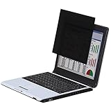

職場にずっといるなら職場で日記を書けばいいじゃない。ということで前回は手書き編をお伝えしました

[https://log-is-fun.com/working-with-diary1/](https://log-is-fun.com/working-with-diary1/)

今回はパソコン編です

<!--more-->

## なぜパソコンで書くか？

職場でスマホをちょこちょこいじれるような環境であれば、スマホを使って日記を書けます。

しかし私のような小心者の場合、仕事中スマホをいじっているとサボってると思われるんじゃないかとか、周りの目が気になってしまうのでパソコンを使っています。パソコンならまだ仕事している風に見えますからね。

あと余談になりますが、日記を書くことは決してさぼりではないと思っています。日記を書くことで感情の整理ができたり、自分の考えが具体化できたり、仕事にも効果があります（とここで言い訳しておきます）。

https://log-is-fun.com/category/%E6%97%A5%E8%A8%98%E3%81%AE%E5%8A%B9%E6%9E%9C/

## 職場のパソコンにはいろいろ制限も

職場で書く日記とプライベートで書く日記ツールは同じにしておくと楽です。windowsならwordやメモ帳で十分日記を書くことができます。

問題はプライベートでEvernoteなどのクラウド系ツールを使っている場合です。

職場のパソコンではEvernoteなどクラウド系のツールにアクセスできないようになっていることがあります。

わたしの場合Evernoteへ日記を書いているのに、職場ではEvernoteにアクセスできません。そこでEvernoteへ日記を書くためにわたしがやってきたことを参考にご紹介します。

#### ①USBで持ち帰って、家でEvernoteに保存する。

仕事が忙しいと家でパソコンを開くのが手間になり、続かなくなる

#### ②Evernoteへ会社のメールで日記を送る

メールでEvernoteに日記を保存できるのを知り、この方法に。最近までこの方法でやっていたが、メールの内容は会社で把握しようと思えばできそうと不安になるので別の方法を考える

#### ③pushbulletでスマホに送る

現在はこの方法で実行中。複数のデバイス間での簡単な文字列や画像のやり取りできるので重宝している。

* * *

**[Pushbullet](https://itunes.apple.com/jp/app/pushbullet/id810352052?mt=8&uo=4&at=11l5XR)**  
価格: 0円(2017/06/28 22:41)

* * *

  

## 人の目に触れないようにする

日記の内容は人の目に触れさせたくありません。しかし職場ではみられる可能性がどうしてもあります。

そこでショートカットキーを使って、日記を書いているときに誰かが後ろを通ろうとしたらすかさず最小化。席を外した時に何かの拍子で見られないようにコンピューターをロックするようにしています。

- 画面の最小化をするショートカットキー windowsキー+M
- コンピューターをロックするショートカットキー windowsキー+L

プライベートを守るためにはこうしたショートカットキーを覚えておくと便利です。あとは目が良ければ字の大きさを小さくする方法もあります。後ろからのぞかれても内容がわかりません。

ほかにも覗き見防止フィルターを使うのも手です。わたしは下の液晶保護フィルムを本気で導入しようと考えてたこともありましたが、かなり高いのでやめました。

[エレコム 液晶保護フィルム 日本製 覗き見防止 15.6 インチ EF-PFS156W](//af.moshimo.com/af/c/click?a_id=765702&p_id=170&pc_id=185&pl_id=4062&s_v=b5Rz2P0601xu&url=http%3A%2F%2Fwww.amazon.co.jp%2Fexec%2Fobidos%2FASIN%2FB008JBR0EQ%2Fref%3Dnosim)

posted with [カエレバ](http://kaereba.com)

エレコム 2012-08-04

## 終わりに

職場で日記を書く方法パソコン編でした。職場で日記を書くためにはどうしても、人の目や雰囲気などの障害があります。でも日記にはその障害を越えるだけのメリットがあると思っています。

ぜひ楽しい日記ライフを過ごしてください。

Log is Fun!!
