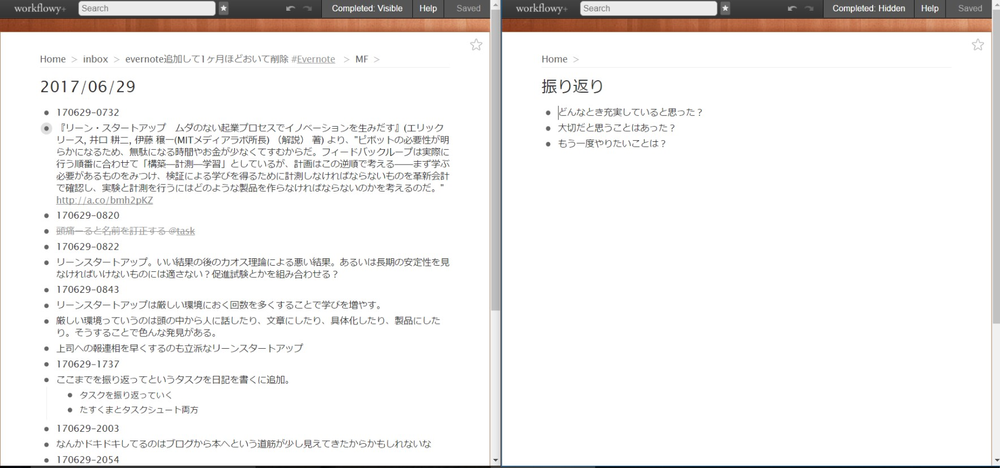
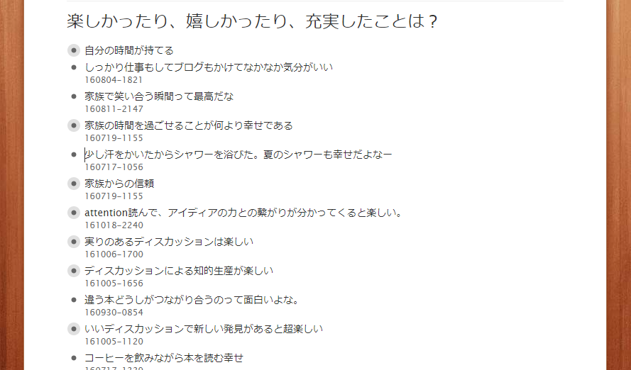

前回の記事でWorkFlowyへ日記を書く方法を書きました。

[https://log-is-fun.com/workflowy1/](https://log-is-fun.com/workflowy1/)

今回はWorkFlowyに書いた日記を振り返りながら蓄積していく方法です。日記を振り返って大切なものを見つけましょう！

* * *

ここまでの記事  
[世界最後の日にも日記を書きたい～日記で大切なものをみつける～](https://log-is-fun.com/world-last-day/)  
[WorkFlowyで自分にとって大切なものを見つける方法～日記を書く編～](https://log-is-fun.com/workflowy1/)

* * *

<!--more-->

## 日記を振り返る

まずはWorkFlowyへ書いた日記から自分が大切だと思うものを抜き出したり、日記を見て思いついたことを書き出します。

と簡単に書きました。しかし漠然と日記を見ているだけではなかなか振り返りがはかどりません。そこで質問形式にすると質問に刺激されて振り返りが進みやすくなります。

例えばこんな質問が使えます。

- どんなとき充実していると思った？
- 大切だと思うことはあった？
- もう一度やりたいことは？

一つでもいいですし、何個か質問を組み合わせると振り返りの解像度がより上がると思います。質問に当てはまると思ったものをコピペで抜き出します。

もちろん思いついたり、思い出したことがあればどんどん書き足していきましょう。

## 二画面にする

具体的なやり方としてはパソコンで二画面にしてやるのをおすすめします。左に質問項目。右に日記を開きます（もちろん逆でもOKですよ）。

そうすると質問を見ながら日記を振り返ることができるので、振り返りがしやすいです。

日記がたまりすぎると見返すのが難儀になってくるので、できるだけ毎日やるほうがいいと思います。私は毎朝仕事の前に昨日の記録を振り返っています。金土日の分はまとめて振り返りますが、やはり時間がかかってしまいますね。

このあたりはそれぞれの環境や生活スタイルによるところが大きいと思います。

ただこれだけは言いたいです。日記を振り返る時間って本当に楽しいですよ！

## どんどん蓄積する

一日だけでは大切なことは見つかりません。一週間は最低でも続けたいところです。

振り返りを続けていくと、じぶんが大切に思うことや充実していると感じたことがどんどん蓄積されていきます。

下の画像のような具合です。これは実際に私のWorkFlowyに蓄積されているものを載せました。

## 終わりに

いかがだったでしょうか。WorkFlowyを使って、日記の振り返りをぜひしてみてください。

次はWorkFlowyのシェイク。日記を振り返って蓄積したものから自分にとって大切なものを見つけるステップです。

[https://log-is-fun.com/workflowy3/](https://log-is-fun.com/workflowy3/)
