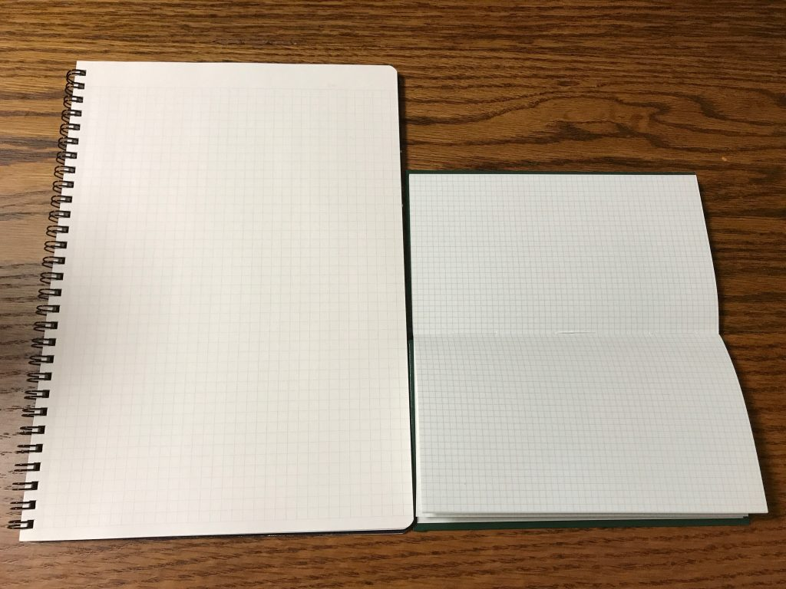
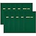
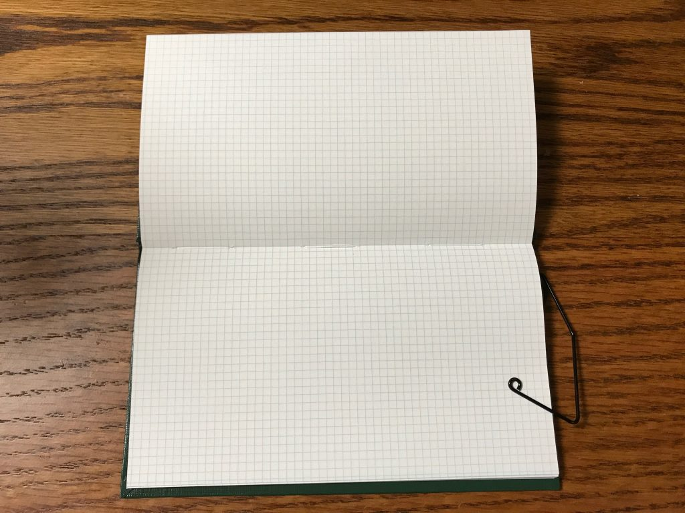
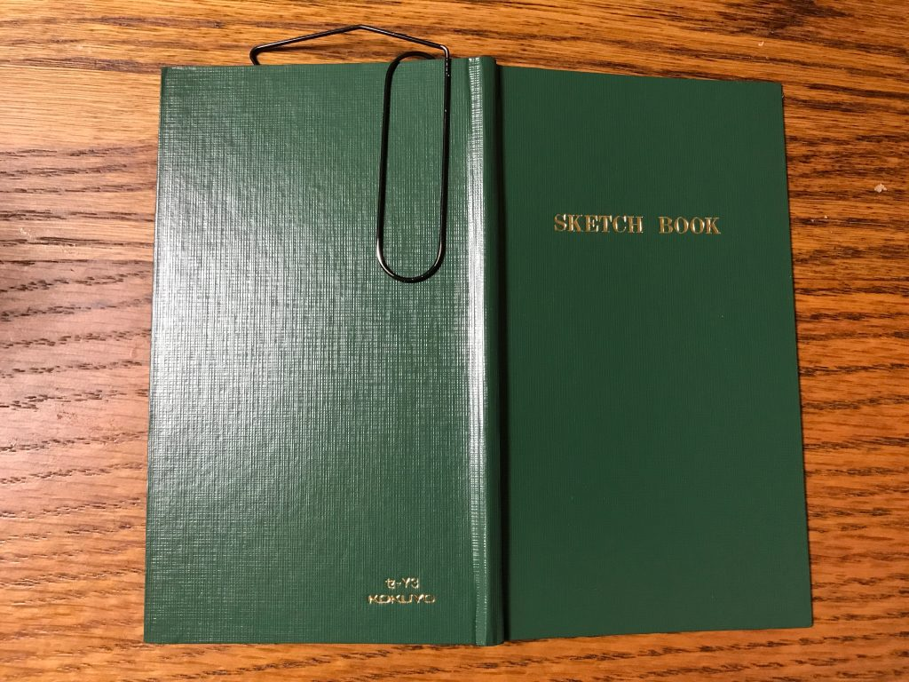
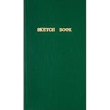
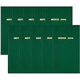

立ったままメモを取る。案外ストレスがたまる作業です。

メモ帳の背表紙が弱いと書こうとしてもしなってしまうのでメモが書きにくかったりします。

メモ帳がなくていらない紙の裏を使ったらへろへろの字になってしまい、何が書いてあるかわからなくなった経験をお持ちの方も多いのではないでしょうか（個人的体験談）

そんなストレスを解消してくれるメモ帳があります。立ったままメモを取るのに最適。測量野帳です。

<!--more-->

## １．丈夫！

測量野帳の背表紙はとても固いです。

バインダーを使って書いているのとほぼ同じです。

だから立ったままでも、ストレスなくメモを取ることができます。

ちなみに測量野帳はどのぐらい丈夫かというと、**山の中に1年半放置され、動物に噛まれたりしても中身は無事読めるぐらい**の頑丈さです

すごい！

http://www.kokuyo-shop.jp/shop/u\_page/honne13\_2.aspx#.WWdZoYjyhPY

## ２．しっかり開くから大きく使える

測量野帳はしっかりと180°開きます。

見開きでほぼ一枚のメモと言ってもいいぐらいです。ですから見開き二ページを使ってメモを取ることができます。

だから小さく見えても、大きく紙を使えます。見開きでB5の2/3ぐらいの大きさにはなります 。

\[caption id="attachment\_499" align="alignnone" width="680"\] 左がB5ノート。右が測量野帳。\[/caption\]

私のおすすめの使い方は横開きで使うことです。方眼なので縦でも横でもどちらでも使えるのも魅力ですね。

このぐらいの大きさがあれば、メモをするのに十分すぎるスペースがあります。

## ３．安い

こんなしっかりしたつくりなのに40枚80ページで一冊220円ほどです。さらにアマゾンでまとめ買いすると2017/7/13現在、一冊136円です。

安すぎてすこし心配になります。

[コクヨ ノート 測量野帳 スケッチブック 40枚 10冊セット セ-Y3](http://www.amazon.co.jp/exec/obidos/ASIN/B00F27U1EQ/do0909-22/)

コクヨ(KOKUYO)

## しおりを使うと捗る

ただ一枚一枚ちぎらないタイプのメモ帳は、メモを書くページがどこか探すのが少しストレスになります。

しかし、しおりを使えばそんなストレスも解消できます。むしろしおりをつけることで自分なりのカスタマイズ感が出て楽しいです。

わたしはこのワイヤークリップブックマーカーを使っています。書くスペースを邪魔せず、ページをめくるだけで最後のページをブックマークしてくれます。

[ワイヤークリップブックマーカー シルバー \[GB200\]](//af.moshimo.com/af/c/click?a_id=765702&p_id=170&pc_id=185&pl_id=4062&s_v=b5Rz2P0601xu&url=http%3A%2F%2Fwww.amazon.co.jp%2Fexec%2Fobidos%2FASIN%2FB017NCC32U%2Fref%3Dnosim)

posted with [カエレバ](http://kaereba.com)

HIGHTIDE

\[caption id="attachment\_500" align="alignnone" width="680"\] 書くスペースを邪魔しない\[/caption\] \[caption id="attachment\_498" align="alignnone" width="680"\] 後ろにつけるとこんな感じ\[/caption\]

## 終わりに

立ってメモしたり、外に出てメモをしたりすることが多い人におすすめです。

ストレスなく楽しいメモライフを！

Log is for Happy!!

* * *

お試しならまずこちらから

[コクヨ 測量野帳 スケッチ 白上質紙 40枚 セ-Y3](http://www.amazon.co.jp/exec/obidos/ASIN/B003AWF578/do0909-22/)

posted with [カエレバ](http://kaereba.com)

コクヨ(KOKUYO)

まとめ買いでお得！

[コクヨ ノート 測量野帳 スケッチブック 40枚 10冊セット セ-Y3](//af.moshimo.com/af/c/click?a_id=765702&p_id=170&pc_id=185&pl_id=4062&s_v=b5Rz2P0601xu&url=http%3A%2F%2Fwww.amazon.co.jp%2Fexec%2Fobidos%2FASIN%2FB00F27U1EQ%2Fref%3Dnosim)

posted with [カエレバ](http://kaereba.com)

コクヨ(KOKUYO) 2013-09-18
