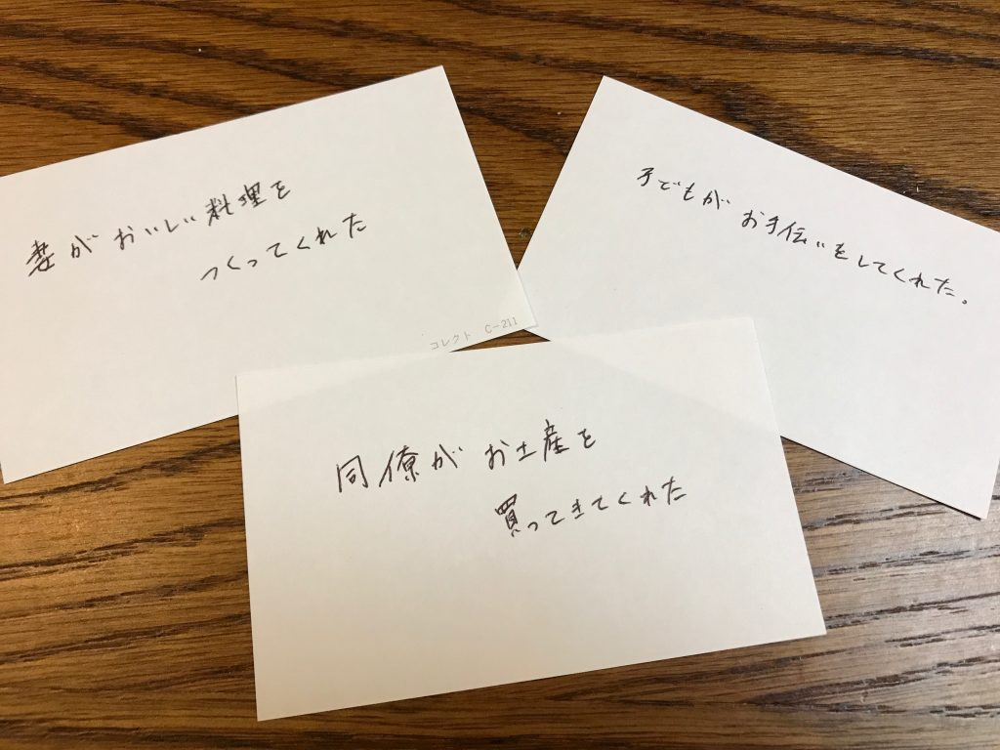
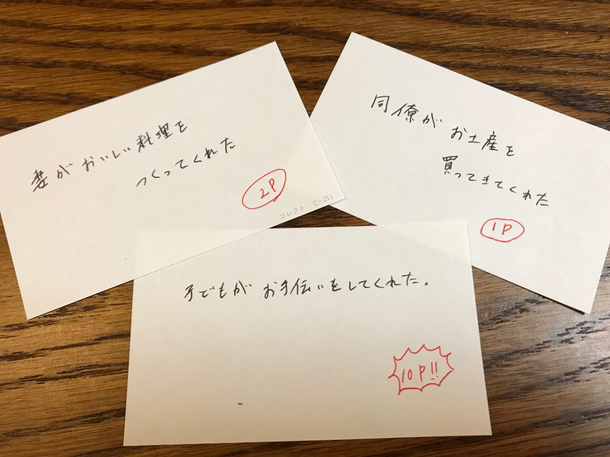
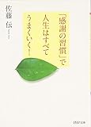

以前感謝日記の効果について記事を書きました。

[https://log-is-fun.com/thanksdiary/](https://log-is-fun.com/thanksdiary/)

その中で感謝日記を書くことで、相手に「ありがとう」が返せると書きました。

じゃあ具体的にはどうすればいいのか？

ゲーム感覚でやってみるのはいかがでしょうか。

<!--more-->

## カードで感謝を見える化

感謝日記をカードを使って書いてみます。

例えば以下のように感謝日記カードに書きます。

- 妻がおいしい料理をつくってくれた
- 同僚がお土産を買ってきてくれた
- 子どもがお手伝いをしてくれた

こうして感謝日記をカードに書いていけば、どんどんカードがたまります。

カードが何枚か集まったらお返しをすると決めて置き、たまったらお返しをしましょう。

ちなみに使っているカードはこんな名刺大の無地カードを使っています。

[情報カード 無地 名刺サイズ J884](http://www.amazon.co.jp/exec/obidos/ASIN/B0018HHRYG/do0909-22/)

ライフ

気軽にメモとしても使えるカード

## ポイントがたまったらお返しをしよう！

カードの枚数もいいですが、交通事故にあいそうなところを助けてくれたことと、肩にごみがついていると教えてくれたことが同じ一枚というのはちょっと違う気がします。

そこで感謝したことに「ありがとうポイント」をつけてみましょう。ありがたいことほどポイントを高くつけます。

カードにポイントを書いていって、10ポイントたまったらありがとうと言う。お土産や花を買って帰る。お返しをする。

こんなポイントシステムはいかがでしょうか？

## 感謝日記を手紙に

感謝日記には感謝したい相手にしてもらったことが書いてあります。その感謝日記に書いてあることを手紙にしてみてはいかがでしょうか。

自分も忘れていたようなことに対してお返しがあったら素敵じゃないですか。相手からの好感度もアップしますよ。

家族に書くのが恥ずかしいなら家族日記を使うという手もあります。

[https://log-is-fun.com/family-diary/](https://log-is-fun.com/family-diary/)

じぶんがお手伝いした子供だったら親から手紙をもらえたら嬉しいと思いませんか？

## 終わりに

誰かに感謝するのは気持ちいいですよね。しぶしぶお返しをするのではなくゲーム感覚でお返しをすると楽しみながらできるのではないでしょうか。

そしてこのブログが続いているのも、あなたに読んでいただいているおかげです。

本当にありがとうございます。よろしければ今後もよろしくお願いいたします。

Log is Fun!!

* * *

[「感謝の習慣」で人生はすべてうまくいく! (PHP文庫 さ 41-1)](//af.moshimo.com/af/c/click?a_id=765702&p_id=170&pc_id=185&pl_id=4062&s_v=b5Rz2P0601xu&url=http%3A%2F%2Fwww.amazon.co.jp%2Fexec%2Fobidos%2FASIN%2F4569669573%2Fref%3Dnosim)

posted with [ヨメレバ](http://yomereba.com)

佐藤 伝 PHP研究所 2008-01-07

[Amazonで探す](//af.moshimo.com/af/c/click?a_id=765702&p_id=170&pc_id=185&pl_id=4062&s_v=b5Rz2P0601xu&url=http%3A%2F%2Fwww.amazon.co.jp%2Fexec%2Fobidos%2FASIN%2F4569669573%2Fref%3Dnosim)

[Kindleで探す](//af.moshimo.com/af/c/click?a_id=765702&p_id=170&pc_id=185&pl_id=4062&s_v=b5Rz2P0601xu&url=http%3A%2F%2Fwww.amazon.co.jp%2Fexec%2Fobidos%2FASIN%2FB0079A08E2%2F)

[楽天ブックスで探す](//af.moshimo.com/af/c/click?a_id=765703&p_id=56&pc_id=56&pl_id=637&s_v=b5Rz2P0601xu&url=http%3A%2F%2Fbooks.rakuten.co.jp%2Frb%2F5297880%2F)

[7netで探す](//af.moshimo.com/af/c/click?a_id=765667&p_id=932&pc_id=1188&pl_id=12456&s_v=b5Rz2P0601xu&url=http%3A%2F%2F7net.omni7.jp%2Fsearch%2F%3FsearchKeywordFlg%3D1%26keyword%3D4-56-966957-1%2520%257C%25204-569-66957-1%2520%257C%25204-5696-6957-1%2520%257C%25204-56966-957-1%2520%257C%25204-569669-57-1%2520%257C%25204-5696695-7-1)
