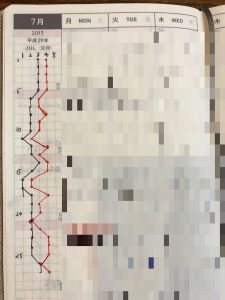
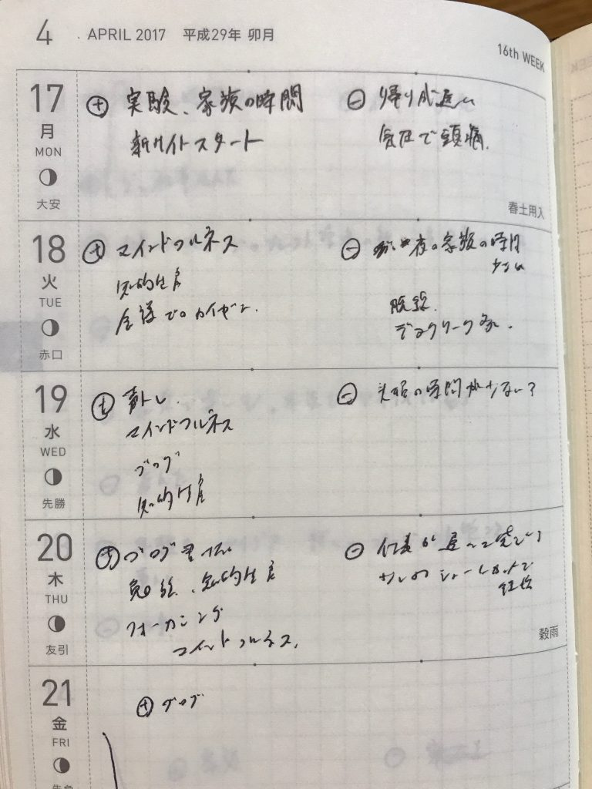

手帳に一年ほどその日のじぶんの調子と一日の評価をつけています。

一年ほどやってみていろいろやり方とかもまとまってきたのでご紹介します。

<!--more-->

## 手帳に調子と評価を記録

写真のようにその日の自分の調子（黒）と一日の評価（赤）を5段階でグラフにつけています。

モザイクのかかっていないところにあるグラフがそうです。1が最低で5が最高評価です。

グラフを書くのに使っているのはほぼ日weeklyの月間カレンダーの方眼の部分です。

## 調子と評価に分ける理由

調子と評価に分ける理由は、分けないとごっちゃになるからです。

実は最初は一日の評価だけをつけていました。しかしある日ふと気づきました。疲れていたら低い評価、疲れていなかったら高い評価をつけていたのです。

自分の調子を判断するのは簡単ですが、一日を評価するのはすこし頭を使いますからね。楽な方向に勝手に進んでいたんだと思います。（「[ファスト&スロー](http://amzn.to/2uIvqjC)」のヒューリスティックってやつですね）

そこで評価と調子を分けるようにしました。

## どんな効果があるの？

### １．バイオリズムが分かる。

まず自分のバイオリズムがなんとなくわかってきます。

わたしの場合のバイオリズムはこんなサイクルです。

1週間普通→1週間調子いい→1週間調子悪い→1週間普通に戻る

だいたいこんな感じのサイクルを繰り返しています。もちろん毎回そうなるわけではないですが、かなりの再現性があります。

このようなバイオリズムが分かることで、調子悪い時に予定をできるだけいれないようにしたり、来週調子悪くなるから仕事を前倒しでやっておいたりできます。

### ２．どんな時に調子が変わるかわかる

どんな時に調子が変わりやすいか。それも分かってきます。

私の場合大きなイベントの後は燃え尽きてます。例えば結婚式、新婚旅行、あるいは大きな仕事のイベントなどがそうです。

その日はテンションが高くて乗り切れますが、そのあとは何日か調子が落ちます。

人それぞれ調子が変わる理由は様々あると思います。例えば先月残業が多かった。睡眠時間が少なかった。あるいはいい仕事ができた。楽しい土日が過ごせた。

調子の予測精度が上がることで、じぶんをうまく使えるようになります。

### ３．じぶんを知ることができる　

だいたいその日の調子と一日の評価は連動していて、調子がよければその日の評価もだいたい高いです。

しかし時々調子がいいのに評価が低くなる時があります。逆に調子が悪いのに評価が高い時があります。

その日が自分を知ることができるポイントです。

なぜその日の評価が低くなったのか？あるいは高かったのか？その理由が分かれば、自分がなにをしたくて、何をしたくないのかが分かります。

自分の場合は調子が良い日でも仕事が忙しくて本が読めたかったり、家族と過ごせなかったり、ブログが書けないと評価が低くなります。逆に調子が悪くても本が読めたり、家族と過ごせれば評価は高くなります。

こうした理由が分かるように週間スケジュールのところに評価の理由をプラスとマイナスに分けて書いています。

自分がどんな時に評価が高いのか、逆にどんな時に低くなるのかが分かりやすくなります。

## 終わりに

3分もあればできるおすすめの記録法です。気になった方はぜひ今日から手帳に今日の調子と評価を書いてみてください。楽しいですよ。

Log is Fun!!
