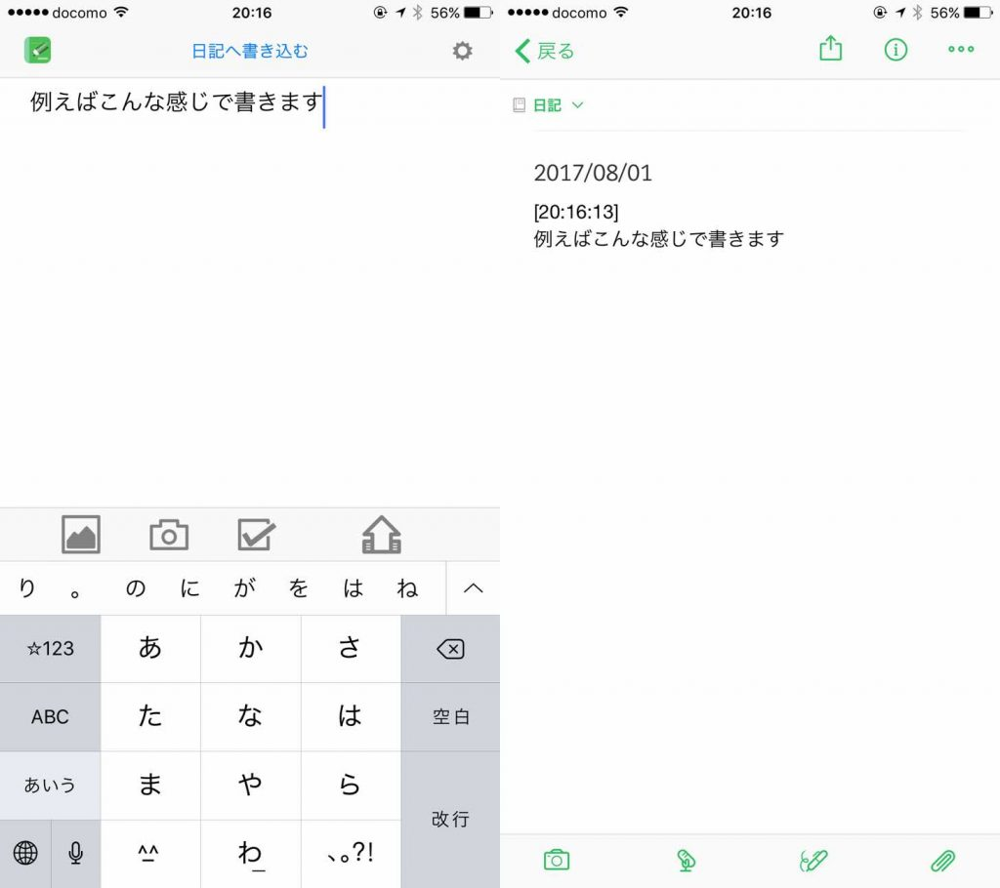
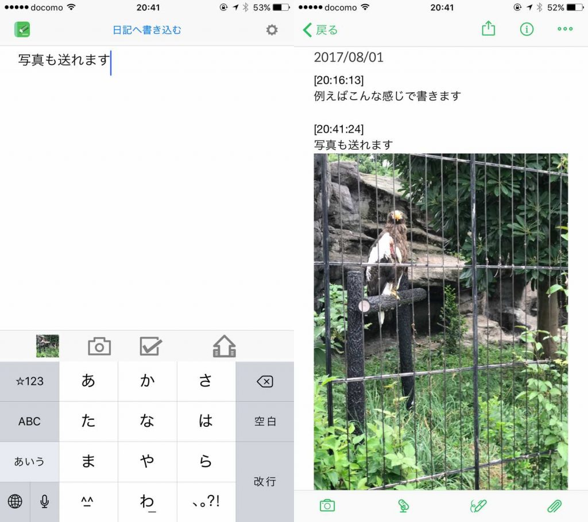
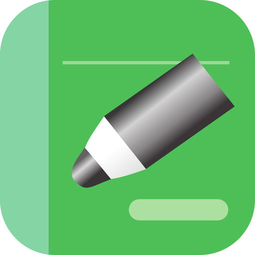
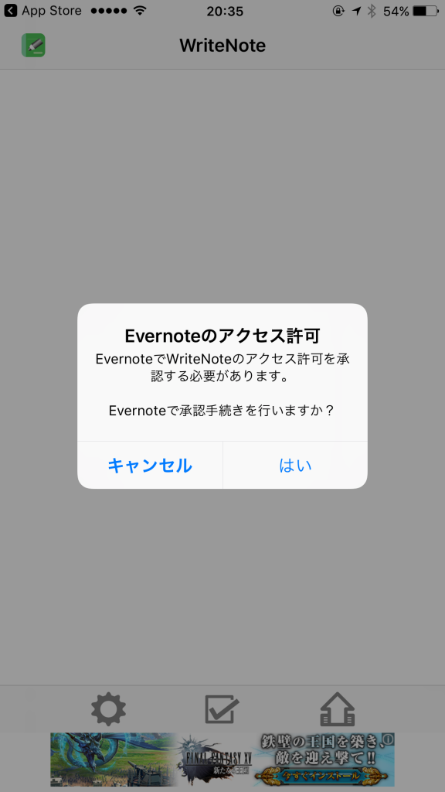
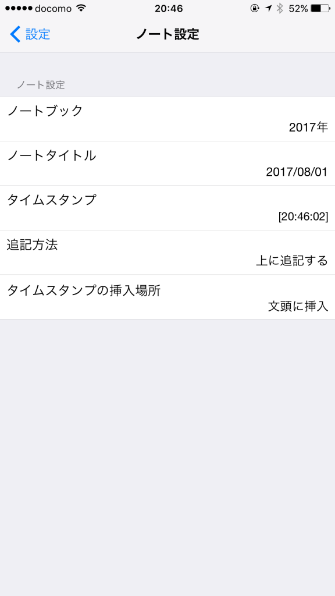
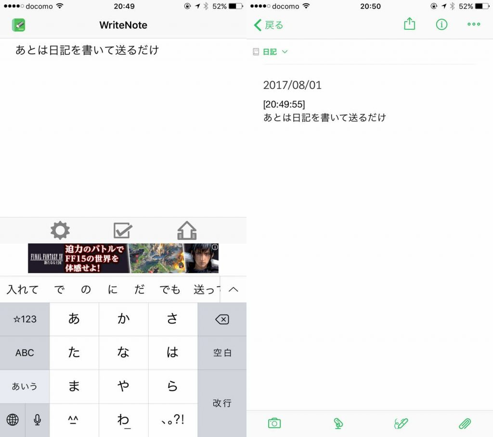
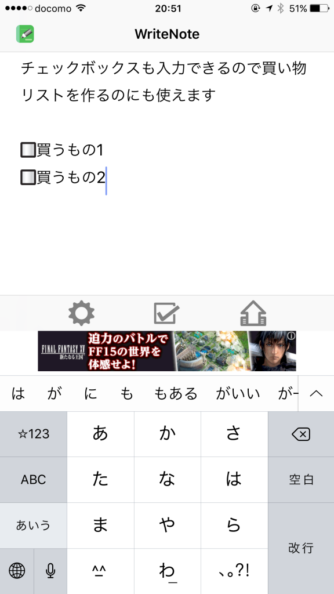
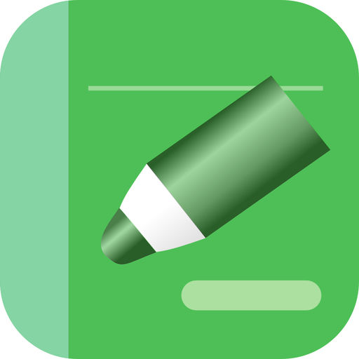

Evernoteは優れた日記ツールです。

https://log-is-fun.com/evernote1/

しかしスマホでEvernoteに日記を書こうとする場合、

1. Evernoteアプリをタップ
2. 今日の日付のノートをタップ。なければノートを作る
3. 書きたい内容を書く。

この3ステップが必要になります。

習慣として続けるならめんどくささはできるだけ排除したいですよね。そしてこのめんどくささをとことん減らしてくれるのがアプリ「wiretenote」です。

<!--more-->

## writenoteってどんなアプリ？

writenoteで日記が簡単に書けます。

左の画像のようにアプリに文章を書いて、右下の送信アイコンをタップします。Evernoteへ送られた文章は今日の日付のノートに右の画面のよう時刻と一緒に記入されます。

今日の日付のノートを作成しておく必要はありません。送れば自動で作成されます。

ちなみにノートに表示する日付や時刻の方式は自分で設定可能です。設定方法のバリエーションは以下のアプリ作者さんのサイトをどうぞ。

http://www.nap.jp/michi/ios/WriteNote/writenotepro.html#format

有料版のwritenote proなら写真も一緒に送れます。

## writenote と writenote proのちがい

無料のwritenoteとの有料のwritenote proがあります。

無料と有料では以下のような違いがあります。

|   | writenote | writenote pro |
| --- | --- | --- |
| 設定できるノート数 | 1 | 6 |
| タグの設定 |   writenote のみ   | 自分で設定可能 |
| 広告有無 |   あり   （アドオンで削除可）   | なし |
| 画像送信機能 | なし | あり |
| 位置情報付与機能 | なし | あり |
| チェックボックス |   Android版は1つ  iOS版は制限なし   | 制限なし |
| 金額 |   無料   |   Android 550円  iOS 600円   |

特にwritenote proで最高なのが写真が送れることです。日記に写真があると日記からの思い出せることの質が違います。写真をあるとその日あったことの雰囲気や感情まで思い出しやすいです。

写真の機能だけでもwritenote proにする価値はあると思います。

## 設定方法

設定方法は簡単です。無料のwritenoteの方を例にご紹介します

まずダウンロードします。

iphone版

**[WriteNote (Free) - Evernoteに日記などを簡単に追記](https://itunes.apple.com/jp/app/writenote-free-evernote%E3%81%AB%E6%97%A5%E8%A8%98%E3%81%AA%E3%81%A9%E3%82%92%E7%B0%A1%E5%8D%98%E3%81%AB%E8%BF%BD%E8%A8%98/id975098903?mt=8&uo=4&at=11l5XR)**  
価格: 0円(2017/08/01 21:08)

Android版

https://play.google.com/store/apps/details?id=jp.eek.nap.writenote&hl=ja

Evernoteへのアクセス許可が必要です。ユーザー名とパスワードを入れます。

これでEvernoteとアプリが連携できました。次にノートの設定です。歯車アイコン→ノート設定をタップします。

ノートブックをEvernoteの日記を書いているノートブックに設定します。これから書き始める場合はそのままでもいいかもしれません。デフォルトでは西暦がタイトルになっています。

あとは文章を書いて送るだけで右の画像のようにEvernoteへ記入できました。

日記だけでなく、その日のメモを書きためたりするなどさまざまな使い方ができます。他にもチェックボックスが入力できるので買い物リストなんかにも使えます。

## 終わりに

writenoteを使って楽に日記を書いちゃいましょう！

Log is Fun!!

iphone 版

**[WriteNote Pro - Evernoteに日記などを簡単に追記する](https://itunes.apple.com/jp/app/writenote-pro-evernote%E3%81%AB%E6%97%A5%E8%A8%98%E3%81%AA%E3%81%A9%E3%82%92%E7%B0%A1%E5%8D%98%E3%81%AB%E8%BF%BD%E8%A8%98%E3%81%99%E3%82%8B/id967739757?mt=8&uo=4&at=11l5XR)**  
価格: 600円(2017/08/01 21:08)

Android版

https://play.google.com/store/apps/details?id=jp.eek.nap.writenotepro&hl=ja
