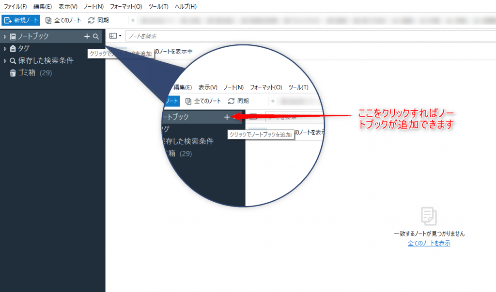
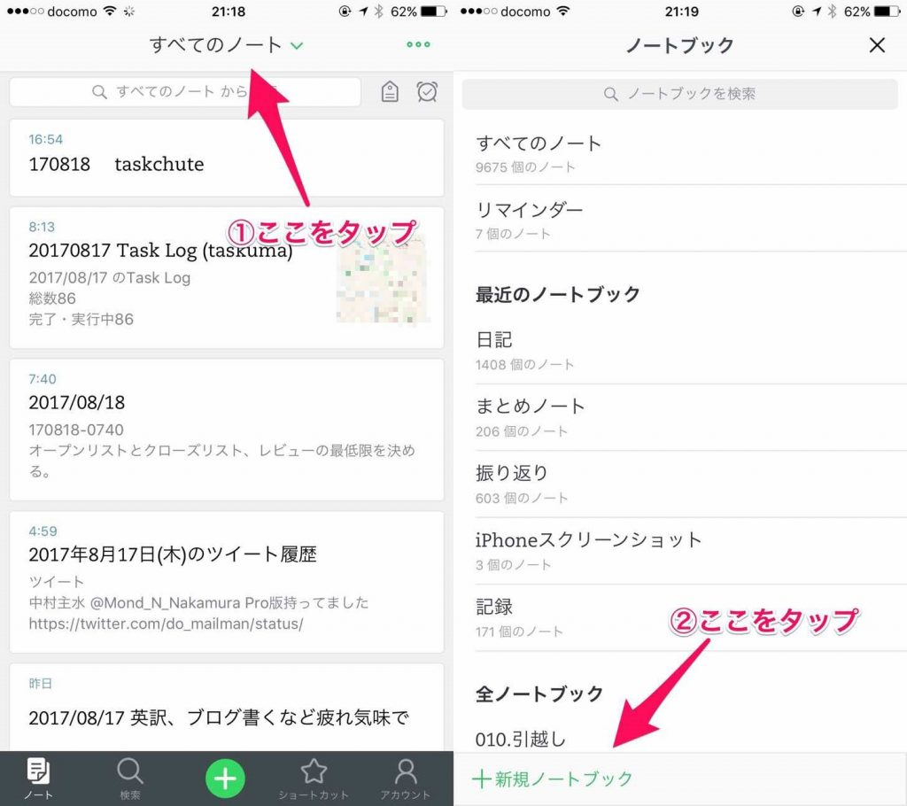
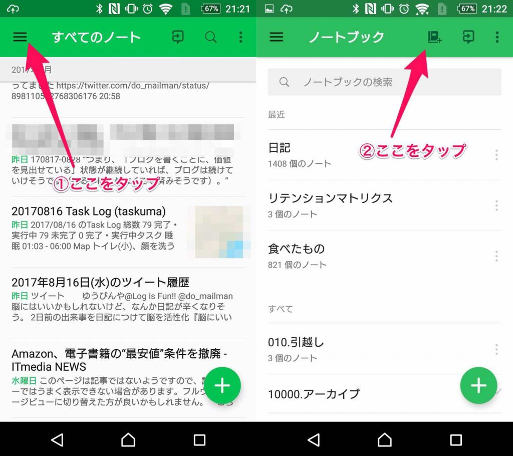

Evernoteはパソコンやスマホで日記を書くのに最適なツールだと思っています。

しかし、デジタルツールになれていない人にとってはどうしてもEvernoteを使うということ自体のハードルが高くなっている気がします。

そこでEvernoteで日記を始めるのはこんなに簡単なんだよとお伝えしようと筆をとった所存です。

ではみていきましょう！

<!--more-->

## ①アカウントを作る

まずはEvernoteのアカウントを作りましょう。

メールアドレスとパスワードを登録するだけで無料で作れます。グーグルのアカウントを持っていれば、それでも登録可能です。

下のリンクから登録すると有料版のプレミアムの機能が1か月使えます。

[Evernoteへ登録する](https://www.evernote.com/referral/Registration.action?sig=652d432f3c102e3305d6d402429b4a133eb2b589c9ad4bd24bf14012bfc9f26c&uid=24971259)

わたしも一ヶ月分プレミアムの期間が延びるのでwin-winですね。

プレミアムは別にいい。管理人が得するのが気に入らないという方は下の公式HPでももちろん大丈夫です。

わたしとしては一人でも多くの人にEvernoteで日記を書いてもらえればそれでOKです。

https://evernote.com/intl/jp/

## ②ソフト、アプリをダウンロードしよう

普段使っているパソコンやスマホにソフトやアプリをダウンロードしましょう。こちらの公式HPから必要なものをダウンロードします。

https://evernote.com/intl/jp/download

windows、mac、android、iphone用にソフトやアプリがあります。

ダウンロードしたら、登録したメールアドレスとパスワードを入れてログインしましょう。

## ③日記用のノートブックを作ろう

ダウンロードをしたら次は日記用のノートブックをつくっておきましょう。名前は日記と分かるものなら何でもいいと思います。

一年ごとに分けるなら「2017年日記」といったものでもいいですし、単に「日記」でもOKです

### パソコンの場合

私はmacは持っていないのでwindows版について説明します。

新しいノートブックの作り方は簡単で、左上のノートブックの＋をクリックすると新しいノートブックがつくれます

### スマホの場合

iphone版では上の「すべてのノートブック」をタップすると下にノート作成ボタンが出ます。そこをタップすれば新しいノートブックがつくれます。

Androidでは左上のアイコンからノートブックをタップ。本のアイコンをタップすると新しいノートブックが作れます。

## ④日記を書こう

次は日記を書きます。一日の最後に日記を書くイメージがありますが、日記はいつかいてもかまいません。複数のタイミングで書いてもいいですし、次の日の朝にまとめて書くほうがいいという方もいます。

自分なりのタイミングをつかめるまでいろいろ試してみるといいと思います。

### パソコンで書く

朝や夜などパソコンの前に座れる時間に日記を書きましょう。

1日のはじめにノートを作る場合はキーボードショートカット Ctrl + Nで作れます。もしくは左上のファイル→新規ノート→新規ノートの順にクリックしても作れます。

毎日の日記のタイトルは「2017/08/21」のような年月日がシンプルでいいでしょう。余裕があれば日記にタイトルをつけるのもおすすめです。

関連記事：[毎日の日記にタイトルをつけるとなにがいいのか？](https://log-is-fun.com/diary-title/)

### スマホで書く

公式アプリからノートを作って直接記入するのもいいですが、他のアプリを使えばもっと簡単にEvernoteに日記を書けます。

こちらのアプリ「Writenote」だとEvernoteに楽に日記が書けます。おすすめです。

[https://log-is-fun.com/writenote/](https://log-is-fun.com/writenote/)

## 日記の書き方

どんな日記を書こうか迷っている方には、これまでLog is Fun!!で書いた日記の書き方カテゴリページをどうぞ。

https://log-is-fun.com/category/%E6%97%A5%E8%A8%98%E3%81%AE%E6%9B%B8%E3%81%8D%E6%96%B9/

## 終わりに

10分もあればEvernoteで日記を始めることができます。

ぜひEvernoteでたのしい日記ライフを！

noteにて日記同好会も始めましたので、こちらもぜひチェックしてみてくださいね。

https://note.com/mailman/n/nbe584ebcaeca

Log is for Happy!!
