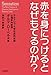
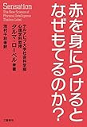

会社や学校でもらった資料へメモをする場面を想像してみてください。

何色のペンで書きますか？もしメモを目立たせるために赤を使っているなら注意が必要です。

<!--more-->

## 赤の持つ影響

まず、なぜ赤でメモを書いてはいけないのか。それは赤が視界にあるだけで頭を使う課題に対するパフォーマンスが落ちるからです。

ではなぜパフォーマンスが落ちるのか。

それは私たちが自分でも気づかぬうちに視覚や聴覚などの感覚から非常に強力な影響を受けるからです。

その強力な影響をまとめたのが「赤を身につけるとなぜもてるのか？」です。

[赤を身につけるとなぜもてるのか?](http://www.amazon.co.jp/exec/obidos/ASIN/4163903178/do0909-22/)

タルマ ローベル

赤色にの影響についてだけでも

- 受験番号や表紙が赤になるだけでテストのパフォーマンスが際立って悪くなる
- 赤のユニフォームは審判に有利な判定をされやすい
- 赤を身に着けた異性に魅力を感じやすい

など様々な影響や効果があります。

## その他にも様々な影響が

感覚から受ける影響の中で何個か印象に残った部分を紹介します。

### 交渉の時は温かい飲み物を用意する。

暖かい飲み物を持つだけで相手を温かみのある人物（やさしい、穏やか、親切）だと思われます。

信頼感を育てたいなら暖かい飲み物を相手に渡しましょう。

### 体に触れながらお願いする

体に触れてお願いをすると、商品などを購入したりするなどリスクが高い行動をとりやすくなります。しかしその影響には気づきません。

おこづかいを増やしてほしい旦那さん各位は奥さんの肩をマッサージしながらお願いするといいかもしれませんね（笑）

### 創造性をイメージさせる要素を見るだけで創造性が上がる

たとえば電球の写真をパソコンのトップ画面にしておけば、仕事中に創造性が上がりそうです。

他にも本の中ではアップルのロゴや箱の外にいる人物の絵などもおすすめしています。

じぶんも箱の外にいる人物をパソコンのトップに表示しています。創造性が上がったかはなかなか測れないのでわかりません。

でも絵を見るだけでなにか違った角度から考えてみようと思えます。それだけでもパソコンのトップ画面を変えてよかったです。

## 終わりに

最近はセルフマネジメントについての記事を増やしています。

それはセルフマネジメントが幸せにとても重要だと考えていますし、感じているからです。ですのでこれからもセルフマネジメントや心理学に関係した本なども紹介していく予定です。

というわけで今回は「赤を身につけるとなぜもてるのか？」の紹介でした。

ここまで読んでいただいた方にはまわりの環境がどれだけわたしたちに影響を与えているかが分かったと思います。

本はすこし事例が多くて冗長と感じるかもしれません。しかし章末にまとめがきちんとあるので、まとめを読むだけでポイントが把握できますよ。

興味がある方はぜひご一読を。

Log is for Happy!!

(この記事は[本屋のポップのようなもの](https://scrapbox.io/bookshelf-of-mailman/%E8%B5%A4%E3%82%92%E8%BA%AB%E3%81%AB%E3%81%A4%E3%81%91%E3%82%8B%E3%81%A8%E3%81%AA%E3%81%9C%E3%82%82%E3%81%A6%E3%82%8B%E3%81%AE%E3%81%8B%EF%BC%9F)とのクロスポストです）

[赤を身につけるとなぜもてるのか?](//af.moshimo.com/af/c/click?a_id=765702&p_id=170&pc_id=185&pl_id=4062&s_v=b5Rz2P0601xu&url=http%3A%2F%2Fwww.amazon.co.jp%2Fexec%2Fobidos%2FASIN%2F4163903178%2Fref%3Dnosim)

posted with [ヨメレバ](https://yomereba.com)

タルマ ローベル 文藝春秋 2015-08-10

売り上げランキング : 41556

[Amazonで探す](//af.moshimo.com/af/c/click?a_id=765702&p_id=170&pc_id=185&pl_id=4062&s_v=b5Rz2P0601xu&url=http%3A%2F%2Fwww.amazon.co.jp%2Fexec%2Fobidos%2FASIN%2F4163903178%2Fref%3Dnosim)

[Kindleで探す](//af.moshimo.com/af/c/click?a_id=765702&p_id=170&pc_id=185&pl_id=4062&s_v=b5Rz2P0601xu&url=http%3A%2F%2Fwww.amazon.co.jp%2Fexec%2Fobidos%2FASIN%2FB012CHHXD0%2F)

[楽天ブックスで探す](//af.moshimo.com/af/c/click?a_id=765703&p_id=56&pc_id=56&pl_id=637&s_v=b5Rz2P0601xu&url=http%3A%2F%2Fbooks.rakuten.co.jp%2Frb%2F13306567%2F)

[楽天koboで探す](//af.moshimo.com/af/c/click?a_id=765703&p_id=56&pc_id=56&pl_id=637&s_v=b5Rz2P0601xu&url=http%3A%2F%2Fbooks.rakuten.co.jp%2Frk%2Fd3ee3ebcd1583552a1118ebf6b273f0d%2F)

[7netで探す](//af.moshimo.com/af/c/click?a_id=765667&p_id=932&pc_id=1188&pl_id=12456&s_v=b5Rz2P0601xu&url=http%3A%2F%2F7net.omni7.jp%2Fsearch%2F%3FsearchKeywordFlg%3D1%26keyword%3D4-16-390317-0%2520%257C%25204-163-90317-0%2520%257C%25204-1639-0317-0%2520%257C%25204-16390-317-0%2520%257C%25204-163903-17-0%2520%257C%25204-1639031-7-0)
