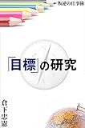

> 青年　行き当たりばったり、というやつですね。
> 
> 徹人　いいや、どこかに行きあたることすらないよ。へらへら笑いながら同じ場所をぐるぐると周り続けることになる。壁にぶつかることを慎重に避けながらね。
> 
> 『「目標」の研究』(倉下忠憲 著) より、http://a.co/9LGPxKK

目標を立てる。目標に向かう。

仕事はもちろんプライベートでも耳にするセリフです。しかしふと振り返ってみると「目標」という言葉を無自覚に簡単に扱っていた気がします。

その「目標」をどう扱うべきかを書いたのが倉下忠憲さんの「「目標」の研究」です。

<!--more-->

## 目標は簡単ではない

目標を立てて、達成するのは難しいものです。でも多くの人が注意することなく簡単に目標を立てます。本書の中では失敗する目標の建て方として以下の4つが出てきます

1. 忘れ去られる目標
2. あいまいな目標
3. サイズ違いの目標
4. ずれた目標

それぞれ詳しくは本書を読んでいただくとして忘れ去られる目標について触れたいと思います。

## 目標を設定しただけで達成した気分になる

目標はだいたい忘れ去られます。しかし目標を単純に忘れるだけではなく、目標を立てることで逆に目標を達成したかのような満足感を得てしまい行動できなくなります。

こうした心理は「[スタンフォードの自分を変える教室](http://amzn.to/2z4TiQ9)」や「[WOOPの法則](http://amzn.to/2xqBHjm)」など様々な本で言及されています。

目標を立てることで目標が達成できなくなる可能性があるのです。

それを防ぐのが以前紹介したWOOPです。詳しくは下の記事を読んでいただくとして、簡単にいうとWOOPは目標、目的の確認のあと、その達成までのハードルを考えさせます。

そのハードルで目標を達成したかのような満足感へくぎを刺す方法がWOOPです。

[https://log-is-fun.com/woop1/](https://log-is-fun.com/woop1/)

## ではどうやって目標を立てればいいのか？

ここについては本書では以下のような手順を推奨しています。

1. 目標を立てる
2. 目標を振り返る
3. 全体を俯瞰する
4. もう一度目標を立てる

目標を立てる→振り返る→全体を俯瞰する→もう一度目標を立てる。

こうした循環構造で目標をより現実に近づけていく。目標をうまく設定するということは、目標を立てる自分や自分の現状を知るということなのだと思います。

> 目標設定力が上がるとは、自分自身を知る、ということだ。その上で、必要な戦略を練る力を持つ、ということでもある。
> 
> 『「目標」の研究』(倉下忠憲 著) より、http://a.co/5s8C9Qu

そうした地道な作業の中で目標設定力は培われていくのだと思います

（自分を知るには日記がおすすめですよ。と小声で言っておきます）

## 終わりに

本書は自己啓発書などが進めてくる「目標」に対する注意点を教えてくれています。

そして、たぶんこの「「目標」の研究」ですら、その自己啓発書のひとつなのです。本書はそのあたりも示唆している良書だと思います。

読めてよかった一冊でした。

Log is for Happy!!

[「目標」の研究\[Kindle版\]](//af.moshimo.com/af/c/click?a_id=765702&p_id=170&pc_id=185&pl_id=4062&s_v=b5Rz2P0601xu&url=http%3A%2F%2Fwww.amazon.co.jp%2Fexec%2Fobidos%2FASIN%2FB01MXXFY28%2Fref%3Dnosim)

posted with [ヨメレバ](https://yomereba.com)

倉下忠憲 R-style 2016-12-11

売り上げランキング : 11833

[Kindleで探す](//af.moshimo.com/af/c/click?a_id=765702&p_id=170&pc_id=185&pl_id=4062&s_v=b5Rz2P0601xu&url=http%3A%2F%2Fwww.amazon.co.jp%2Fexec%2Fobidos%2FASIN%2FB01MXXFY28%2F)

（この記事は[ほんぽっぷ](https://honpop.com/mokuhyou/)とのクロスポストです）
