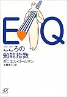

## はじめに

この記事はkindle出版を目指している「日記のすすめ（仮）」の一部です。

日記の読み返しかたの章の一部になります。

## 日記を読み返し続けることで一つ上のの視点を持てる

前回記事：[日記を読み返す期間の違いで何が変わるの？](https://log-is-fun.com/read-diary1/)

自分では完璧だと思っていた資料も人に見せるとボロボロとミスが見つかることがあります。

他の人は先入観がなく、客観的にみているからです。

これは日記、特に1年前など昔の日記を読み返したときと似ています

日記に書いた時点では正しいと思っていたことも、時間がたってから読み返すとまた違った意見や視点もあるなと分かってきます。

そしてこの点が分かってくると**いま日記に書いたことにももっと違った視点があるのではないか**と考えられるようになります

これが日記を読み返す効果です。自分の主観的な考えに対してツッコミを入れる感覚を肌で理解できます。

そうすることで自分を俯瞰する視点が少しずつ持てるようになってきます。

心理学では「メタ認知」と呼ばれています。

そしてこのメタ認知する力は日記の読み返しを続けていくことでどんどん上がってきます。その効果は複利のようにどんどんどんどん効いてきます。

メタ認知はダニエル・ゴールマンの「EQ こころの知能指数」でも重要な要素として触れられています。

> 自己の情動を認識する能力は情動に関わるあらゆる知性の基礎になる
> 
> ダニエル・ゴールマン「EQ こころの知能指数」 p93

このメタ認知力の向上により

- 自分にとってなにが幸せか
- 自分が何が大切なのか
- 自分の今の行動は、自分の目的に合っているか
- 自分が今何を考えているのか。それはどうするといいのか？
- 自分の今の感情はなにかの影響を受けていないか　etc.

自分について様々なことが分かるようになってきます。

こうしたことが分かっているかどうかで人生の満足度は左右されます。また人生が幸せかどうかには、自分でコントロールできる部分があるかどうかが大きいと言われています

関連記事：[日記で幸せへの第一歩を踏み出す](https://log-is-fun.com/how-to-be-happy/)

日記を読み返すことで自分に対する視点が上がり、視野が広がります。自分が分かっていなかった自分自身に光が当てられます

自分について詳しく知れば、自分をコントロールしやすくなります。

これが日記を読み返す効果の根本と言えるでしょう。

## おわりに

メタ認知する力は本当に大切な力の一つです。このメタ認知力を手軽に鍛えられるのが日記です。

日記を書いたらぜひ読み返してみてくださいね！

Log is for Happy!!

https://log-is-fun.com/book-how-to-start-diary/

関連記事  
・[幸せはメタ認知の行きつく先にある？](https://log-is-fun.com/katuai/)  
・[かっこいい大人にはメタ認知が必要？～3月のライオンを読んで考えたこと～](https://log-is-fun.com/march-lion/)

参考文献

[EQ こころの知能指数 (講談社+α文庫)](//af.moshimo.com/af/c/click?a_id=765702&p_id=170&pc_id=185&pl_id=4062&s_v=b5Rz2P0601xu&url=http%3A%2F%2Fwww.amazon.co.jp%2Fexec%2Fobidos%2FASIN%2F4062562928%2Fref%3Dnosim)

posted with [ヨメレバ](https://yomereba.com)

ダニエル・ゴールマン 講談社 1998-09-18

売り上げランキング : 3591

[Amazonで探す](//af.moshimo.com/af/c/click?a_id=765702&p_id=170&pc_id=185&pl_id=4062&s_v=b5Rz2P0601xu&url=http%3A%2F%2Fwww.amazon.co.jp%2Fexec%2Fobidos%2FASIN%2F4062562928%2Fref%3Dnosim)

[楽天ブックスで探す](//af.moshimo.com/af/c/click?a_id=765703&p_id=56&pc_id=56&pl_id=637&s_v=b5Rz2P0601xu&url=http%3A%2F%2Fbooks.rakuten.co.jp%2Frb%2F1003063%2F)

[7netで探す](//af.moshimo.com/af/c/click?a_id=765667&p_id=932&pc_id=1188&pl_id=12456&s_v=b5Rz2P0601xu&url=http%3A%2F%2F7net.omni7.jp%2Fsearch%2F%3FsearchKeywordFlg%3D1%26keyword%3D4-06-256292-8%2520%257C%25204-062-56292-8%2520%257C%25204-0625-6292-8%2520%257C%25204-06256-292-8%2520%257C%25204-062562-92-8%2520%257C%25204-0625629-2-8)
