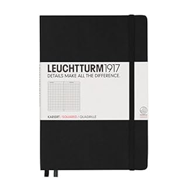
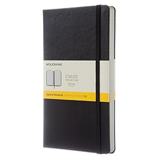
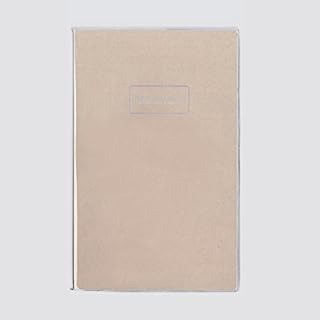
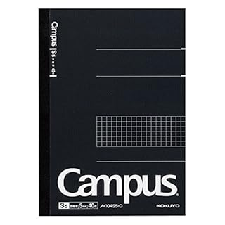
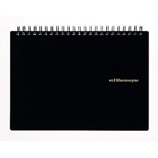

（2019/9/15：値段などの情報を更新しました。）

はじめてのバレットジャーナルを読んで、バレットジャーナルを使いたくなりました。

https://log-is-fun.com/bullet-journal1/

バレットジャーナルに必要なのはペンとノートです。

というわけでノートの選定です。バレットジャーナルの公式ホームページでは以下のようにおすすめしています。

1. 好きなノート
2. できれば高品質なものを

シンプルですね。

ほかに私の場合に欲しいのは以下の3つぐらいです

1. 方眼（好きなので）
2. ガシガシ書くので遠慮なく消費できるもの
3. 持ち歩きを考えるとA5。大きくてもB5まで。

そして調べてみて以下の5つが候補になりました。以下箇条書きでご紹介します。

## Leuchtturm 1917 ロイヒトトゥルム

[LEUCHTTURM1917 ロイヒトトゥルム手帳](http://amzn.to/2z1MV2C)

- バレットジャーナルのノートを調べると必ず出てくる一品
- 目次とページナンバーがついているのがバレットジャーナル始めるうえでかなり楽
- 購入経路はネットぐらい？輸入元は[銀座吉田](http://www.ginzayoshida.co.jp/LEUCHTTURM.htm)
- しおりが２本あるのがポイント高い（マンスリースケジュールページとデイリーページで使い分け）
- 1冊3132円 249p　12.6円/page
- カラー豊富

## moleskin モレスキン

[Moleskine　クラシックノートブック  ブラック](http://amzn.to/2z2Cegu)

- ネットやロフト、本屋とかでもよくみかける
- やっぱりかっこいい
- しおりは一本。ポケットやバンドもある
- 1冊3132円　240p　13.1円/page
- ページナンバーがないのが残念
- カラー豊富

## Numbered Note　ナンバードノート

[コクヨ　ナンバードノートブック](http://amzn.to/2lBFjyH)

- ロイヒトトゥルムと同じようにすべてのページにナンバーがついていて、indexページもある。
- しおりとかバンドはなし
- 1296円 255ページ　5.1円/page
- ページあたりも安い。コスパは一番かも。
- そんなにページをどんどん消費しない場合は月間スケジュールページがあるドローイングダイアリーも使いやすそう

買いました！（2017/12/11追記）

https://log-is-fun.com/drawing-diary/

## Campus note　キャンパスノート　A5 方眼

[キャンパスノート　A5 方眼](https://amzn.to/300zs9J)

- 方眼でも一ページごとにタイトルが書ける欄があるのがいい
- 切り取り線あり
- 当たり前だけどしおりやバンドはない
- 160p  340円 2.1円/page
- 安いし、キャンパスノートの安心感はある

## Mnemosyne ニーモシネ A5 方眼

[ニーモシネ A5 方眼](http://amzn.to/2ly5Ah5)

- 切り取り線あり
- 表紙がノートにしては強いから持ち歩きには便利かも
- 当たり前だがこれもしおりとかはない
- なにか貼っても、裏に来ないから書きやすい。
- バンドはないが[公式アイテム](http://amzn.to/2z0MIN7)で1800円である
- 70枚 594円　8.5円/page

買いました！（2017/12/11追記）

https://log-is-fun.com/mnemosyene/

## まとめ

|   | ロイヒト   トゥルム | モレスキン | ナンバード   ノート | キャンパス   ノート | ニーモシネ |
| --- | --- | --- | --- | --- | --- |
| 目次 |  ○ | × | ○ | × | × |
| ナンバリング |  ○ | × | ○ | × | × |
| ページ数 |  249p | 240p | 255p | 160p | 70p |
| 値段 |  3132円 | 3132円 | 1296円 | 341円 | 594円 |
| 値段/page |  12.6円 |  13.1円 |  5.1円 |  2.1円 |  8.5円 |
| 特徴 | 定番の一冊 | 少し高め | コスパ高い | 安い | 貼っても   書きやすい |

こう見ると、バレットジャーナルを始めるなら、ページナンバーがあるロイヒトトゥルムかナンバードノートがやっぱりよさそうですね。

リンク

リンク

## 終わりに

ロイヒトテュルムかナンバードノートが間違いなさそうですね。ただニーモシネのA4を気に入ってるからニーモシネでもいいんですよね。

最安ならキャンパスノートか。さてどうしよう。こうして悩むのもまた楽しいものです。

次回は何を買ってどう使っているかを紹介したいと思います。

Log is for Happy!!

▼関連記事  
・[バレットジャーナルとはなにか知りたいなら「箇条書き手帳でうまくいく　はじめてのバレットジャーナル」がおすすめ](https://log-is-fun.com/bullet-journal1/)  
・[4つのバレットでシンプルに！タスク管理よりもアイデア寄りにバレットジャーナルを運用する](https://log-is-fun.com/bullet-journal3/)  
・[バレットジャーナルのノートをニーモシネにした3つの理由](https://log-is-fun.com/mnemosyene/)  
・[手帳、バレットジャーナルにおすすめ！コクヨのドローイングダイアリーを紹介](https://log-is-fun.com/drawing-diary/)
