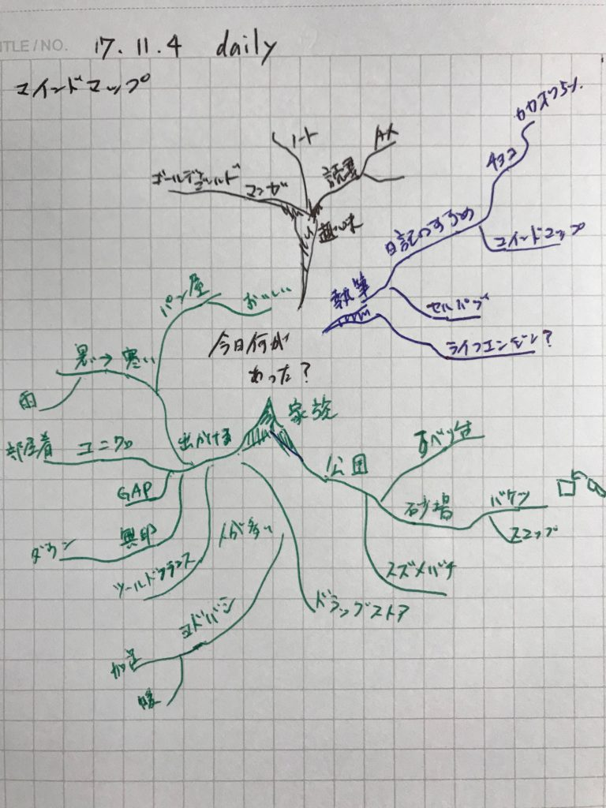

## はじめに

この記事はkindle出版を目指している「日記のすすめ（仮）」の一部です。

日記の書き方についての一部になります。

## 文章で綴る以外でも日記は書ける

日記といえば文章で書くイメージがあります。でも文章以外でも日記は書けます。今回は例としてマインドマップ、todoリスト、写真で日記を書く方法をご紹介します。

### マインドマップ

まずはマインドマップです。

マインドマップを知らない方でもこんな図をみたことがあるかたもいらっしゃると思います

\[caption id="attachment\_1169" align="alignnone" width="400"\] ↑ 管理人が書いたマインドマップ\[/caption\]

マインドマップは中央にあるイメージから芋づる式に繋がりを重視しながら描いていきます。これは人間の記憶する方法と一緒です。

なにかのきっかけで恥ずかしかった過去を一気に思い出すことがありますよね。

だからマインドマップで日記を書くとその日の出来事が思い出しやすいんです。マインドマップは暗記法としてよく用いられています。（余談ですがわたしがマインドマップを知ったのはドラゴン桜が初めてでした）

また文章にせず、ポイントだけ書き出すので慣れれば文章よりも早く書けます。また読み返したときもイメージとして思い出すのに便利です。

日記でマインドマップを使うときはたとえば中央に「今日何があった？」と書いてみてそこからどんどん派生させていとよいでしょう

たとえば上の画像で下に伸びる緑のマインドマップを見てみると「今日何があった→家族→出かけた→ユニクロetc.」と派生していっているのがわかります。

もしマインドマップについて興味が出た方は「[ふだん使いのマインドマップ](http://amzn.to/2AbJFig)」などが参考になると思います。

### todoリストにメモをしたもの

手帳やノートに今日やることを書き出して、todoリストを作っている方は多いと思います。そのリストにひと工夫してあげればすぐに日記になります

ToDoリストにあることを実行した後、その結果や感想を書き込んでおきます。

できなかったものがあったらなんでできなかったのか、しなかったのかといったことを書いておくと次に活かせます。

5行日記のように左側に余白を取っておくと、追記しやすいです。

またマインドマップと組み合わせるとお互いを補い合ってくれます。

todoリストは今日やったことが箇条書きで整理しています。逆にマインドマップは今日あったことをどんどん展開させていきます。

ですからtodoリストで整理されているところからマインドマップで細部を展開させてやるとより詳細な日記になります。

▼todoリストとマインドマップの組み合わせ例  
右がtodoリスト。左がリストをもとに展開させたマインドマップ

### 写真とその感想を載せる

今日の一枚を選んで手帳などに貼り付けることも立派な日記です。スマホのカメラの性能も上がり、スマホで写真を撮る機会も増えています。

スマホで撮った写真から今日の一枚を選んで、そこで何があったを少し書き加えるだけで立派な日記が出来上がります。

最近ではプリンターを持っている方も多いので、印刷して日記帳に貼ってもいいですし、スマホのアプリにもいいものがたくさんあります。

写真を撮ったということは、その風景や出来事があなたの中でなにかしら特別と感じたということです。

家族想いの方ならこどもや家族の写真が多いでしょうし、旅行や出かけるのが好きなら風景や名所、食べるのが好きならおいしい料理の写真が多くなると思います。

そうした写真をコメントと一緒に残しておくと、自分が何を特別と感じているのかが分かります。

このようにその人にあった日記の書き方があります。ぜひ自分に合った方法を探してみてください。

## おわりに

日記にはいろんな書き方があります。写真やtodoリストだって立派な記録であり、日記にすることができます。

肩ひじを張らずにじぶんにあったやり方を探してみてくださいね。

Log is for Happy!!

▼日記のすすめ(仮)のまとめページはこちらです。

https://log-is-fun.com/book-how-to-start-diary/
