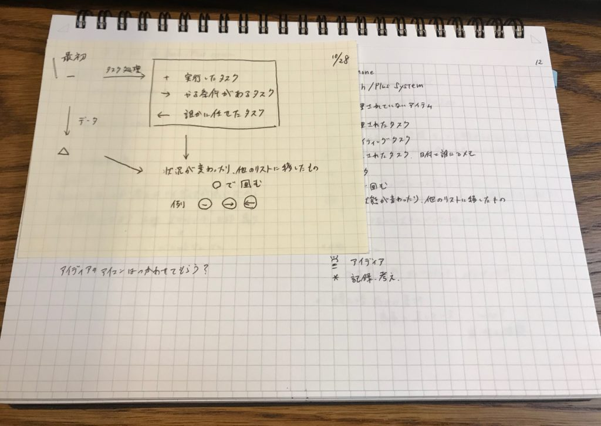
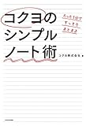

前回どんなふうにバレットジャーナルを運用しているかご紹介しました。

[https://log-is-fun.com/bullet-journal3/](https://log-is-fun.com/bullet-journal3/)

今回はなんでバレットジャーナルにニーモシネを使ったのか。その3つの理由をご紹介します。

<!--more-->

## ニーモシネにした理由

### 1\. 何かを貼ったりした後でも気持ちよく書ける

一番の理由は何かを貼ったりした後でも気持ちよく書けることです。

追加でメモしたり、A4で書いたものをこっちにも追加しておきたいときにバレットジャーナルに貼り付けます。

↓こんな感じに貼り付けてます。

ただ普通のノートに貼った場合、貼ったページの裏に書くときには段差ができて気になったり、文字がよれてしまったりするのがストレスになってました。

しかしニーモシネは違います。まず貼ったページの裏に書くことがありません。

またリングノートなので折り返しても使えますが、裏表紙が強いので気になりません。もし何枚も貼り付ければ気になるしれませんが、そのときは開いて使えばいいだけです。

### 2\. 立ったままでも書きやすい

1番目の理由でも書きましたが、ニーモシネは裏表紙が強いノートです。

だから立ったままでも書きやすいのです。これはなかなかのメリットです。

ほかにもパソコンの画面を見ながら、ノートにメモしたりするときも手に持ってできるので視線の移動が少なくて済みます。

今までは立ってメモするときは測量野帳を使っていましたが、それも必要ないかもしれません。

[https://log-is-fun.com/sokuryouyatyou/](https://log-is-fun.com/sokuryouyatyou/)

測量野帳はいざというときのために胸ポケットにしまっておいて、基本はすべてニーモシネになってきています。

ちなみに表紙もプラスチック製なので鞄で持ち歩いても四隅がめくれてきたりすることもありません。

### 3\. 机に置いておいても邪魔にならない

横長なので机の上に置きやすいですね。これも何気にポイント高いです。

キーボードを打つ腕の間に置いておいてもそんな気になりませんし、パソコン作業中にすぐメモが取れます。

また横だと縦よりもスムーズに目に入ってくる気がします。なんでかなと思っていたら「コクヨのシンプルノート術」にこんな記載がありました。

> "ヨコ型のノートは、目の配置と同じなので、視界に自然に入ってくる感覚がします。
> 
> また、パソコンのモニターもヨコ型ですから、ノート上の作業からパソコン作業へ移動するとき、思考の移動もスムーズです。"
> 
> 『たった１分ですっきりまとまる　コクヨのシンプルノート術』(コクヨ株式会社 著) より、http://a.co/bzxCeGx

確かになぁと。でもまぁこれは感覚的な話なので参考程度にしてください。

## 終わりに

ニーモシネで一つだけデメリットを上げるならページ数が少ないことですね。実質70ｐですからね。いまは二冊目を使っているのですが、一冊で一ヶ月持ちませんでした。

まぁここらへんはトレードオフなのかなと。しばらくはニーモシネで楽しいノートライフを過ごしたいと思います。

Log is for Happy!!

▼関連記事  
・[バレットジャーナルとはなにか知りたいなら「箇条書き手帳でうまくいく　はじめてのバレットジャーナル」がおすすめ](https://log-is-fun.com/bullet-journal1/)  
・[バレットジャーナルを始めるのでノートを5つ選んでみた](https://log-is-fun.com/bullet-journal2/)  
・[4つのバレットでシンプルに！タスク管理よりもアイデア寄りにバレットジャーナルを運用する  
](https://log-is-fun.com/bullet-journal3/)・[手帳、バレットジャーナルにおすすめ！コクヨのドローイングダイアリーを紹介](https://log-is-fun.com/drawing-diary/)

* * *

[マルマン ノート ニーモシネ A5 方眼罫 N182A](//af.moshimo.com/af/c/click?a_id=765702&p_id=170&pc_id=185&pl_id=4062&s_v=b5Rz2P0601xu&url=http%3A%2F%2Fwww.amazon.co.jp%2Fexec%2Fobidos%2FASIN%2FB00TES82HW%2Fref%3Dnosim)

posted with [カエレバ](http://kaereba.com)

マルマン(maruman) 2015-02-16

売り上げランキング : 1029

[Amazonで調べる](//af.moshimo.com/af/c/click?a_id=765702&p_id=170&pc_id=185&pl_id=4062&s_v=b5Rz2P0601xu&url=http%3A%2F%2Fwww.amazon.co.jp%2Fgp%2Fsearch%3Fkeywords%3DMnemosyne%26__mk_ja_JP%3D%25E3%2582%25AB%25E3%2582%25BF%25E3%2582%25AB%25E3%2583%258A)

[楽天市場で調べる](//af.moshimo.com/af/c/click?a_id=765702&p_id=54&pc_id=54&pl_id=616&s_v=b5Rz2P0601xu&url=http%3A%2F%2Fsearch.rakuten.co.jp%2Fsearch%2Fmall%2FMnemosyne%2F-%2Ff.1-p.1-s.1-sf.0-st.A-v.2%3Fx%3D0)

[7netで調べる](//af.moshimo.com/af/c/click?a_id=765702&p_id=932&pc_id=1188&pl_id=12456&s_v=b5Rz2P0601xu&url=http%3A%2F%2F7net.omni7.jp%2Fsearch%2F%3Fkeyword%3DMnemosyne%26searchKeywordFlg%3D1)

[たった１分ですっきりまとまる　コクヨのシンプルノート術\[Kindle版\]](//af.moshimo.com/af/c/click?a_id=765702&p_id=170&pc_id=185&pl_id=4062&s_v=b5Rz2P0601xu&url=http%3A%2F%2Fwww.amazon.co.jp%2Fexec%2Fobidos%2FASIN%2FB01N6I0OG9)

posted with [ヨメレバ](https://yomereba.com)

コクヨ株式会社 KADOKAWA / 中経出版 2016-12-24

売り上げランキング : 1404

[Kindleで購入](//af.moshimo.com/af/c/click?a_id=765702&p_id=170&pc_id=185&pl_id=4062&s_v=b5Rz2P0601xu&url=http%3A%2F%2Fwww.amazon.co.jp%2Fexec%2Fobidos%2FASIN%2FB01N6I0OG9%2F)

[Amazon\[書籍版\]で購入](//af.moshimo.com/af/c/click?a_id=765702&p_id=170&pc_id=185&pl_id=4062&s_v=b5Rz2P0601xu&url=http%3A%2F%2Fwww.amazon.co.jp%2Fexec%2Fobidos%2FASIN%2F4046017619%2F)
