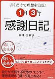

投稿日: {{ page.date | date: '%Y-%m-%d' }}

日記の書き方のひとつに「感謝日記」があります。文字の通り、今日あった感謝したいことを書く日記です。

わたしの場合は毎日3つ感謝したいことを書いています。書き方は感謝したいことであれば何でも構いません。

例えば

- ご飯がおいしい！
- おもしろい本を書いてくれた作者に感謝
- 家族が元気

となんでもOKです。夜寝る前に書くと幸せな気持ちで眠りにつくことができるのでおすすめです。

この感謝日記の効果について今回ご紹介したいと思います。

<!--more-->

## 感謝日記で前向きに

ありがとうと感謝することで相手だけでなく、自分もポジティブな気持ちになれます。ですから今日1日にあった感謝したいことを感謝日記として書くだけで気分が前向きになります。

また過去に感謝するということは、昔のことに意味があると考えることです。

- 昔あの本を読んだから今がある。
- 病気をしたけど、そのおかげで健康に気をつかって長生きできた
- あのとき友人が怒ってくれなかったら、勘違いしたままだったかもしれない

こうして昔に意味があると考えると、今のじぶんの環境に対しても意味があると考えられるようになります。

意味があると考えられれば、つらいときでも前向きに考えることができるようになります。

## 「痛みがない」ことに感謝できる

感謝したいことがなかった日でも感謝日記は書けます。

昔スポーツでアキレス腱を切ったことがあります。手術や長いリハビリなど、私の人生の中でもつらい経験の一つです。母はいまでもその時のリハビリ用具をすぐ見えるところに置いています。

ある日、捨てようとしたら母に止められました。

「見えるところに置いておけば今歩ける幸せをおもいだせるでしょ？」と。

このリハビリ器具は歩ける幸せを思い出させてくれるリマインダーと言えます。そして感謝日記にも、この幸せを思い出させてくれる効果があります。

例えいいことが全くなかった日でもわたしは松葉づえもなく歩けることに感謝できます。

「痛みがない」幸せを人は忘れやすいものです。今痛みがないことの幸せに気づくためにも、感謝日記を書いてみてはいかがでしょうか。

## 感謝日記を見返してお礼ができる

感謝するだけでなく感謝されるのもうれしいものです。

インターネット調査ですが、ネスレが行った[調査結果](http://www.nestle.co.jp/media/pressreleases/allpressreleases/20130924 )では平均して1日に7.5回ありがとうを言っているという結果になりました。逆にありがとうと言われた回数は4.5回となっています。

人は感謝はしていると思っていても、感謝はされていないと感じているのかもしれません。

そこで感謝日記に出てきた人たちにお返してみてはいかがでしょうか？家族に、親に、友人に、同僚に、上司に感謝の気持ちを伝えればきっと喜びますよ。

[https://log-is-fun.com/thanksdiary1/](https://log-is-fun.com/thanksdiary1/)

## 環境への満足度が分かる

感謝するということはその環境へ満足度が高いということでもあります。

家族への感謝が多ければ家族に、会社への家族が多ければ会社に満足しているということです。 逆に感謝が少ないところへは不満を感じている可能性があります。

こうした環境への満足度が分かることで、自分のいる環境のどの部分を変えるべきかが分かってきます。

[https://log-is-fun.com/thanksdiary2/](https://log-is-fun.com/thanksdiary2/)

## 終わりに

簡単にできる感謝日記。慣れれば1日1分もかかりません。

ぜひためしてみてください。

Log is Fun!!

▼寄稿しました

https://www.ashi-tano.jp/?p=12488

* * *

[1日3行「感謝日記」―書くだけで理想を実現!](//af.moshimo.com/af/c/click?a_id=765702&p_id=170&pc_id=185&pl_id=4062&s_v=b5Rz2P0601xu&url=http%3A%2F%2Fwww.amazon.co.jp%2Fexec%2Fobidos%2FASIN%2F4495575414%2Fref%3Dnosim)

posted with [ヨメレバ](https://yomereba.com)

柳澤 三樹夫 同文舘出版 2007-09

売り上げランキング : 183783

[Amazonで探す](//af.moshimo.com/af/c/click?a_id=765702&p_id=170&pc_id=185&pl_id=4062&s_v=b5Rz2P0601xu&url=http%3A%2F%2Fwww.amazon.co.jp%2Fexec%2Fobidos%2FASIN%2F4495575414%2Fref%3Dnosim)

[楽天ブックスで探す](//af.moshimo.com/af/c/click?a_id=765703&p_id=56&pc_id=56&pl_id=637&s_v=b5Rz2P0601xu&url=http%3A%2F%2Fbooks.rakuten.co.jp%2Frb%2F4513927%2F)

[7netで探す](//af.moshimo.com/af/c/click?a_id=765667&p_id=932&pc_id=1188&pl_id=12456&s_v=b5Rz2P0601xu&url=http%3A%2F%2F7net.omni7.jp%2Fsearch%2F%3FsearchKeywordFlg%3D1%26keyword%3D4-49-557541-0%2520%257C%25204-495-57541-0%2520%257C%25204-4955-7541-0%2520%257C%25204-49557-541-0%2520%257C%25204-495575-41-0%2520%257C%25204-4955754-1-0)
