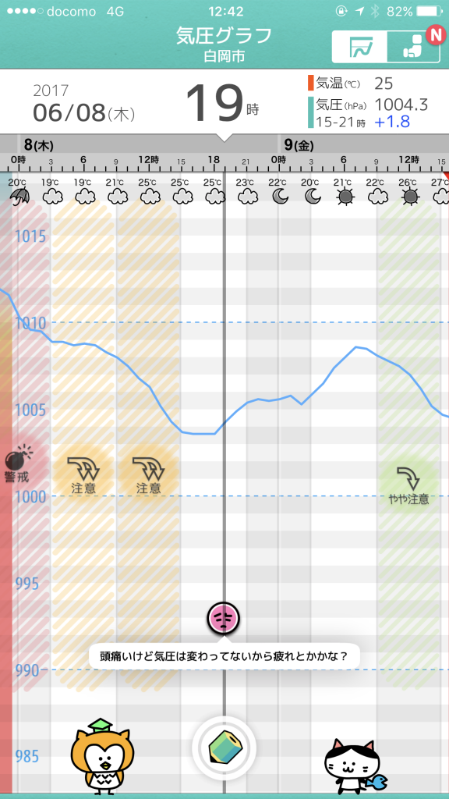
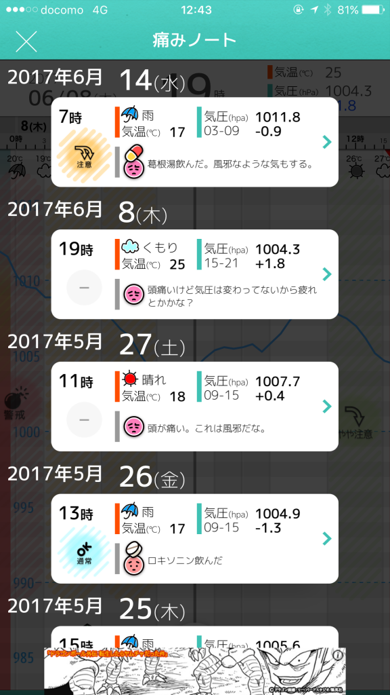

突然ですが頭痛もちです。

頭痛には様々な原因がありますが、わたしの場合、体調不良からくるものと気圧の変化など環境の変化によるもの、この2つのパターンがありました。

しかしこの2つのパターンのどちらか判断がつかないため頭痛がすると、とりあえず風邪と判断して葛根湯を飲んだりしていました。

この頭痛は体調不良によるものか？それとも環境の変化によるものか？

その判断を助けてくれるのが「頭痛ーる」です

<!--more-->

## その頭痛は風邪？気圧？

頭ツールは住んでいる町の気圧変化と一緒に、いつ頭痛がしたか、薬は飲んだかなどを記録できます。

↓こんな具合に気圧のグラフと自分がいつどんなふうに頭が痛かったか記録できます。

記録できるのは以下の3つです。「痛みノート」に記録されます。

- 気圧の変化具合
- 頭痛のひどさ
- 薬の有無
- メモ

↓こんな感じで記録を振り返れます。

## 頭痛に対する判断をアシストしてもらう

こうして記録することで自分の頭痛の傾向が分かります。わたしの場合は気圧が落ちると毎回頭痛がするわけではなく、

- 睡眠不足
- 疲れ
- ストレスが多い

こういったときに気圧の影響を受けやすいと記録から分かりました。

自分の傾向が分かってきたので、気圧も下がっていないときに頭痛がした場合は体調不良と判断するようになりました。気圧による頭痛の場合は、様子を見ながら「ちょっとぐらいなら無理しても大丈夫かな」といった判断しています（たぶん無理はしないほうがいいです）。

こうして判断を助けてもらうことで、頭痛でもすこし気分が楽になります。

## 保存がネック

頭痛ーるのネックは記録の保存です。頭痛ーるの痛みノートは90日間までしか保存できません。約3か月です。

痛みノートを一気にEvernoteなんかに送ることもできません。このあたりはぜひ有料版でもいいから、保存期間を無期限にしてほしいところです。

他にも頭痛を記録した1時間ぐらいあとに「頭痛はどうなった？」と聞いてくれるとさらにいいですね。

記録をもっと役立てるためには「薬を飲んだけどダメだった」とか、「いつの間にか頭痛が治っていた」とか頭痛がした後の情報も大事だと思うんですよね。

役立つアプリなだけにこういったところが改善されるともっとよくなるのになーと個人的に思います。

## 終わりに

ちなみにキャラクターがなかなかヘビーな過去を持っていることでも知られています。この過去を知った後はてるてるねこ（アイコンのキャラ）の見る目が変わりますね。

なにはともあれ、頭痛持ちの方はぜひ試してみてください。

Log is Fun!!

* * *

**[頭痛ーる](https://itunes.apple.com/jp/app/%E9%A0%AD%E7%97%9B%E3%83%BC%E3%82%8B/id602991338?mt=8&uo=4&at=11l5XR)**  
価格: 0円(2017/06/28 22:39)

* * *

  

https://play.google.com/store/apps/details?id=jp.co.pocke.android.zutsu&hl=ja
