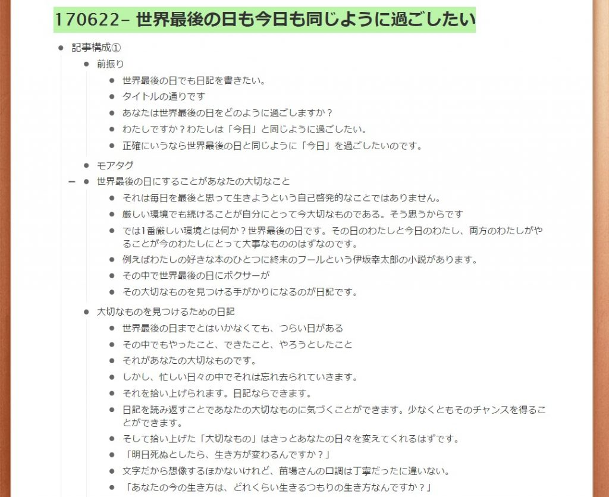
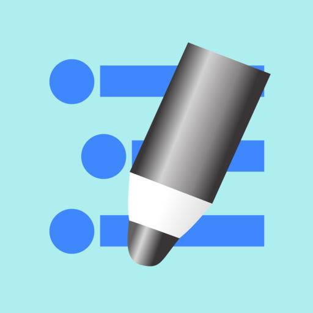
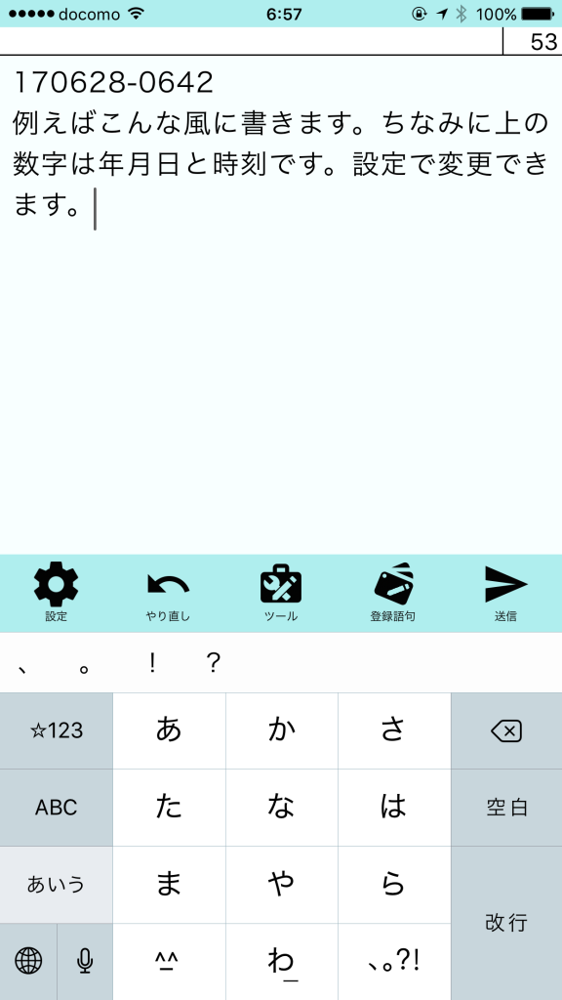
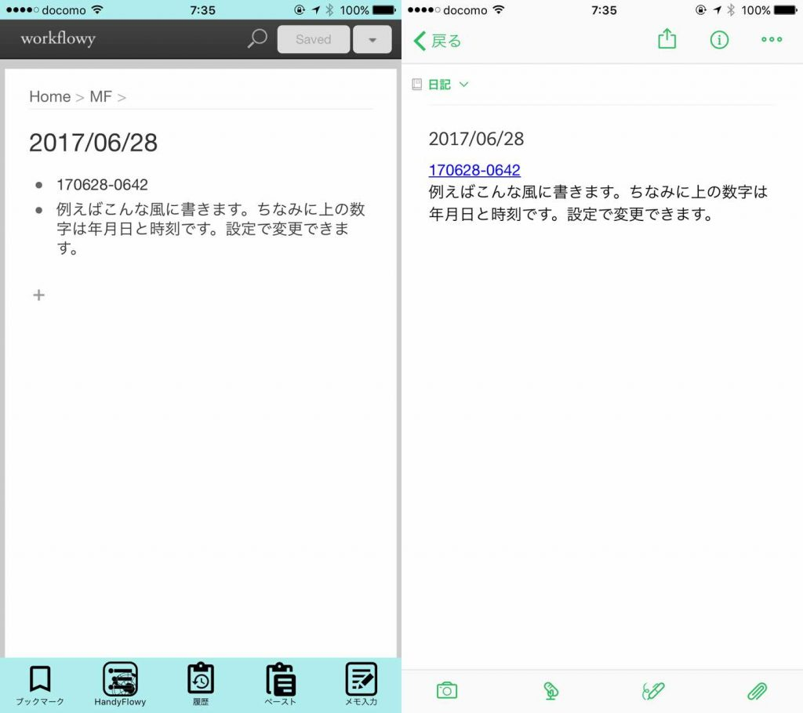
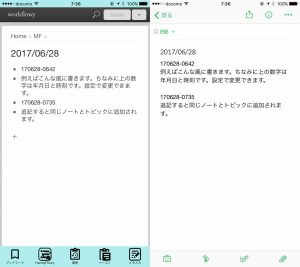
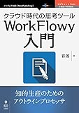

投稿日: {{ page.date | date: '%Y-%m-%d' }}

前回、日記から大切なものを見つけると記事を書きました。

[https://log-is-fun.com/world-last-day/](https://log-is-fun.com/world-last-day/)

では具体的にはどうすればいいのか？workflowyを使った方法をご紹介します。

その前にWorkFlowyで日記を書かないとはじまりません。というわけで今回はWorkFlowyで日記を書く方法です。

<!--more-->

## WorkFlowyとは？

WorkFlowyとはクラウド型のアウトライナーです。大雑把に言うと段差をつけて文章が書けるソフトがアウトライナーです。

wordにもアウトラインモードがあるように、様々なアウトライナーソフトがあります。その一つがWorkFlowyです。

わたしはWorkFlowyを使ってブログを書いています。前回の記事を書いた時のアウトラインがこちらです。画像を見ると大体アウトライナーがどのようなものかイメージできるのではないでしょうか（アイキャッチと同じ画像です）。

## MemoFlowyを使って日記を書く

WorkFlowyで日記を書くためにおすすめのアプリがあります。

MemoFlowyです。

* * *

**[MemoFlowy](https://itunes.apple.com/jp/app/memoflowy/id1052582668?mt=8&uo=4&at=11l5XR)**  
価格: 0円(2017/06/27 20:24)

* * *

私もこのアプリを使って日記を書いています。MemoFlowyで私が一番気に入っているのがWorkFlowyとEvernote両方に同じ内容を送ることができます（有料アドオン）。

例えば下の画像のように書いて送信すると、日付のノート、日付のトピックに追記されます。ない場合はそれぞれのノート、トピックが作成されます。

下の画像のように左のWorkFlowy、右のEvernote両方に同じ内容が記入できます。

追記もこんな感じにできます。

こうしてWorkFlowyとEvernote両方に日記が蓄積されます。

## なぜEvernoteとWorkFlowy両方へ送るのか？

それはEvernoteとWorkFlowy両方に送る理由はそれぞれのツールの使い分けのためです。

WorkFlowyでは各要素（上に載せた画像の・につづく文章部分）を簡単に動かすことができます。大雑把にいえば、WorkFlowyは記録するよりも考えるためのツールです。この部分については次の記事で書きたいと思います。

Evernoteはどちらかというと記録するためのツールです。

Evernoteに同じ内容を送っておくことで、WorkFlowyでその内容を気兼ねなくいじることができます。WorkFlowyに書いてある内容をいつどんなときに書いたのかということもEvernoteを見直すことで分かります。

カーボン紙にうつしを残しておくと安心みたいなイメージです（ちなみにいまカーボン紙ってほとんど使われていないみたいですね）。

こうしてWorkFlowyにも日記の内容を書いておくことで、その次のステップ「日記を見直して、大切なものを見つける」ことがしやすくなります。

## 終わりに

次はWorkFlowyで書いた日記を見直して大切なものリストを作ります。

WorkFlowyについてもっと知りたいかたはこちらが参考になりますよ！

http://www.tjsg-kokoro.com/workflowy/

[クラウド時代の思考ツールWorkFlowy入門 (OnDeck Books（NextPublishing）)\[Kindle版\]](//af.moshimo.com/af/c/click?a_id=765702&p_id=170&pc_id=185&pl_id=4062&s_v=b5Rz2P0601xu&url=http%3A%2F%2Fwww.amazon.co.jp%2Fexec%2Fobidos%2FASIN%2FB01AXRCDU4%2Fref%3Dnosim)

posted with [ヨメレバ](http://yomereba.com)

彩郎 インプレスR&D 2016-01-29

[Kindleで調べる](//af.moshimo.com/af/c/click?a_id=765702&p_id=170&pc_id=185&pl_id=4062&s_v=b5Rz2P0601xu&url=http%3A%2F%2Fwww.amazon.co.jp%2Fexec%2Fobidos%2FASIN%2FB01AXRCDU4%2F)

[Amazon\[書籍版\]で調べる](//af.moshimo.com/af/c/click?a_id=765702&p_id=170&pc_id=185&pl_id=4062&s_v=b5Rz2P0601xu&url=http%3A%2F%2Fwww.amazon.co.jp%2Fexec%2Fobidos%2FASIN%2F4802090579%2F)

Log is Fun!!

* * *

次の記事はこちらです。

https://log-is-fun.com/workflowy2/
