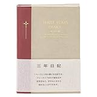

投稿日: {{ page.date | date: '%Y-%m-%d' }}

日記などの記録はなぜ書くのでしょうか。

大辞林で「記録」を調べてみると以下のように出ています。

> きろく【記録】
> 
> ①のちのちまで残すために物事を書きしるすこと。また、その書きしるしたもの。「名前を━する」「━に残す」「━を調べる」
> 
> 大辞林 第三版

つまり記録は「残すため」のものです。そして、なぜ残すのか。それは「読み返す」ためです。日記などの記録を「読み返す」ことでその記録は初めて活きてきます。

では自分が書いた日記を読み返すことにはどんな効果があるのでしょうか？

<!--more-->

## そのときの気持ちをよみがえらせる

たとえば同窓会で久しぶりに中学や高校のときの友人と会うと、嘘みたいに昔のように話せることはありませんか。それは友人との出会いに刺激されて、当時の感情や気持ち、思い出などがよみがえるからです。

日記を読み返しているときにも同じ効果があります。たとえば結婚初日、出産当日などの日記を読み返すことは、その日の気持ちをよみがえらせてくれます。

そこまですごいイベントでなくても、例えば目標を決めた日のことや、友人や家族で笑って楽しかったときの気持ちをよみがえらせてくれます。それが日記です。

## 変化が分かる

気持ちがよみがえることで自分の変化が分かります。「あのときは仕事が大変だったけど、今は楽になったなぁ」とかあるいは「昔と比べてちょっと熱心さがなくなっているんじゃないか」「子どもも成長したなぁ」など、日記を振り返ることでこうした変化が分かります。

こういった変化は長い期間さかのぼって日記を読み返すと分かりやすいです。たとえば一ヶ月前や一年前までさかのぼると変化が良く分かります。

こうした変化を見やすくしてくれるのが3年日記や10年日記です。同じ日を10年分一覧で見ることができるので変化がすぐわかります。しかも書こうとすれば自然と今まで書いたことが目に入ってくるので読み返すことをうながしてくれます。

## 自分を引き継ぐ

人間変わっていきます。それはあたりまえのことです。だから日記で変化が分かります。

しかし、自分にとって変えたくない部分、ポイントもあるはずです。もし変わるのだとしてもいつのまにか変わっているのではなく、自分で納得したうえで変わりたいとわたしは思っています。

そのためには前回までの記事で書いたように大切なものを見つけて、育てていくことが自分の変化が分かる方法の一つじゃないかなと考えています。

[https://log-is-fun.com/workflowy3/](https://log-is-fun.com/workflowy3/)

ちなみにリストが変わるときは前のリストをコピペなどで保存しておくと後からさかのぼれるのでおすすめです。

ほかにも「気持ちをよみがえらせる」の項目でも書きましたが、自分の目標を決めた日の日記を読み返せば、その日の気持ちを思い出すことができます。

たとえば手帳やエクセル、日記帳、Evernoteに目標に関する行動や考えたことを日記から抜き出します。そこに毎日目標に関することを日記から抜き出し、書き足ししていくと自然と今まで抜き出したそこまでの記録も目に入ってきます。

こうすることで自然と目標を決めた日の気持ちのバトンを今日の自分に渡すことができます。読み返すのは毎日などできるだけ頻繁なほうがよいでしょう。

## 終わりに

ここまで効果を書いてきました。でも日記を読み返す一番の効果はやっぱり「楽しい!!」ってことだと思います。日記ではないですけど、例えばグーグルフォトで去年の写真を見返すだけでも楽しくないですか？

楽しいから読み返しますし、読み返せば読み返すほど楽しさは深まります。わたしもまだまだ日記の本当の楽しさが分かってきたばかりだと思っています。

ぜひ日記を読み返して、日記の楽しさに触れてください。

noteにて日記同好会も始めましたので、よろしければこちらもぜひ。

https://note.com/mailman/n/nbe584ebcaeca

Log is Fun!!

* * *

|  |   [アピカ 3年日記 横書き A5 D307 日付け表示なし](//af.moshimo.com/af/c/click?a_id=765702&p_id=170&pc_id=185&pl_id=4062&s_v=b5Rz2P0601xu&url=http%3A%2F%2Fwww.amazon.co.jp%2Fexec%2Fobidos%2FASIN%2FB003BLPMC6%2Fref%3Dnosim)  アピカ  売り上げランキング : 187  <table style="border: none; margin-top: 10px;"><tbody><tr><td style="border: none; text-align: left;"></td><td style="vertical-align: bottom; padding-left: 10px; font-size: x-small; border: none;">by <a href="http://kaereba.com" target="_blank" rel="nofollow noopener noreferrer">カエレバ</a></td></tr></tbody></table>   |
| --- | --- |
