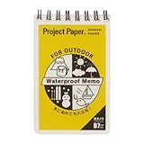
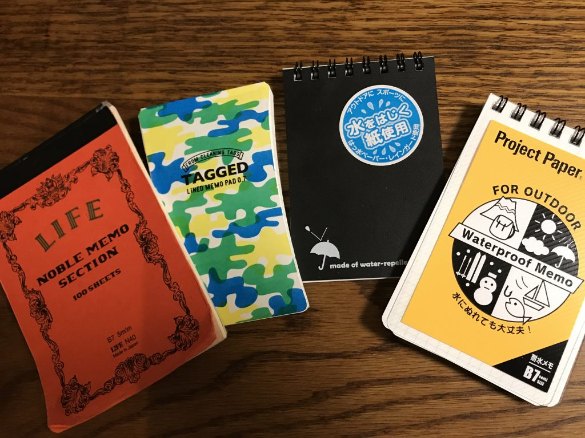
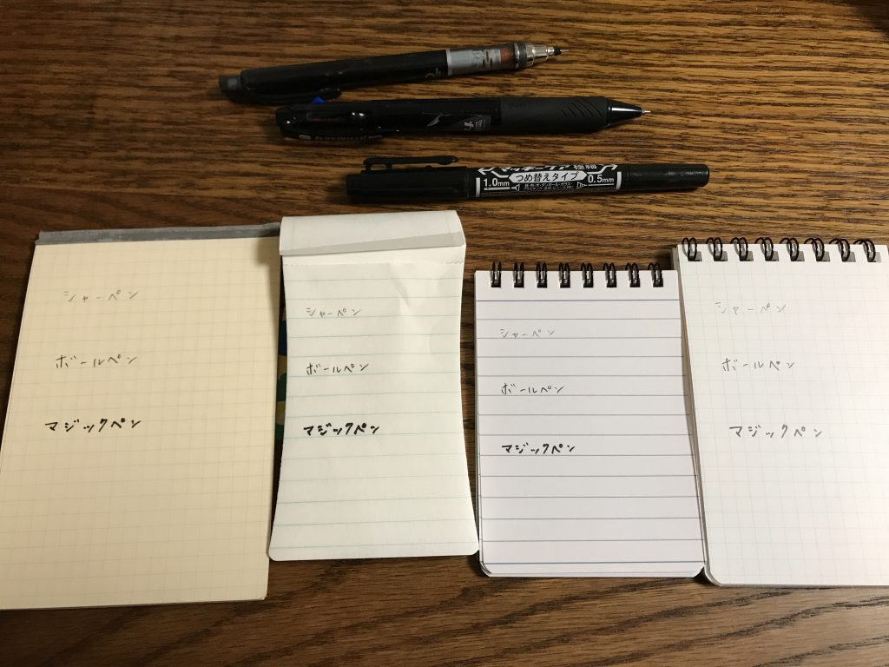
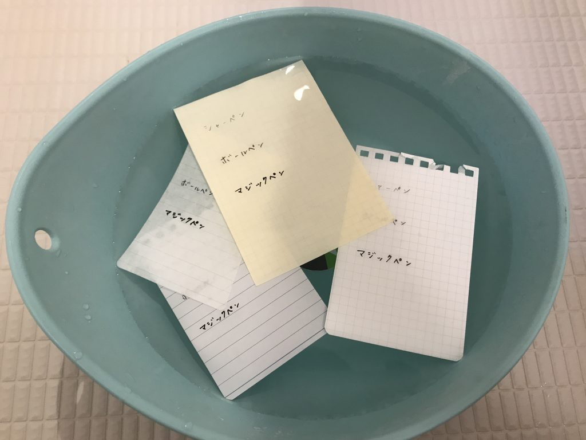
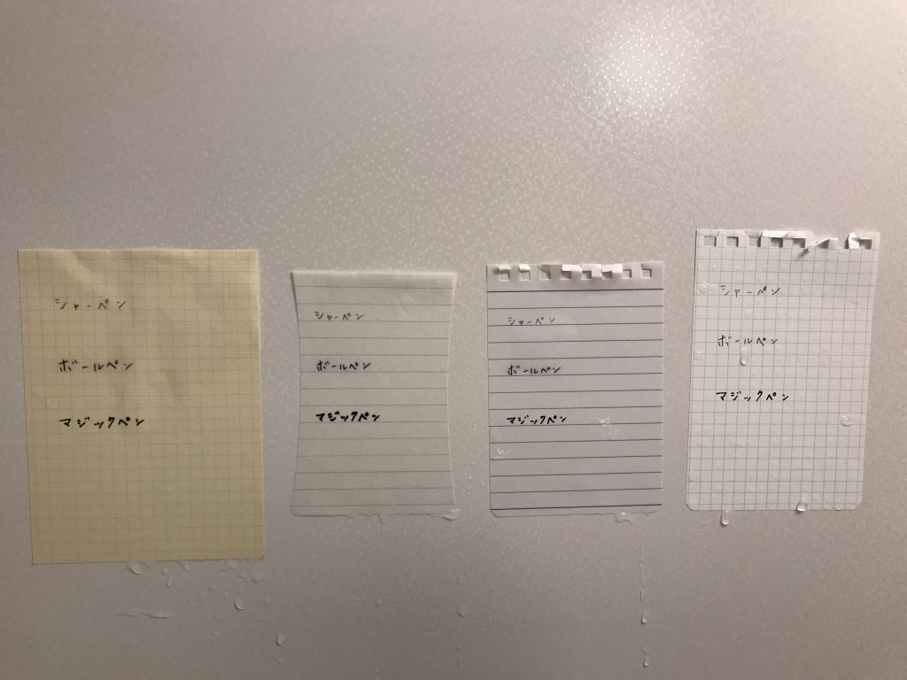
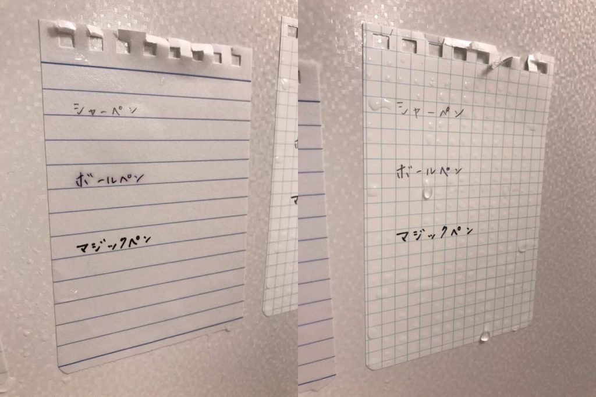
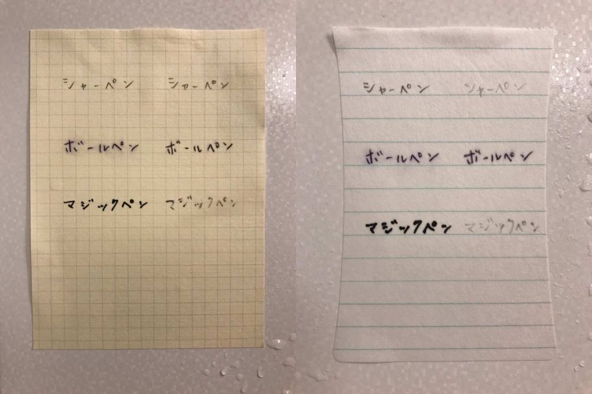
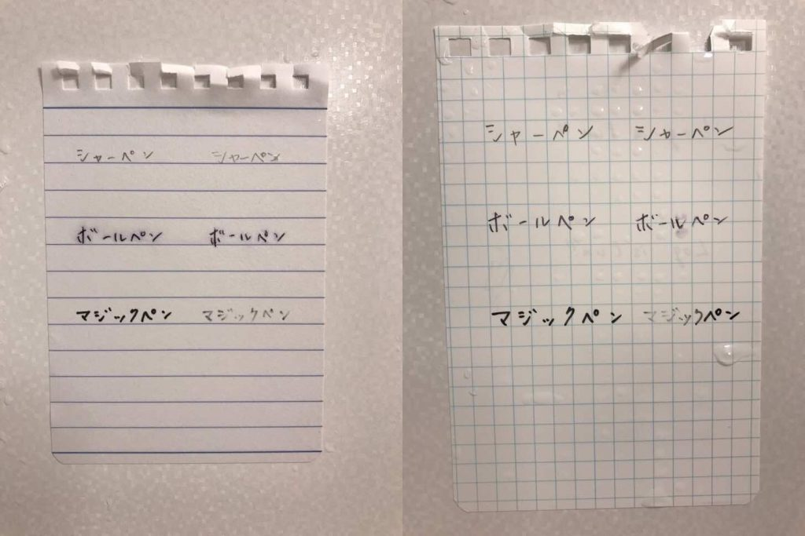
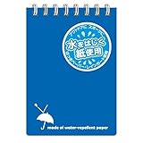

投稿日: {{ page.date | date: '%Y-%m-%d' }}

風呂に入っていて、アイディアが降って来たことはありませんか？

そしてそれをメモすることができずに、なにかいいアイディアだった気がするということだけ残ってもやもやしたことはありませんか？

わたしはあります！（なぜか自慢げ）

そこで風呂でもアイディアを捕まえるためにやり始めたのが「風呂メモ」です。今まで風呂メモするために色々なメモ帳を試してみました。こんなものや、あんなもの。

その結果、たどり着いたのはこのメモでした。

[オキナ プロジェクト耐水メモ B7 PWB7](//af.moshimo.com/af/c/click?a_id=765702&p_id=170&pc_id=185&pl_id=4062&s_v=b5Rz2P0601xu&url=http%3A%2F%2Fwww.amazon.co.jp%2Fexec%2Fobidos%2FASIN%2FB001ADB0EQ%2Fref%3Dnosim)

posted with [カエレバ](http://kaereba.com)

オキナ 2000-07-01

[Amazon](//af.moshimo.com/af/c/click?a_id=765702&p_id=170&pc_id=185&pl_id=4062&s_v=b5Rz2P0601xu&url=http%3A%2F%2Fwww.amazon.co.jp%2Fgp%2Fsearch%3Fkeywords%3D%25E8%2580%2590%25E6%25B0%25B4%25E3%2580%2580%25E3%2583%25A1%25E3%2583%25A2%26__mk_ja_JP%3D%25E3%2582%25AB%25E3%2582%25BF%25E3%2582%25AB%25E3%2583%258A)

[楽天市場](//af.moshimo.com/af/c/click?a_id=765702&p_id=54&pc_id=54&pl_id=616&s_v=b5Rz2P0601xu&url=http%3A%2F%2Fsearch.rakuten.co.jp%2Fsearch%2Fmall%2F%25E8%2580%2590%25E6%25B0%25B4%25E3%2580%2580%25E3%2583%25A1%25E3%2583%25A2%2F-%2Ff.1-p.1-s.1-sf.0-st.A-v.2%3Fx%3D0)

今回はなぜオキナの耐水メモがいいのかをお伝えしたいと思います。

<!--more-->

## １．濡れてもどんどん書ける

風呂メモの条件として、まず挙げられるのが濡れてもどんどん書けることです。

シャワーなどでビショビショでも紙が破けることもなく、この耐水メモはどんどん書くことができます。水中でメモを書くことも可能です。

ちなみに風呂メモに書くときは鉛筆やシャープペンを使いましょう。ボールペンを使うと滲んでしまうことがあります。

## ２．すぐ乾く

風呂メモの次の条件はすぐ乾くことです。

濡れても書けるメモ帳だったとしても、乾かすのに洗濯ばさみに挟んでベランダに干しておく必要があるのでは困ります。

このメモはポリプロピレンをベースに使っているので濡れても紙自体には染み込まないのですぐ乾きます。

また乾いたあともしわしわになりません。

## ３．書き味がいい

ぬれてもどんどん書けることと関連しますが、ぬれてる時の書き味が違います。

書いていて紙にペンが引っかかる感覚がありません。ジェットストリームなどのボールペンで書くと摩擦がなさすぎるぐらいです。シャーペンや鉛筆で書くにはちょうどいい摩擦になっています。

またほかのメーカーの防水メモでは、濡れている状態で書けるけど薄くしか書けないものもありましたが、オキナの耐水メモではそんなことはありません。

## 風呂メモ比較してみた

ここまで読んで「ホントかな？」と思った慎重派のあなたのために、実際に比較をしてみました。

比較したのは以下の4つのメモ帳

１．[ノーブルメモ](http://amzn.to/2tKAFAO)　Life社　すこし上質なのメモ帳

２．[タグドメモパッド](http://amzn.to/2uo8rtl)  ハイモジモジ社　クリーニングタグに使われる「耐洗紙」製メモ帳

３．[レインガードメモ](http://amzn.to/2tfBeld)　アピカ社　撥水加工がしてあるメモ帳

４．[プロジェクト耐水メモ](http://amzn.to/2uIxDu4)　オキナ社　

\[caption id="attachment\_392" align="alignnone" width="680"\] （左から１、２、３、４のメモ帳）\[/caption\]

まずは濡らす前にシャーペン、ボールペン、マジックペンでメモしておきました。

濡らします。

さて結果は？

小さくてわかりにくいですが濡らすだけだと案外どのメモ帳もそこまでにじんだりはしませんでした。これは自分も予想外でした。

しかしオキナの耐水メモに違いがありました。やはりすぐ乾きます。

例えば３のアピカの撥水メモがびしょびしょなのに対して、オキナの耐水メモは水が染み込まず水滴が浮いている状態です。このまま１０分ぐらいおいておけば乾きます。

\[caption id="attachment\_409" align="alignnone" width="680"\] (左がアピカのレインガードメモ、右がオキナの耐水メモ）\[/caption\]

次に濡れた状態でシャーペン、ボールペン、マジックペンで書き込んでみました。メモ帳の左側に書いてあるのが濡れる前に書いた文字。右側が濡れた後に書いた文字です。

１のライフのノーブルメモはマジックペンの文字が薄くなっていますし、シャーペンで書こうとしたら引っかかりがすごかったです。

２のハイモジモジのメモパッドはシャーペン、マジックペンの文字がかなり薄くなっていますし、ボールペンもやや滲んでいます。書き味もあまり良くありません。

\[caption id="attachment\_411" align="alignnone" width="680"\] (左がライフのノーブルメモ、右がハイモジモジのメモパッド）\[/caption\]

３のアピカの撥水メモはなかなか良さそうです。それでもシャーペン、マジックペンの文字が薄くなっていますし、濡れると少し書きにくいです。

最後に４のオキナの耐水メモです。濡れたところのボールペンやマジックペンの部分が滲んだり、薄くなっています。しかしシャーペンは濡れる前と同じように書けました。

\[caption id="attachment\_410" align="alignnone" width="680"\] (左がアピカのレインガードメモ、右がオキナの耐水メモ）\[/caption\]

というわけで風呂でメモ帳が濡れた状態でメモするなら４のオキナの耐水メモが一番という結論になりました。

[オキナ プロジェクト耐水メモ B7 PWB7](//af.moshimo.com/af/c/click?a_id=765702&p_id=170&pc_id=185&pl_id=4062&s_v=b5Rz2P0601xu&url=http%3A%2F%2Fwww.amazon.co.jp%2Fexec%2Fobidos%2FASIN%2FB001ADB0EQ%2Fref%3Dnosim)

posted with [カエレバ](http://kaereba.com)

オキナ 2000-07-01

[Amazonで購入](//af.moshimo.com/af/c/click?a_id=765702&p_id=170&pc_id=185&pl_id=4062&s_v=b5Rz2P0601xu&url=http%3A%2F%2Fwww.amazon.co.jp%2Fgp%2Fsearch%3Fkeywords%3D%25E3%2582%25AA%25E3%2582%25AD%25E3%2583%258A%25E3%2580%2580%25E3%2583%2597%25E3%2583%25AD%25E3%2582%25B8%25E3%2582%25A7%25E3%2582%25AF%25E3%2583%2588%25E8%2580%2590%25E6%25B0%25B4%25E3%2583%25A1%25E3%2583%25A2%26__mk_ja_JP%3D%25E3%2582%25AB%25E3%2582%25BF%25E3%2582%25AB%25E3%2583%258A)

[楽天市場で購入](//af.moshimo.com/af/c/click?a_id=765702&p_id=54&pc_id=54&pl_id=616&s_v=b5Rz2P0601xu&url=http%3A%2F%2Fsearch.rakuten.co.jp%2Fsearch%2Fmall%2F%25E3%2582%25AA%25E3%2582%25AD%25E3%2583%258A%25E3%2580%2580%25E3%2583%2597%25E3%2583%25AD%25E3%2582%25B8%25E3%2582%25A7%25E3%2582%25AF%25E3%2583%2588%25E8%2580%2590%25E6%25B0%25B4%25E3%2583%25A1%25E3%2583%25A2%2F-%2Ff.1-p.1-s.1-sf.0-st.A-v.2%3Fx%3D0)

他にもアピカのレインガードメモは少し書きにくいですけど値段がお手頃なので最初に風呂メモを試すならこちらのほうがいいかもしれません。コンビニにもときどき売ってますしね。

[アピカ レインガードメモ SW59BN A7 青](//af.moshimo.com/af/c/click?a_id=765702&p_id=170&pc_id=185&pl_id=4062&s_v=b5Rz2P0601xu&url=http%3A%2F%2Fwww.amazon.co.jp%2Fexec%2Fobidos%2FASIN%2FB003T9C93A%2Fref%3Dnosim)

posted with [カエレバ](http://kaereba.com)

アピカ

[Amazonで購入](//af.moshimo.com/af/c/click?a_id=765702&p_id=170&pc_id=185&pl_id=4062&s_v=b5Rz2P0601xu&url=http%3A%2F%2Fwww.amazon.co.jp%2Fgp%2Fsearch%3Fkeywords%3D%25E3%2582%25A2%25E3%2583%2594%25E3%2582%25AB%25E3%2580%2580%25E3%2583%25AC%25E3%2582%25A4%25E3%2583%25B3%25E3%2582%25AC%25E3%2583%25BC%25E3%2583%2589%25E3%2583%25A1%25E3%2583%25A2%26__mk_ja_JP%3D%25E3%2582%25AB%25E3%2582%25BF%25E3%2582%25AB%25E3%2583%258A)

[楽天市場で購入](//af.moshimo.com/af/c/click?a_id=765702&p_id=54&pc_id=54&pl_id=616&s_v=b5Rz2P0601xu&url=http%3A%2F%2Fsearch.rakuten.co.jp%2Fsearch%2Fmall%2F%25E3%2582%25A2%25E3%2583%2594%25E3%2582%25AB%25E3%2580%2580%25E3%2583%25AC%25E3%2582%25A4%25E3%2583%25B3%25E3%2582%25AC%25E3%2583%25BC%25E3%2583%2589%25E3%2583%25A1%25E3%2583%25A2%2F-%2Ff.1-p.1-s.1-sf.0-st.A-v.2%3Fx%3D0)

## 終わりに

いかがだったでしょうか？

オキナの耐水メモはすこし他の防水メモ帳と比較するとお高いですが、風呂でストレスなくメモを書くためならその価値はあると思います。

メモを書くときのストレスでアイディアを忘れたりするのは嫌なものですからね。

ぜひ風呂メモを試してみてください！

Log is Fun!!
