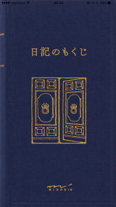
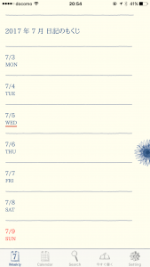
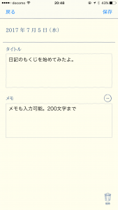
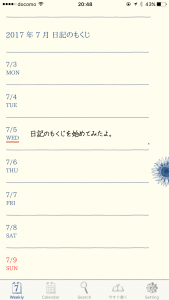
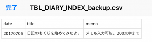

日記を始める方におすすめな日記の書き方が一行日記です。一行日記は手軽に日記の効果が分かる日記といえます。

[https://log-is-fun.com/one-sentence-diary1/](https://log-is-fun.com/one-sentence-diary1/)

そんな一行日記が書きやすいiphoneアプリ「日記のもくじ」が正式にスタートしたみたいなので紹介します。

<!--more-->

## 日記のもくじはこんなアプリ

日記のもくじはシンプルです。記入できるのはその日のタイトルとして50文字。補足のメモとして200文字です。

twitterが140文字ですから、ほぼ2ツイート分に文字数をあえて制限しているアプリといえます。

アプリを起動すると表紙が出ます。この表紙は設定で他の色にすることが可能です。

次に日記を書いてみます。週間カレンダー画面が表示されるので書きたい日付のところをタップします。

タイトルとメモ入力画面はこんな感じ。

入力するとタイトルがカレンダーに表示されます。メモは表示されません。

下のメニューから月間カレンダー画面や検索画面、当日の日記をすぐ書く画面に移動することができます。

さらにバックアップもしっかりしていて、メールでcsvファイルを送ることができます。

こんな感じの表形式になります。

エクセルやgoogleスプレッドシートなどで保存することが可能です。日記を読み返すならこの表形式の方が読み返しやすいと思います。

読み返しの効果については以下の記事をどうぞ。

[https://log-is-fun.com/effect-of-review1/](https://log-is-fun.com/effect-of-review1/)

## 一行日記に使いやすい

ここまでのアプリ画面やバックアップして表形式になった日記をご覧になると分かると思います。一行日記がすごい書きやすいアプリです！

タイトルが50文字までになっているのも秀逸で、文字数に制限があることで自分にとって今日何が一番大切なのかを絞れるようになっています。

物足りなければメモ欄に200文字書けばいいんです。そこでも物足りなければ、手書きの日記帳に書いたり、ほかの日記アプリに移るのもいいですね。

## 日記を始めるのにぴったり

日記を書く分量が少ないので、日記が習慣になっていない方でも始めやすいアプリだと思います。

アプリにはタイトルを書くためのアラームと、日記を書くためのアラームがついているので、日記書き忘れ防止にもなります（設定画面から時間を設定できます）。

そして前の項目にも書いたように、物足りなくなってきたら日記帳を買ったり、Evernoteなどほかのアプリを使っていくこともできます。

日記を始めるだけでなく、日記を習慣づけることやできるアプリだと思います。またシンプルなので他の日記の書き方（手書きの日記帳や日記アプリなど）ともコラボしやすいアプリです。

追記:エクセルとコラボさせてみました。

[https://log-is-fun.com/nikkinomokuji2/](https://log-is-fun.com/nikkinomokuji2/)

## アプリ評価

日記に大事な「手軽さ」、「検索性」、「自由度」、「携帯性」、「保管しやすさ」の項目でまとめてみました。

|   | 日記のもくじ |
| --- | --- |
| 手軽さ | ◎：手軽に書ける。無料。 |
| 検索性 | ◎：検索しやすい |
| 自由度 | △：あえて自由度を狭くしている |
| 携帯性 | ◎：持ち歩きやすい |
| 保管 | △：手動バックアップ機能あり |

## 終わりに

この日記のもくじを出してるデザインフィルってどんな会社かなと思って調べたら、あの[MDノート](http://www.midori-japan.co.jp/md/)だしている会社だったんですね。手書きの日記書いているときお世話になってました。あの書き心地がいいんですよね～

日記のもくじのプレスリリースにあった、この文章はまさしく当ブログがやりたいことでもあります。

> 一方で、「日記を書きたい気持ちはあるけれど、なかなか続かない」という声も多く聞かれます。 このような悩みを解消し、日記の楽しさをより多くの方に知っていただくために、何かサポートできることはないだろうか、という想いから社内でプロジェクトが立ち上がり、『日記のもくじ』が誕生しました。  
>   
> [プレスリリース | 『日記のもくじ』本サービス開始のご案内](http://www.designphil.co.jp/press/web2017/170627_nikki.html)

日記のもくじを微力ながら応援していきたいと思います！

Log is for Happy!!

* * *

**[日記のもくじ](https://itunes.apple.com/jp/app/%E6%97%A5%E8%A8%98%E3%81%AE%E3%82%82%E3%81%8F%E3%81%98/id1183692012?mt=8&uo=4&at=11l5XR)**  
価格: 0円(2017/07/06 17:49)

* * *

Amazonにて拙著「日記のすすめ」好評発売中です！

[日記のすすめ: 日記で人生はもっと楽しくなる!!\[Kindle版\]](//af.moshimo.com/af/c/click?a_id=765702&p_id=170&pc_id=185&pl_id=4062&s_v=b5Rz2P0601xu&url=http%3A%2F%2Fwww.amazon.co.jp%2Fexec%2Fobidos%2FASIN%2FB078MNHHPZ)

posted with [ヨメレバ](https://yomereba.com)

ゆうびんや 2017-12-25
