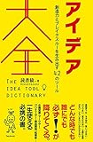

以前のWorkFlowyについての記事でじぶんの大切なものを見つけるプロセスをご紹介しました。

* * *

関連記事  
[世界最後の日にも日記を書きたい～日記で大切なものをみつける～](https://log-is-fun.com/world-last-day/)  
[WorkFlowyで自分にとって大切なものを見つける方法～日記を書く編～](https://log-is-fun.com/workflowy1/)  
[WorkFlowyで自分にとって大切なものを見つける方法～日記を振り返る編～  
](https://log-is-fun.com/workflowy2/)[WorkFlowyで自分にとって大切なものを見つける方法～リストを育てる編～](https://log-is-fun.com/workflowy3/)

* * *

そしてみなさまお気づきのようにこのプロセスは自分の大切なもの以外でも、もちろん使えます。

今回は目の前にある問題をもぐらたたきのようにつぶしていくのではなく、その裏に隠れている問題をWorkFlowyをつかって見つけ出す方法をご紹介します。

<!--more-->

## 自分が問題と思っているものをひたすら書き出す。

まずはWorkFlowyにじぶんが問題だと思っているものをひたすら書き出します。

どんな些細なことでもかまいません。どんどん書いていきます。書いたものから連想して思いついたものもまた書きます。

どんどん書いてください。遠慮はいりません。どんどん行きましょう。どんどん。

一通りできったかなと思ったら、いったん終わりです。

書き出した問題の中にどうしても今日中や今すぐにやらなければいけない問題がなければとりあえず書き出したものは放っておきましょう。

### 問題を書き出した例

- 体を動かすのが足りない
- 帰る時間が遅い
- 寝不足
- 勉強したい
- 子どもが起きている時間に帰れない
- 英会話行きたい
- 何がやりたいかわからない
- などなど

## どんどん書き出す効果

こうして書き出した時点で副次的に以下のような効果があります。この効果だけでも書き出す価値はあると思います。

### すっきりする

書き出すとすっきりします。本当です。もしあなたがいまもやもやしていることがあったら、紙やパソコンに1分間もやもやしていることを書き出してみてください。

書き出した後、気分がスッキリしていることが分かるはずです

### 客観化できる

問題を紙に書き出したことで、問題を頭の中だけで考えるより客観的に見ることができます。

考えているときはすごい大変な問題だと感じていたことでも書き出してみると「あれ、たいしたことないぞ？」となるのはよくあります。解決策も思いつきやすくなります。

自分の感情を書き出す「ラべリング」と似た効果があると言えます。

ラベリングについてはこちらの記事をどうぞ。

[https://log-is-fun.com/effect-of-diary2/](https://log-is-fun.com/effect-of-diary2/)

### 自分が認めたくないような問題でも書き出せる。

どんどん書き出すことで自分の中の理性的、反省的思考からの関与を減らします。

これは「アイデア大全」の中の「ノンストップライティング」の項目で以下のように述べられています（アイデア大全おもしろいですよ！）。

> 「仮想の読み手」の中核をなす反省的思考は、認知的リソースを消耗するから、それほど素早くは反応できない。そこで、際限なく書き続けることで「仮想の読み手」をオーバーフローさせるのである。
> 
> アイデア大全 No.545

こうして「仮想の読み手」＝理性的、反省的思考をオーバーフローさせることで、大したことないと思っている問題や、書き出すのをためらうこと、認めたくない問題（例えば誰かを嫉妬しているけど認めたくない）なども書き出すことができます。

[アイデア大全\[Kindle版\]](//af.moshimo.com/af/c/click?a_id=765702&p_id=170&pc_id=185&pl_id=4062&s_v=b5Rz2P0601xu&url=http%3A%2F%2Fwww.amazon.co.jp%2Fexec%2Fobidos%2FASIN%2FB06XFPYZ8P%2Fref%3Dnosim)

posted with [ヨメレバ](http://yomereba.com)

読書猿 フォレスト出版 2017-03-09

[Kindleで探す](//af.moshimo.com/af/c/click?a_id=765702&p_id=170&pc_id=185&pl_id=4062&s_v=b5Rz2P0601xu&url=http%3A%2F%2Fwww.amazon.co.jp%2Fexec%2Fobidos%2FASIN%2FB06XFPYZ8P%2F)

[Amazon\[書籍版\]で探す](//af.moshimo.com/af/c/click?a_id=765702&p_id=170&pc_id=185&pl_id=4062&s_v=b5Rz2P0601xu&url=http%3A%2F%2Fwww.amazon.co.jp%2Fexec%2Fobidos%2FASIN%2F4894517450%2F)

## シェイクして真の問題に対処する

問題を書き出すのを一日だけで終わらせずに1週間ほど続けてみます。書き出し続けることで日々の感じている問題についてのリストが蓄積されていきます。必要ならもう少し長い期間続けてみましょう。

そこで蓄積された問題リストをシェイクします。シェイクすることで、問題への共通点が出てきます。シェイクとは簡単に言えばトップダウンとボトムアップ両方から考える手法です。

シェイクについては詳しくはこちらをご覧ください。

[https://log-is-fun.com/workflowy3/](https://log-is-fun.com/workflowy3/)

シェイクすることで、これらの問題にはこういう共通点がある。上のカテゴリーに隠れているのはこんな問題であるといったことが分かってきます。このシェイクで発見した問題は自分が抱えている問題群の急所ともいえるものです。

急所に力をかければ一気に問題群の解決が見えてきます。急所＝真の問題です。この真の問題が見えれば、日々の生活をどう過ごすか、どいうったところに力をかければいいのか、どこを変えるといいのかが分かってきます。

### 問題群の上に隠れている問題を発見した例

- **時間管理、やること管理、スケジュール管理ができていない（真の問題）**
    - 体を動かすのが足りない
    - 帰る時間が遅い
    - 寝不足
    - 勉強したい
    - 子どもが起きている時間に帰れない
    - 英会話行きたい
    - 何がやりたいかわからない

## 終わりに

いかがだったでしょうか。自分の抱えている真の問題が分かっているだけでも気持ちが楽になりますよ。

Log is Fun!!

* * *

シェイクなどアウトライナーについてもっと知りたい方はこちらがおすすめです。

[アウトライン・プロセッシング入門: アウトライナーで文章を書き、考える技術\[Kindle版\]](//af.moshimo.com/af/c/click?a_id=765702&p_id=170&pc_id=185&pl_id=4062&s_v=b5Rz2P0601xu&url=http%3A%2F%2Fwww.amazon.co.jp%2Fexec%2Fobidos%2FASIN%2FB00XCIETIG%2Fref%3Dnosim)

posted with [ヨメレバ](http://yomereba.com)

Tak. 2015-05-07

[Kindleで調べる](//af.moshimo.com/af/c/click?a_id=765702&p_id=170&pc_id=185&pl_id=4062&s_v=b5Rz2P0601xu&url=http%3A%2F%2Fwww.amazon.co.jp%2Fexec%2Fobidos%2FASIN%2FB00XCIETIG%2F)
