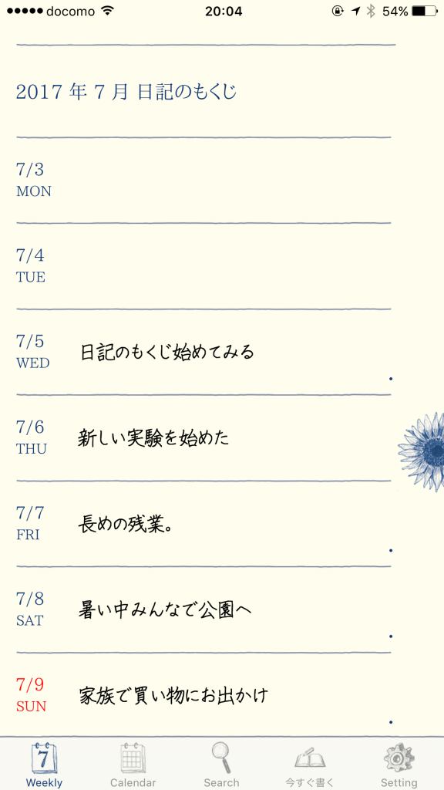
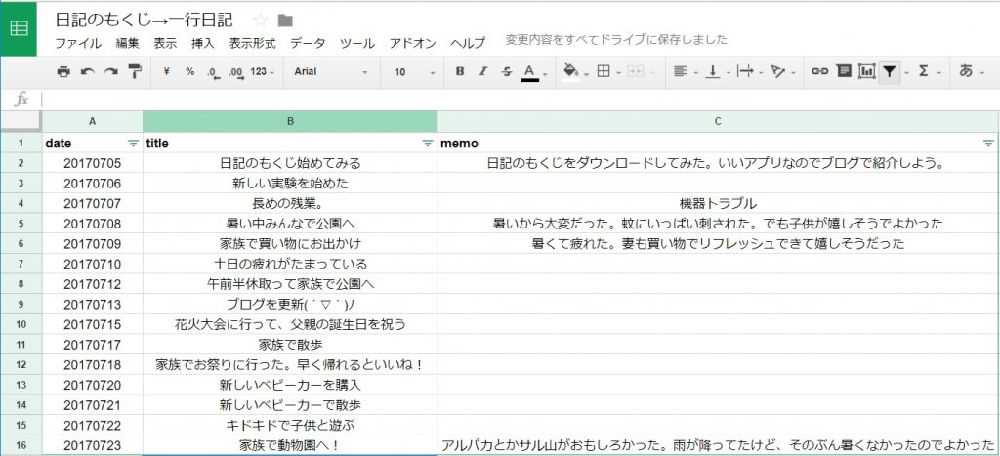
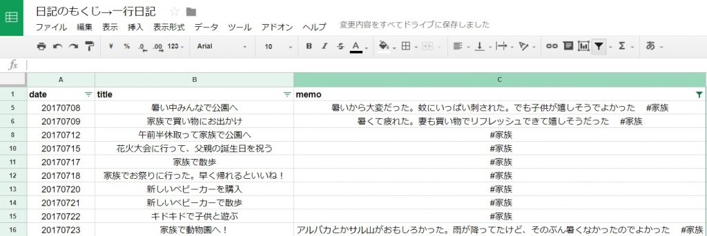

投稿日: {{ page.date | date: '%Y-%m-%d' }}

以前ご紹介したアプリ「日記のもくじ」を3週間ほど使ってみました。日記を始めるのに適したアプリだとあらためて感じます。

日記のもくじはシンプルなアプリです。記入できるのはその日のタイトルとして50文字。補足のメモとして200文字です。

この日記のもくじを使うと一行日記が簡単に書けます。

[https://log-is-fun.com/nikkinomokuji/](https://log-is-fun.com/nikkinomokuji/)

今回は日記のもくじのバックアップ機能を使って、エクセルやgoogleスプレッドシートとくみあわせると楽しかったのでご紹介します。

日記を読み返すのに便利ですよ！

<!--more-->

## バックアップ機能を使って一覧でみる

日記のもくじはいいアプリです。しかし一覧性に欠けます。

このように1週間分のタイトルしか一気に読み返せません

一日一日をゆっくり振り返るのにはいいですが、どうせなら俯瞰的な視点から日記を読み返したいこともあります。

そこで日記をある程度書いたらバックアップ機能を使います。

画面右下の設定からバックアップをタップすると、好きなメルアドにバックアップデータを添付して送ることができます。

このバックアップをエクセルやスプレッドシートで開けば、このように日記をざっと見やすくなります

今回は無料で使えるgoogleスプレッドシートにバックアップデータをコピペしてみました。

このように一覧で見られることで自分が1週間、1か月の間に何をしていたかが分かります。

## フィルター機能を使う

さらにフィルター機能を使えば自分が読み返したいもののみをピックアップできます。

単純に家族などのワードでフィルターしてもいいですが、たとえば家族に関する日記には#家族と記入しておきます。

このようにタグをつけておくことで家族に関することのみ日記から抜き出すことができます。

\[caption id="attachment\_553" align="alignnone" width="680"\] メモに#家族を含むでフィルター\[/caption\]

ほかにもいい一日だった！と思えるような日には#GOODのようなタグをつけてフィルターすることで、自分がどんなことを最高と思っているかわかります。

このように日記のもくじのバックアップ機能とエクセルやgoogleスプレッドシートのフィルター機能を使うことでポイントを絞った読み返しできるようになります。

## 終わりに

日記のもくじとエクセルなどを組み合わせることでポイントを絞って日記を読み返すことができます。

日記のもくじとエクセルやgoogleスプレッドシートを組み合わせて楽しい日記ライフを！

Log is Fun!!

* * *

**[日記のもくじ](https://itunes.apple.com/jp/app/%E6%97%A5%E8%A8%98%E3%81%AE%E3%82%82%E3%81%8F%E3%81%98/id1183692012?mt=8&uo=4&at=11l5XR)**  
価格: 0円(2017/07/25 12:44)

* * *
