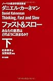

投稿日: {{ page.date | date: '%Y-%m-%d' }}

## はじめに

この記事はkindle出版を目指している「日記のすすめ（仮）」の一部です。

日記の効果について書いた章の一部になります。

今回の記事が「日記のすすめ（仮）」についての最初の記事です。以下のまとめページに更新していく予定です。

https://log-is-fun.com/book-how-to-start-diary/

## 幸せのロングテール

「幸せのロングテール」を知っていますか？

え、知らないですか。そうですか。すみません、実は何を隠そうわたしが考えたものです。

ロングテールとはAmazonなどのネットショッピングの販売手法として有名になりました。

普通の商売ではだいたい20％の売れすじ商品が80％の売上を稼ぎます([80：20の法則](http://amzn.to/2hclj3r)として有名ですね）。

現実の店舗では売り場の面積が限られるため、この20%の売れ筋商品を中心に商売をします。

しかし、Amazonのようなネットショッピングの場合は売り場の面積に縛られません。残りの80%の商品を少しずつ売ることで合計すれば20%の売れ筋商品を上回る売り上げを上げることができます。

グラフの長い部分がしっぽのように見えるためにロングテールと呼ばれます。

* * *

参考記事　[ロングテール - Wikipedia](https://ja.wikipedia.org/wiki/%E3%83%AD%E3%83%B3%E3%82%B0%E3%83%86%E3%83%BC%E3%83%AB)

* * *

そのロングテールが幸せとどう関係あるんだ？と思われたかもしれません。そこには人間の忘れっぽさが関係してきます。

人間の記憶には限りがあります。すべてを覚えることはできません。だから重要なことのみ記憶に残し、そのほかのささいなことは忘れてしまいます。

しかし日記に書いておけばずっと残しておくことができます。

つまり人間の記憶＝現実の店舗、日記＝ネットショッピングと考えられます。そして現実の店舗であれば、どんな商品を仕入れるかは選べます。しかし記憶の場合なにを覚えるかは選べなません。

例えば、運動することが大好きな男性がいるとしましょう。運動ができれば1日を幸せと感じる。逆に運動できなければダメな一日と感じてしまいます。

この男性にとっては「運動すること」＝「売れ筋商品」となります。

ある日その男性は友人の仕事の手伝いをすることになり、一日運動ができませんでした。その日の夜男性は思います。今日は運動できなくてダメな一日だったなと。

このように毎日幸せな記憶、この男性の場合は「運動する」という売れ筋商品を仕入れることはできません。

しかし日記があれば違います。

普段であれば忘れるようなささいな幸せやうれしかったことも、日記を読み返すことで仕入れることができるのです。

たとえば例の男性の一日の出来事には、友人の仕事を手伝うことで違う領域の仕事が学べて刺激になったこと、ほかにも手伝いを感謝されてうれしかったこともありました。移動中の電車からきれいな夕日がみえたりもしました。

こうしたことも忘れてしまえばなかったことになります。

しかし日記を書くことでこうしたささいなことも仕入れることができるのです。こうした些細なことも合わされば、自分にとって重要だと思っていることに匹敵するぐらい大切になってくるのです。

またこうした小さな幸せであるとわかってくれば、その小さな幸せを仕入れるように意識することができます。

つまり幸せのロングテール理論とは、日記による無限の品ぞろえで大きな幸せという売れ筋商品だけでなく、小さな些細な幸せも仕入れられるようにすることで充実した日々を過ごせるという考え方です。

また自分自身の売れ筋商品そのものを忘れてしまうこともしばしばあります。家族のために働いていたはずが忙しく仕事をしているうちに家族のことをないがしろにしてしまったというのはよく聞く話です。

自分にとってなにが大切かを日記で把握することが日々充実してすごすためのコツといえます。

続き→[\[日記のすすめ(仮)\]日記で幸せへの第一歩を踏み出す](https://log-is-fun.com/how-to-be-happy/)

## おわりに

ちなみにどうやって大切なものをみつけるかということを書いたのが以下の関連記事です。

関連記事  
[世界最後の日にも日記を書きたい～日記で大切なものをみつける～](https://log-is-fun.com/world-last-day/)  
[WorkFlowyで自分にとって大切なものを見つける方法～日記を書く編～](https://log-is-fun.com/workflowy1/)  
[WorkFlowyで自分にとって大切なものを見つける方法～日記を振り返る編～  
](https://log-is-fun.com/workflowy2/)[WorkFlowyで自分にとって大切なものを見つける方法～リストを育てる編～](https://log-is-fun.com/workflowy3/)

今後も週一で「日記のすすめ（仮）」を更新していく予定です。ちなみに（仮）がついているのはもっといいタイトルがあるんじゃないかと優柔不断にしているからです(笑)

他の記事が気になる方はまとめページを時々チェックしてみてください。

https://log-is-fun.com/book-how-to-start-diary/

Log is Fun!!

* * *

参考文献

[ファスト&スロー(下) あなたの意思はどのように決まるか? (ハヤカワ・ノンフィクション文庫)](//af.moshimo.com/af/c/click?a_id=765702&p_id=170&pc_id=185&pl_id=4062&s_v=b5Rz2P0601xu&url=http%3A%2F%2Fwww.amazon.co.jp%2Fexec%2Fobidos%2FASIN%2F4150504113%2Fref%3Dnosim)

posted with [ヨメレバ](http://yomereba.com)

ダニエル・カーネマン 早川書房 2014-06-20

[Amazonで探す](//af.moshimo.com/af/c/click?a_id=765702&p_id=170&pc_id=185&pl_id=4062&s_v=b5Rz2P0601xu&url=http%3A%2F%2Fwww.amazon.co.jp%2Fexec%2Fobidos%2FASIN%2F4150504113%2Fref%3Dnosim)

[Kindleで探す](//af.moshimo.com/af/c/click?a_id=765702&p_id=170&pc_id=185&pl_id=4062&s_v=b5Rz2P0601xu&url=http%3A%2F%2Fwww.amazon.co.jp%2Fexec%2Fobidos%2FASIN%2FB00ARDNMDC%2F)

[楽天ブックスで探す](//af.moshimo.com/af/c/click?a_id=765703&p_id=56&pc_id=56&pl_id=637&s_v=b5Rz2P0601xu&url=http%3A%2F%2Fbooks.rakuten.co.jp%2Frb%2F12788226%2F)

[7netで探す](//af.moshimo.com/af/c/click?a_id=765667&p_id=932&pc_id=1188&pl_id=12456&s_v=b5Rz2P0601xu&url=http%3A%2F%2F7net.omni7.jp%2Fsearch%2F%3FsearchKeywordFlg%3D1%26keyword%3D4-15-050411-3%2520%257C%25204-150-50411-3%2520%257C%25204-1505-0411-3%2520%257C%25204-15050-411-3%2520%257C%25204-150504-11-3%2520%257C%25204-1505041-1-3)

 第5部の「記憶する自己」と「経験する自己」についての話は日記のことを考えるうえでかなり刺激になりました。
