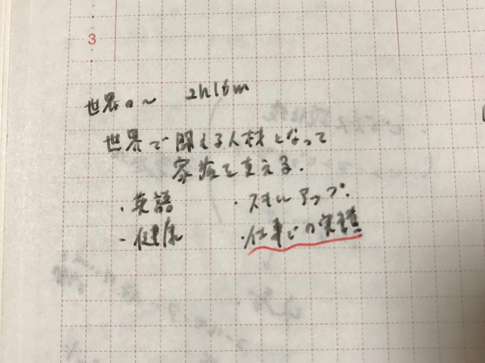
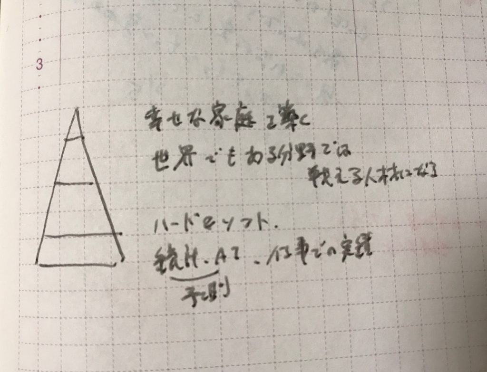
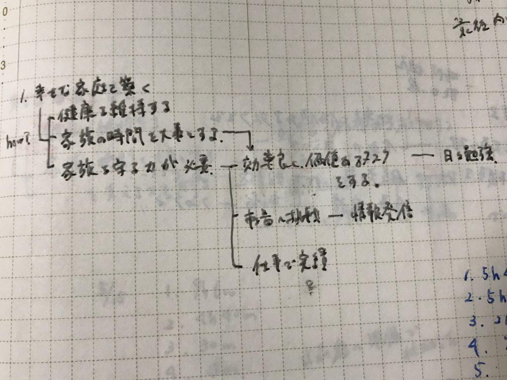
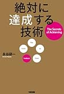

手帳に一年の目標を書いておき、いつでも読めるようにしていました。

でもふと思いました。目標ってずっと一緒だろうか？日々環境は変化していくのに一年間目標は一緒なのか？

もちろん同じなこともあります。しかし変わっているのに最初に決めたからとそのままにしていることもあります。

こんなことも思いました。年のはじめに頭だけで考えた目標はわたしの本当の目標か？それは正月の雰囲気にのまれた目標になっていないか？

しかし忙しい日々の中で目標を見直していくことはなかなか手間です。

その手間を省く、手軽な目標の見直し方法があります。

毎日手帳に書けばいいのです。

<!--more-->

## 目標をなぜ書くのか？

目標を毎日書く理由。それは見るのはスルーできるが、書くのはスルーできないということです。

たとえば部屋に目標を貼ってあったのにいつのまにか慣れて風景と同化していたことはありませんか（わたしはありました）。

しかし書けばそうしたスルーはできません。しっかりと頭の中に入っていきます。

そして、目標を書く中でその目標は今の自分に合っているだろうか、もっと他の目標はないだろうか？

あるいはもっと広い視点での目標はないか、あるいはもっと目標をこまかくできないだろうかと考えることができます。

目標を毎日書くことでどんどん育っていくのです。

そして手書きなら、目標の書き方は自由自在です。箇条書きでも、マインドマップでも、なんなら絵でも詩でも目標を書けます。

## どんなふうに育つの？

実例を見てもらうとより分かりやすいと思うので、わたしの具体例をご紹介したいと思います。

 まず最初です。簡単なメモ書きみたいなものでした。

上に「世界の～」と書いてあるので本を読んでこうなりたいなと思ったものを書いたのだと思います。

30日ほど書いていくと少しずつ変化します。こうなりました。

ピラミッド型で優先順位を表しています。「幸せな家庭を築く」ことが最優先課題であることに書いていく中で気づけました。

最後はこのような階層構造になりました。アウトライナーのWorkFlowyをいじりだした影響もあったのかもしれません。

おととしのほぼ日手帳から目標を抜き出しました。二年後のいまではまた違う目標に変わっています。こうした目標の変化がわかるのも楽しいですね。

## 目標だけでなく自分も変化する

このように手帳に目標を書くことで今の自分と目標との差が自然と分かってきます。その差が分かるからこそ目標が変化していくのだと思います。

もしくは目標は変化しなくても、自分自身が変化していってることもあります。

毎日目標を書くわけですから、自然と目標が頭にインプットされています。だから目標に関することへのセンサーも自然と強化されます。

本を100冊読むのが目標だったら、本が読める隙間時間に敏感になるでしょう。ある分野を勉強したいのであれば、本屋ではその分野に関連する本が自然と目に入ってくるはずです。

書くことでなりたい姿へ近づけるのです。以下は日記に関してですが書くことでなりたい自分に近づけると書いた記事です。

[https://log-is-fun.com/effect-of-diary3/](https://log-is-fun.com/effect-of-diary3/)

手帳に目標を書くことも同様の効果があるのだと思います。

## 終わりに

手帳に目標を書くのは時間があるなら朝や始業前が良いと思います。朝のほうが頭も回っていますし、目標を頭にインプットするのは一日の初めが合理的です。

3分ぐらいでできるおすすめの手帳活用法です。もちろん手帳以外でもできますよ。

ぜひお試しあれ！

Log is Fun!!

* * *

目標って何だろうというかたにはこちら！

kindle unlimited対象です。

紹介記事：[目標がうまく扱えていないあなたに「「目標」の研究」をおすすめします](https://log-is-fun.com/mokuhyou-kennkyu/)

[「目標」の研究\[Kindle版\]](//af.moshimo.com/af/c/click?a_id=765702&p_id=170&pc_id=185&pl_id=4062&s_v=b5Rz2P0601xu&url=http%3A%2F%2Fwww.amazon.co.jp%2Fexec%2Fobidos%2FASIN%2FB01MXXFY28%2Fref%3Dnosim)

posted with [ヨメレバ](https://yomereba.com)

倉下忠憲 R-style 2016-12-11

[Kindleで探す](//af.moshimo.com/af/c/click?a_id=765702&p_id=170&pc_id=185&pl_id=4062&s_v=b5Rz2P0601xu&url=http%3A%2F%2Fwww.amazon.co.jp%2Fexec%2Fobidos%2FASIN%2FB01MXXFY28%2F)

目標達成系の本ではこちらがLog is Fun!!的おすすめです。 

[絶対に達成する技術 (中経出版)\[Kindle版\]](//af.moshimo.com/af/c/click?a_id=765702&p_id=170&pc_id=185&pl_id=4062&s_v=b5Rz2P0601xu&url=http%3A%2F%2Fwww.amazon.co.jp%2Fexec%2Fobidos%2FASIN%2FB00E5V5T88%2Fref%3Dnosim)

posted with [ヨメレバ](http://yomereba.com)

永谷 研一 KADOKAWA / 中経出版 2013-07-29

[Kindleで探す](//af.moshimo.com/af/c/click?a_id=765702&p_id=170&pc_id=185&pl_id=4062&s_v=b5Rz2P0601xu&url=http%3A%2F%2Fwww.amazon.co.jp%2Fexec%2Fobidos%2FASIN%2FB00E5V5T88%2F)

[Amazon\[書籍版\]で探す](//af.moshimo.com/af/c/click?a_id=765702&p_id=170&pc_id=185&pl_id=4062&s_v=b5Rz2P0601xu&url=http%3A%2F%2Fwww.amazon.co.jp%2Fexec%2Fobidos%2FASIN%2F4046026065%2F)

