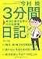
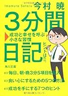
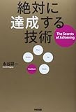

今回ご紹介するのは3分間日記です。

[3分間日記 成功と幸せを呼ぶ小さな習慣 (角川文庫)](http://www.amazon.co.jp/exec/obidos/ASIN/4041005736/do0909-22/)

今村 暁

本のタイトルにもあるように、「日記を書くことで夢や目標を達成しよう」というのがコンセプトになっています。

ではどんな日記の書き方なのか？さっそく見ていきましょう

<!--more-->

## 3分間日記の特徴

3分間日記の特徴は以下の３つです

### １. 目標の達成が主眼

この日記は記録という面ももっています。しかしより夢や目標の達成を重視した日記の書き方になっています。

たとえば毎日目標を書くことが目標達成に重点を置いていることを表しています。

### ２. ５つの項目に記入するだけで定着させやすい

項目が決まっているので書きやすいです。

たとえば真っ白な紙に好きに絵を描いてくださいと言われれば、絵をずっとかいていた人ならともかく、絵を描きなれていない人であれば、まず最初に手が止まるはずです。

犬の絵を描いてくださいなどお題が決まっていたほうが描きやすいと思います。

それと同じで3分間日記も項目が決まっているので書きやすいです。

### ３．朝と夜に書く

朝と夜に書くことで日記に対する一回のハードルを下げます。また朝と夜と人間の感情の傾向の違いも利用しています。

夜に悩んでいたことでも、朝になると悩みについて建設的に考えることができるようになります。また朝のほうが頭がすっきりしています。

朝に書く日記の項目は後述するように「目標」や「やりたいこと」といった未来に関することです。

未来のことを考えるなら夜ではなく、前向きに考えやすい朝のほうが向いています

## 朝に書く項目

まず朝に書く項目「目標」「やりたいこと」についてです。

### 目標

目標を毎日書きます。目標は長期目標と短期目標の二つを書きます。

たとえば長期目標が年収を増やしたいであれば、短期目標はスキルを磨く、資格を取る、副業をするといった目標になります。

この目標は同じことを何日も書いていきます。同じ目標を毎日書くことで自分の頭の中に目標をすりこみます。

また目標は書いているうちに変わっていくことも普通です。毎日目標を書くことで目標が育っていくからです。その点にについては本を読んでいただくか、以前書いたこちらの記事に詳しいです。

[https://log-is-fun.com/mokuhyou/](https://log-is-fun.com/mokuhyou/)

### やりたいこと

今日やりたいことを書きます。簡単なことで構いません。やりたいことを日記に書いて実現していくことで自信がつきます。その自信が上で書いた目標を実現するための力になります。

## 夜に書く項目

次が夜に書く「今日の出来事」「今日の感謝」「成功法則・学びの言葉」です。

### 今日の出来事

その日にあったことを出来事と感情をセットにして書きます。自分がどんな感情をどんな時の持つかを記録することができます。

また一日の終わりなのでネガティブな感情で終わらないように「確認-肯定法」でネガティブなこともポジティブに終わらせるようにします。

「確認-肯定法」は簡単に言ってしまえば書いた出来事と感情を確認し、ポジティブに肯定する方法です。

たとえば理不尽な客がいて苦しかった（確認）→でも、こうした客に鍛えられることは次につながる（肯定）といった具合です。

### 今日の感謝

これはそのまま感謝日記ですね。感謝の気持ちを書くことで明日から頑張ろうという気持ちになれます。

[https://log-is-fun.com/thanksdiary/](https://log-is-fun.com/thanksdiary/)

### 成功法則・学びの言葉

成功法則はその日にわかった自分をうまく使うための法則を書きます。これは簡単なものでOKです。例えばこんな感じです。

- 朝シャワーを浴びると一日をすっきりすごせる
- のどが痛くなったらすぐに漢方薬を飲む
- 休憩のときに食べるのはチョコよりもヨーグルトのほうが回復する

自分の取説になりそうなものを日々書きためていくイメージです。毎日書けるとは限らないのでかけるときだけでいいと思います。

## まとめ

朝に目標について考えておくことで、目標に関する行動ができるようにします。そして夜に書く項目で自分を知りることで、自分自身をうまく使いこなせるようにする。

この朝と夜の二つの日記で目標達成の確率をあげる。

それが3分間日記です。

## 終わりに

夢や目標を達成するための日記、3分間日記でした。かなり割愛して紹介したので、詳しく知りたい方は本書のほうを参考にしてください。

すこし自己啓発的なきらいはありますが、「確かに」と思うところが多い良書だと思います。

やりたいことがある方におすすめの日記です。

Log is Fun!!

* * *

[3分間日記 成功と幸せを呼ぶ小さな習慣 (角川文庫)](//af.moshimo.com/af/c/click?a_id=765702&p_id=170&pc_id=185&pl_id=4062&s_v=b5Rz2P0601xu&url=http%3A%2F%2Fwww.amazon.co.jp%2Fexec%2Fobidos%2FASIN%2F4041005736%2Fref%3Dnosim)

posted with [ヨメレバ](http://yomereba.com)

今村 暁 角川書店(角川グループパブリッシング) 2012-12-25

[Amazonで探す](//af.moshimo.com/af/c/click?a_id=765702&p_id=170&pc_id=185&pl_id=4062&s_v=b5Rz2P0601xu&url=http%3A%2F%2Fwww.amazon.co.jp%2Fexec%2Fobidos%2FASIN%2F4041005736%2Fref%3Dnosim)

[Kindleで探す](//af.moshimo.com/af/c/click?a_id=765702&p_id=170&pc_id=185&pl_id=4062&s_v=b5Rz2P0601xu&url=http%3A%2F%2Fwww.amazon.co.jp%2Fexec%2Fobidos%2FASIN%2FB00SUU9PEE%2F)

[楽天ブックスで探す](//af.moshimo.com/af/c/click?a_id=765703&p_id=56&pc_id=56&pl_id=637&s_v=b5Rz2P0601xu&url=http%3A%2F%2Fbooks.rakuten.co.jp%2Frb%2F12081954%2F)

[楽天koboで探す](//af.moshimo.com/af/c/click?a_id=765703&p_id=56&pc_id=56&pl_id=637&s_v=b5Rz2P0601xu&url=http%3A%2F%2Fbooks.rakuten.co.jp%2Frk%2F558beeef876c327ea78db1706abf64a7%2F)

[7netで探す](//af.moshimo.com/af/c/click?a_id=765667&p_id=932&pc_id=1188&pl_id=12456&s_v=b5Rz2P0601xu&url=http%3A%2F%2F7net.omni7.jp%2Fsearch%2F%3FsearchKeywordFlg%3D1%26keyword%3D4-04-100573-6%2520%257C%25204-041-00573-6%2520%257C%25204-0410-0573-6%2520%257C%25204-04100-573-6%2520%257C%25204-041005-73-6%2520%257C%25204-0410057-3-6)

目標達成系の本ではこちらもLog is Fun!!的おすすめです。

[絶対に達成する技術](//af.moshimo.com/af/c/click?a_id=765702&p_id=170&pc_id=185&pl_id=4062&s_v=b5Rz2P0601xu&url=http%3A%2F%2Fwww.amazon.co.jp%2Fexec%2Fobidos%2FASIN%2F4046026065%2Fref%3Dnosim)

posted with [ヨメレバ](http://yomereba.com)

永谷 研一 KADOKAWA/中経出版 2013-07-23

[Amazonで探す](//af.moshimo.com/af/c/click?a_id=765702&p_id=170&pc_id=185&pl_id=4062&s_v=b5Rz2P0601xu&url=http%3A%2F%2Fwww.amazon.co.jp%2Fexec%2Fobidos%2FASIN%2F4046026065%2Fref%3Dnosim)

[Kindleで探す](//af.moshimo.com/af/c/click?a_id=765702&p_id=170&pc_id=185&pl_id=4062&s_v=b5Rz2P0601xu&url=http%3A%2F%2Fwww.amazon.co.jp%2Fexec%2Fobidos%2FASIN%2FB00E5V5T88%2F)

[7netで探す](//af.moshimo.com/af/c/click?a_id=765667&p_id=932&pc_id=1188&pl_id=12456&s_v=b5Rz2P0601xu&url=http%3A%2F%2F7net.omni7.jp%2Fsearch%2F%3FsearchKeywordFlg%3D1%26keyword%3D4-04-602606-4%2520%257C%25204-046-02606-4%2520%257C%25204-0460-2606-4%2520%257C%25204-04602-606-4%2520%257C%25204-046026-06-4%2520%257C%25204-0460260-6-4)
