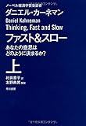

投稿日: {{ page.date | date: '%Y-%m-%d' }}

## はじめに

この記事はkindle出版を目指している「日記のすすめ（仮）」の一部です。

日記の効果についての章の一部になります。

今回の記事が「日記のすすめ（仮）」についての～の記事です。以下のまとめページに更新していく予定です。

https://log-is-fun.com/book-how-to-start-diary/

この記事の前の話はこちらです。

[\[日記のすすめ(仮)\]幸せのロングテールを知っていますか？](https://log-is-fun.com/longtail/)

## 日記で幸せへの第一歩を踏み出す

[幸せのロングテール](https://log-is-fun.com/longtail/)で自分にとってなにが大切か知ることが大事と書きました。

ではなぜ自分にとってなにが大切かを知ることが大事なのでしょうか。

それは自分が幸せになれるかどうかにかかわってくるからです。

では自分にとってなにが大切かを知ることが、幸せになれるかどうかにかかわってくるのか？

それを考える前にまず幸せとはなにか考えてみましょう。

わたしがこれまででなるほどと思った幸せの定義がこちらです。

**幸福度＝客観的条件が主観的な期待をどれぐらい満たすか**

ぱっと見た感じ難しく感じられるかもしれませんが、そんなことはありません。行ってしまえば当たり前の話です。

・客観的な条件

財産、お金、健康、家族や友人の有無などです

・主観的な期待

自分が何を期待しているか、求めているかです。

つまり自分がどれぐらいのものを期待しているか、そしてその期待はどれぐらい満たされているかが幸福度を決めるということです。

主観的な期待が高ければ、たとえどれほど高い客観的な条件を得ても幸せにはなれません。

同じ100万円でも、わたしがもらうのとビルゲイツがもらうのとでは幸福度への影響は段違いです。

また主観的な期待と異なるものを得ても幸せにはつながりません。幸福な家庭を築いていた男性に宝くじ1等が当たったとしても、それが原因で家庭が崩壊してしまったらその男性にとっては幸せではなりません。

どんなに高い客観的な条件を得られても、主観的な期待に沿っていなければ意味がないのです。

だからこそ主観的な期待をどれぐらいのくわしく分かっているかが大事になってきます。

たとえば「家族が大事です」という男性がいたとします。

その男性は家族が大事なので家族のためにお金を稼ぎます。稼ぐために残業もして土日はゴルフをします。

もしかしたらこの人は本当は家族よりも仕事が大事なのかもしれません。

ではもう一歩踏み込んで「家族も大事だけど、仕事も大事です。」と分かったとします。

ここまでわかってくると、じゃあどうやって家族と仕事のバランスを取ろうかという話になってきます。

さらに理解を深めると「家族と過ごす時間が大事で、特に家族で誕生日などのイベントを過ごすのが幸せです。仕事で新しいアイディアを思いつくのもワクワクします。」と分かりました。

ここまでわかってきたら、家族のイベントを外さないようにする。アイディアを思いつくのが好きなのであれば土日のゴルフはしないようにすることが幸せに繋がってくるでしょう。

こうすることで自分の主観的な期待を満足させられる確率が高まります。

もし主観的な期待の理解度が低い場合、ひたすら仕事をしてお金をためたけれど、なぜか幸せになれない状態に陥ってしまいます。

ここまで幸せには主観的な期待をどれだけ詳しく理解できているかが大事だというお話をしてきました。

この主観的な期待への理解を間違いなく手助けしてくれるのが日記なのです。

日記は自分にとってなにが幸せかを忘れてしまっても思い出させてくれます。幸せと感じた日の日記を読み返してみましょう。

また日記に書くうちに自分にとってでじぶんにとってなにが幸せなのか気づくこともできます。

日記で必ず幸せになれるとは言いません。でも幸せに気づくこと、自分にとっての幸せは何なのか気づくこと。その手伝いを日記は間違いなくしてくれます。

日記は幸せになるための第一歩なのです。

## おわりに

Log is Fun!!内でこちらに関連する記事はこちらです。

関連記事  
[世界最後の日にも日記を書きたい～日記で大切なものをみつける～](https://log-is-fun.com/world-last-day/)  
[WorkFlowyで自分にとって大切なものを見つける方法～日記を書く編～](https://log-is-fun.com/workflowy1/)  
[WorkFlowyで自分にとって大切なものを見つける方法～日記を振り返る編～  
](https://log-is-fun.com/workflowy2/)[WorkFlowyで自分にとって大切なものを見つける方法～リストを育てる編～](https://log-is-fun.com/workflowy3/)  
[WorkFlowyで「じぶんの取説」をつくろう！](https://log-is-fun.com/workflowy5/)

日記のすすめ(仮)の他の記事はこちらからチェックできます。

https://log-is-fun.com/book-how-to-start-diary/

Log is Fun!!

* * *

幸福の定義として参考になったのが以下の二冊です。

[サピエンス全史(上)文明の構造と人類の幸福](//af.moshimo.com/af/c/click?a_id=765702&p_id=170&pc_id=185&pl_id=4062&s_v=b5Rz2P0601xu&url=http%3A%2F%2Fwww.amazon.co.jp%2Fexec%2Fobidos%2FASIN%2F430922671X%2Fref%3Dnosim)

posted with [ヨメレバ](http://yomereba.com)

ユヴァル・ノア・ハラリ 河出書房新社 2016-09-08

売り上げランキング : 94

[Amazonで探す](//af.moshimo.com/af/c/click?a_id=765702&p_id=170&pc_id=185&pl_id=4062&s_v=b5Rz2P0601xu&url=http%3A%2F%2Fwww.amazon.co.jp%2Fexec%2Fobidos%2FASIN%2F430922671X%2Fref%3Dnosim)

[Kindleで探す](//af.moshimo.com/af/c/click?a_id=765702&p_id=170&pc_id=185&pl_id=4062&s_v=b5Rz2P0601xu&url=http%3A%2F%2Fwww.amazon.co.jp%2Fexec%2Fobidos%2FASIN%2FB01LW7JZLC%2F)

[楽天ブックスで探す](//af.moshimo.com/af/c/click?a_id=765703&p_id=56&pc_id=56&pl_id=637&s_v=b5Rz2P0601xu&url=http%3A%2F%2Fbooks.rakuten.co.jp%2Frb%2F14385169%2F)

[7netで探す](//af.moshimo.com/af/c/click?a_id=765667&p_id=932&pc_id=1188&pl_id=12456&s_v=b5Rz2P0601xu&url=http%3A%2F%2F7net.omni7.jp%2Fsearch%2F%3FsearchKeywordFlg%3D1%26keyword%3D4-30-922671-2%2520%257C%25204-309-22671-2%2520%257C%25204-3092-2671-2%2520%257C%25204-30922-671-2%2520%257C%25204-309226-71-2%2520%257C%25204-3092267-1-2)

昨年ベストセラーになりましたね。

[ファスト&スロー(上) あなたの意思はどのように決まるか? (ハヤカワ・ノンフィクション文庫)](//af.moshimo.com/af/c/click?a_id=765702&p_id=170&pc_id=185&pl_id=4062&s_v=b5Rz2P0601xu&url=http%3A%2F%2Fwww.amazon.co.jp%2Fexec%2Fobidos%2FASIN%2F4150504105%2Fref%3Dnosim)

posted with [ヨメレバ](http://yomereba.com)

ダニエル・カーネマン 早川書房 2014-06-20

売り上げランキング : 530

[Amazonで探す](//af.moshimo.com/af/c/click?a_id=765702&p_id=170&pc_id=185&pl_id=4062&s_v=b5Rz2P0601xu&url=http%3A%2F%2Fwww.amazon.co.jp%2Fexec%2Fobidos%2FASIN%2F4150504105%2Fref%3Dnosim)

[Kindleで探す](//af.moshimo.com/af/c/click?a_id=765702&p_id=170&pc_id=185&pl_id=4062&s_v=b5Rz2P0601xu&url=http%3A%2F%2Fwww.amazon.co.jp%2Fexec%2Fobidos%2FASIN%2FB00ARDNMEQ%2F)

[楽天ブックスで探す](//af.moshimo.com/af/c/click?a_id=765703&p_id=56&pc_id=56&pl_id=637&s_v=b5Rz2P0601xu&url=http%3A%2F%2Fbooks.rakuten.co.jp%2Frb%2F12788225%2F)

[7netで探す](//af.moshimo.com/af/c/click?a_id=765667&p_id=932&pc_id=1188&pl_id=12456&s_v=b5Rz2P0601xu&url=http%3A%2F%2F7net.omni7.jp%2Fsearch%2F%3FsearchKeywordFlg%3D1%26keyword%3D4-15-050410-6%2520%257C%25204-150-50410-6%2520%257C%25204-1505-0410-6%2520%257C%25204-15050-410-6%2520%257C%25204-150504-10-6%2520%257C%25204-1505041-0-6)

人間心理を知るための良書です。
