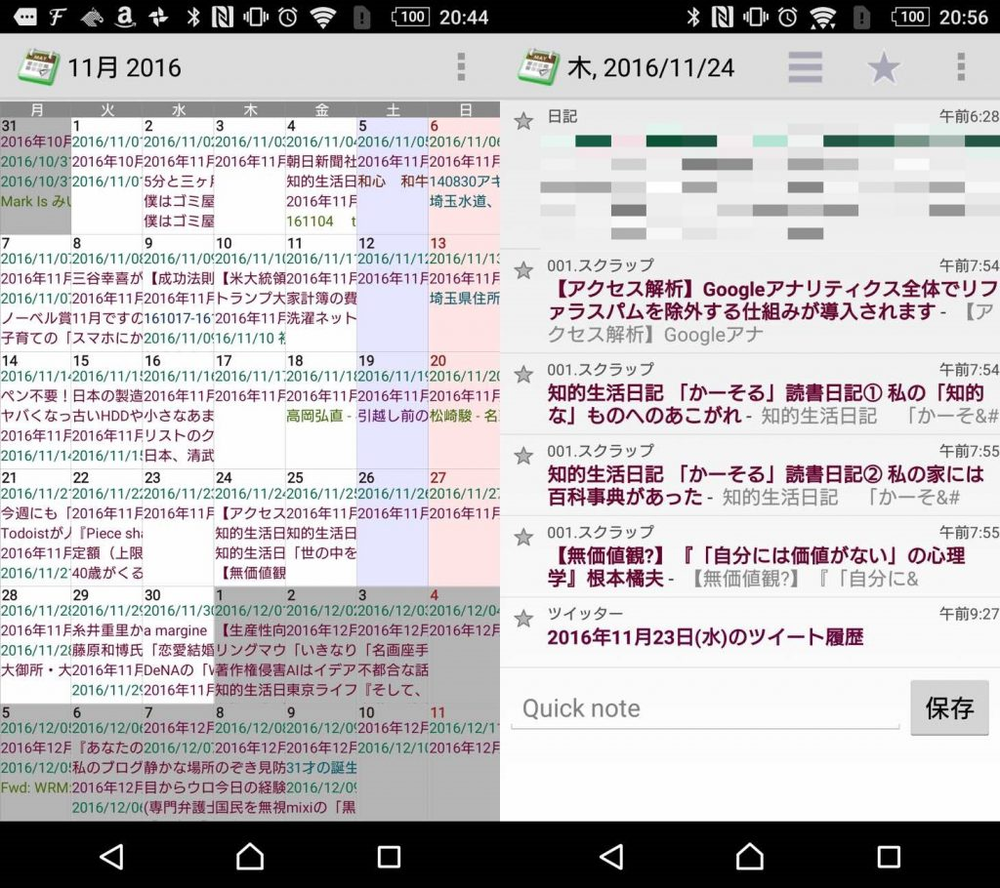
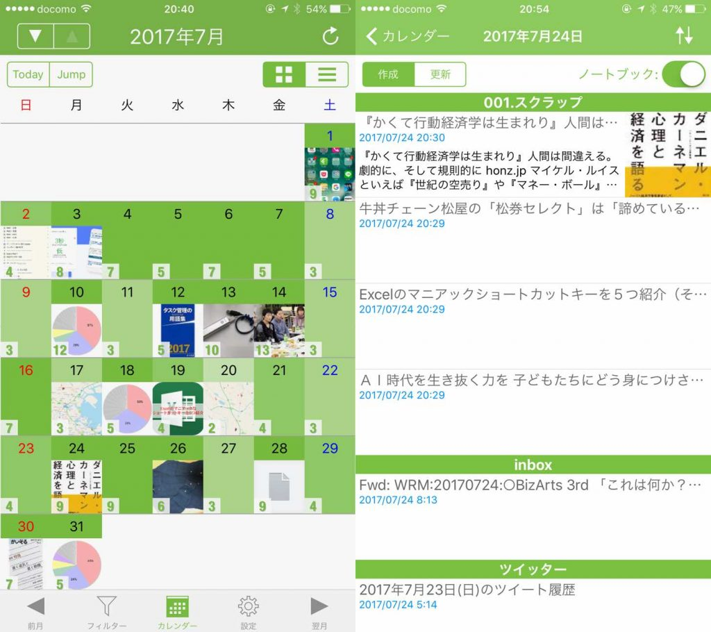
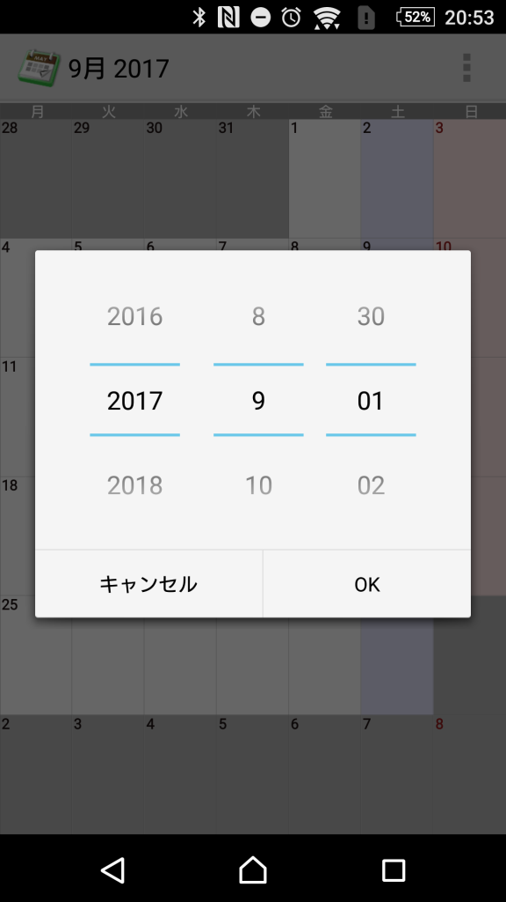
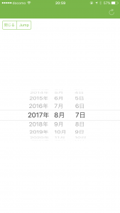

投稿日: {{ page.date | date: '%Y-%m-%d' }}

日記の楽しみのひとつは日記を読み返すことです。

特に1年前の今日何をしていたか、2年前3年前はどんなことを考えていたのかわかると自分や環境の変化がわかります。

自分の成長が分かって自信につながったり、あるいは去年の反省を今年に生かしたり。日記を読み返す効果は様々です。

[https://log-is-fun.com/effect-of-review1/](https://log-is-fun.com/effect-of-review1/)

去年の同じ日はだいたい季節や環境、イベントなどが似ているので同じような失敗（夏バテや二日酔いなど）を繰り返しやすくなります。

日記を読み返せば同じような失敗を回避できます。

さてEvernoteです。

Evernoteの場合、スマホで日記を読み返そうとしたらEvernoteを開いて、1年前の日記までひたすらスワイプしていく必要があります。

大変めんどくさいです。そのめんどくささを解消してくれるのがこちらのアプリEverCalendarとNotesViewerです。

<!--more-->

## カレンダーで直感的に見やすい

AndroidではEverCalendar、iphoneではNotesViewer。それぞれ違うアプリですが基本的なコンセプトはほぼ同じです。

「カレンダーで過去のノートに直感的にアクセスできる」ことです。

たとえば去年の出来事を参考にするなら1年前の同じ曜日の方が参考になります。カレンダー表示なら同じ曜日が直感的に分かります。

まずはEverCalendarです。左がカレンダー画面。右が日付をタップした後表示されるノート詳細画面です。

次はNotesViewerです。同じく左がカレンダー画面。右が日付をタップした後表示されるノート詳細画面です。

NotesViewerのほうが画像が出るのでより華やかな印象ですね。EverCalendarは文字だけでシンプルな表示になっています。

日付を選んだらあとは読みたいノートをタップすればOKです。

## ジャンプ機能

どちらのアプリにも目的の日付へ行けるようにジャンプ機能がついています。読みたい日のノートにすぐアクセスできるので便利です。日記を楽に読み返すならこの機能は欠かせません。

EverCalendarでは右上の□三つアイコンからgotoをタップすると画像のように好きな日付に飛ぶことができます。

NotesViewerなら左上の△▽アイコンで一年ずつ、スワイプか下の前月翌月アイコンで一か月ジャンプできます。また左上のjumpボタンで好きな日にちを選んでジャンプできます。

## 終わりに

EverCalendarはいいアプリなんですけど、最新の更新が2013年なんですよね。ややその点が不安です。ただAndroidでは他にこうしたアプリがないんですよね。アップデートしてくれるといいのですが。

あ、NotesViewerの方はしっかりアップデートされていますよ。

日記を読み返すならこんなアプリを入れてると楽できるよというお話でした。日記以外のノートも手軽に見返せるのでその点でもおすすめです！

日記同好会も始めましたので、こちらもぜひチェックしてみてくださいね。

https://note.com/mailman/n/nbe584ebcaeca

Log is Fun!!

* * *

**[CalEver (NotesViewer) - カレンダー、日記、ライフログ](https://itunes.apple.com/jp/app/calever-notesviewer-%E3%82%AB%E3%83%AC%E3%83%B3%E3%83%80%E3%83%BC-%E6%97%A5%E8%A8%98-%E3%83%A9%E3%82%A4%E3%83%95%E3%83%AD%E3%82%B0/id1140145030?mt=8&uo=4&at=11l5XR)** 価格: 360円(2017/08/08 21:29)

https://play.google.com/store/apps/details?id=com.moaiapps.evercal.app&hl=ja
