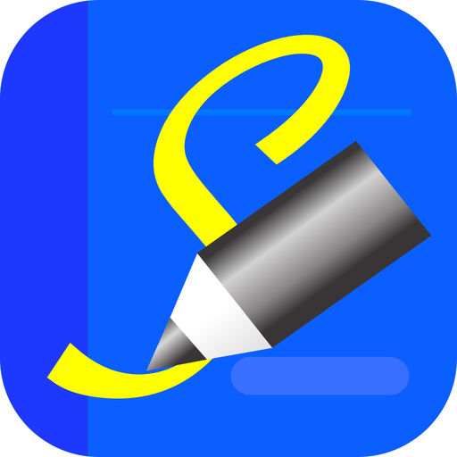
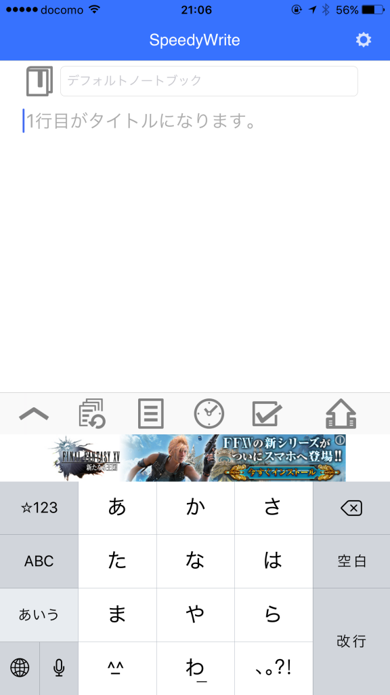
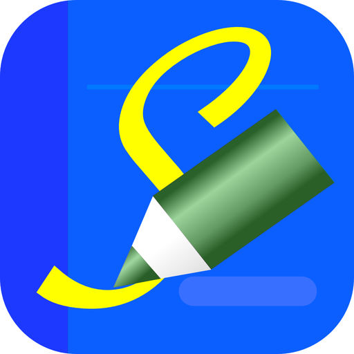

日記の中からイベントを抜き出して別のノートにまとめておきたくなることはありませんか？

たとえば家族のイベントやおいしいごはん、達成したこと、筋トレの内容。動画の中からハイライトを抜き出すような楽しさがあります。

はたまた本の感想や思いついたアイディアをEvernoteへメモしておきたいときもあります。

そんなときに便利なのがspeedywriteです。

例えばこの記事のトップ画像のように簡単にEvernoteへおいしいものの記録が残せます。

<!--more-->

## writenoteとの違い

以前紹介したwritenoteと同じ作者さんのアプリです。

[https://log-is-fun.com/writenote/](https://log-is-fun.com/writenote/)

writenoteは同じノートへ追記することに優れたアプリです。日記などのノートにどんどん追記していくことができます。

しかし、Evernoteのノートブックをいろいろ分けてつかう。それぞれのノートブックに簡単に新しいノートを追加する。そんなときにはwritenoteよりSpeedyWriteが便利です。

SpeedyWriteならたとえば外食したらその写真は「おいしかったものノートブック」にすぐ入れられます。

アイディアメモを「アイディア専用ノートブック」へ追加したりも可能です。

## 使い方例

- 本の感想をEvernoteの読書録へ記録
- 外食の写真をEvernoteの外食ノートブックへ保存
- 今日のお気に入りの写真を抜き出してEvernoteへ保存
- 思いついたアイディアをEvernoteのネタ帳へ保存

など使い方は様々です。

## SpeedyWriteの使い方

ダウンロードして、Evernoteと連携させます。

**[SpeedyWrite - いつでもサッとメモを書いてEvernoteに送れます。](https://itunes.apple.com/jp/app/speedywrite-%E3%81%84%E3%81%A4%E3%81%A7%E3%82%82%E3%82%B5%E3%83%83%E3%81%A8%E3%83%A1%E3%83%A2%E3%82%92%E6%9B%B8%E3%81%84%E3%81%A6evernote%E3%81%AB%E9%80%81%E3%82%8C%E3%81%BE%E3%81%99/id996434292?mt=8&uo=4&at=11l5XR)**  
価格: 0円(2017/08/16 20:49)  

入力画面はこんな感じです。

一行目がノートタイトルになります。

左上のアイコンで送信したいノートブックを選択。選択しない場合はデフォルトノートブックに追加されます。

デフォルトノートブックはEvernoteで自分で設定できます。

https://help.evernote.com/hc/ja/articles/208314728-%E6%97%A2%E5%AE%9A%E3%81%AE%E3%83%8E%E3%83%BC%E3%83%88%E3%83%96%E3%83%83%E3%82%AF%E3%82%92%E5%A4%89%E6%9B%B4%E3%81%99%E3%82%8B%E6%96%B9%E6%B3%95

左下から順番にアイコンについて説明します。

### 追記方法、タグの設定

追記する場合に上に追記するか、下に追記するか選べます。タグは無料版では変更できません。

SpeedyWriteは同じノートブックとタイトルにすれば、ノートへの追記に使うことも可能です。

有料版のSpeedyWrite proの場合はここから写真の添付やカメラの起動。位置情報の付与もできます。

### 履歴をみる

今までにSpeedyWriteを使って送ったノートブックとタイトルが表示されます。同じノートに追記したいときにはこちらからやると便利です。

また同じ形式のタイトル、例えば「2017/8/16 夕ご飯」といったタイトルでノートを作っている場合は、履歴を使えば次の日は日付をすこし変えるだけでいいので楽です。

### ノート一覧をみる

Evernoteのノートタイトル一覧がでます。同じノートに追記したい場合はこちらからでも便利です。

アイコン長押しでEvernoteと同期します。

### 日付、時刻を入力

タイムスタンプを入力します。

### チェックボックスを入力

チェックボックスを入力します。

## pro版との違い

|   | SpeedyWrite | SpeedyWrite pro |
| --- | --- | --- |
| 同期できるノートブック一覧数 |   iOS 全て可能  Android 5個まで   | 全て |
| 同期できるノートタイトル一覧数 |   iOS 100以上可能  Android 5個まで   |   iOS 100以上可能  Android 25個まで   |
| タグの設定 | SpeedyWrite のみ | 自分で設定可能 |
| 広告有無 | あり   （アドオンで削除可） | なし |
| 画像送信機能 | なし | あり |
| 位置情報付与機能 | なし | あり |
| チェックボックス |   Android版は1つ  iOS版は制限なし   | 制限なし |
| 金額 | 無料 |   Android 300円  iOS 600円   |

Android版はiOSに比べて制限が強めですが、その分安くpro版が買えます。

## 終わりに

というわけで人それぞれ様々な使い方ができるSpeedyWriteの紹介でした！

Log is Fun!!

**[SpeedyWrite Pro - いつでもサッとメモを書いてEvernoteに送れます。](https://itunes.apple.com/jp/app/speedywrite-pro-%E3%81%84%E3%81%A4%E3%81%A7%E3%82%82%E3%82%B5%E3%83%83%E3%81%A8%E3%83%A1%E3%83%A2%E3%82%92%E6%9B%B8%E3%81%84%E3%81%A6evernote%E3%81%AB%E9%80%81%E3%82%8C%E3%81%BE%E3%81%99/id996430939?mt=8&uo=4&at=11l5XR)**  
価格: 600円(2017/08/16 21:36)

https://play.google.com/store/apps/details?id=jp.eek.nap.speedywrite&hl=ja
