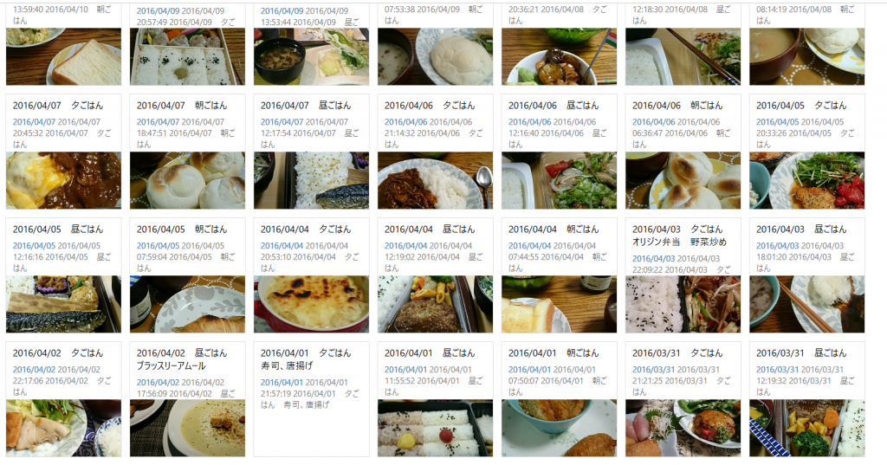

デジタルで日記を書くならEvernoteをおすすめしています。これまでいろいろEvernoteや、その関連アプリについて紹介してきました。

じゃあEvernoteで日記を具体的にどう活用すればいいんだろう？

というわけでEvernoteで日記を書くとこんないいことがあるよというのを一日の場面ごとにご紹介します。

<!--more-->

## 朝起きたとき

朝起きて寝起きの体調や気分を書きます。

寝起きの体調なんかを記録していくと、自分には睡眠時間がどのぐらい必要なんだなとかいろいろわかってきます。

自分の場合は記録してきてこんなことが分かりました。

- どんなに疲れていても風呂に入ってから寝るといい。全然違う。
- 睡眠は最低でも6時間以上
- 寝つく直前に起こされると睡眠時間は十分でも寝足りない。

また寝起きはアイディアが出やすい時間でもあるので、仕事やプライベートでの問題がふと解決すようなアイディアが出たりします。

思いついたアイディアはしっかり日記に残しておけば思い出せます。

## 朝ごはん、昼ごはん、夕ごはん

ご飯関係は写真で記録しておくと分かりやすいです。

Speedywriteを使うとこんな感じで食事を記録できます。

料理するならメニューを記録しておくと次のごはんを考える参考になります。たとえば栄養面を考えたり、中華やイタリアンなどが続くのを避けられます。

また毎日昼ごはんを外食していて、どこで食べるか迷った時も最近なにを食べたか記録に残しておくと何を食べるか決めやすいです。

## 通勤中

通勤中には日記読み返します。わたしがおすすめするのは一年前、二年前の今日あたりの日記を読み返すことです。

日記を読み返すにNotesViewerなどが便利です。日記を読み返して思ったことや気づいたことは日記に残します。

日記を読み返すとこんな効果があります。

### 去年と同様の失敗をしなくて済む

だいたい公私ともに同じ時期には同じようなイベントがあり、対策をしなければだいたい同じ失敗をします。

例えば夏休みに夜更かしをして体調を崩したとか、年一のプレゼンを練習不足で失敗したとかです。

こういったことも日記を読み返せば対策を打つことができます

### 緩やかな変化でも年単位で見返すとわかる。

日々の変化って少しずつなのでわからないものです。しかし年単位で見ると自分の中の変化がよく分かります。

数年前は本を書こうなんて少しも思っていませんでした(笑)

[https://log-is-fun.com/book-how-to-start-diary/](https://log-is-fun.com/book-how-to-start-diary/)

ほかにも1年前だけでなく昨日の日記を読み返す効果とかも書きたいですが、それはまた別の機会にします。

## 仕事中

仕事中に日記を書くとこんな効果があります。職場のパソコンでEvernoteが使えればいいのですが、使えないときはサボりだと思われない程度にスマホで日記を書きましょう。

仕事中に日記を書くとこんな効果があります。

### 気持ちを整理できる

事実や気持ちを書くことで自分から切り離して、客観的に見ることができます。

たとえば理不尽だと思っていた仕事の依頼も日記に書いてみたら、実はそうでもなかったと思ったりします。

もちろんそうじゃないこともありますが、それでも書くだけで気持ちが落ち着きます。

### 仕事の記録が残る

1日の仕事が終わった時に午前中なにをやってたか思い出せますか？印象が強い出来事でもない限りけっこう思い出せないものです。

何をやったか思い出せないと達成感や満足感を感じにくくなります。いわゆる日曜日に今日俺なにやったっけ？って感じるのと同じことですね。

関連記事：[\[日記のすすめ(仮)\]日記を書くとなぜ休日終わりに憂鬱にならないのか？](https://log-is-fun.com/holiday-melanchol/)

でも日記を書いておけばじぶんが何をやったのかわかるので自信、達成感につながります。また記録が残っていれば、仕事の改善や反省、PDCAサイクルも回せます。

## プライベートな時間

たとえば自分の趣味の記録、読書録や本やマンガを読んだ感想を書いたりできます。

読み終わった本の感想を書くことで、本の内容がより頭に定着します。また日記を読み返せばその内容がさらに定着します。

そのほかにも子供の成長具合や名言（迷言）を記録したりなど様々な活用方法が考えられます

## 寝る前

感謝日記を書くことで前向きな気持ちで眠りにつくことができます。

[https://log-is-fun.com/thanksdiary/](https://log-is-fun.com/thanksdiary/)

## 終わりに

というわけでEvernoteで書いた日記の活用法でした。使っているアプリが気になった方はこちらの関連記事をどうぞ。

関連記事[  
\[おすすめアプリ\]Evernoteで日記を書くならwritenote!!](https://log-is-fun.com/writenote/)  
[\[おすすめアプリ\]Evernoteへメモや画像を簡単送信するならSpeedyWriteですよ！](https://log-is-fun.com/speedywrite/)  
[Evernoteで日記を読み返すならカレンダー形式のこのアプリが便利！](https://log-is-fun.com/calendar/)

それでは、ぜひEvernoteでたのしい日記ライフを！

Log is for Happy!!
