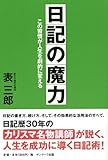

投稿日: {{ page.date | date: '%Y-%m-%d' }}

「ぞのドットコム」のぞのさんのおもしろそうな企画「寄せ書きブログ」に参加しました。

<blockquote class="twitter-tweet" data-cards="hidden" data-lang="ja">
ブログを使って、面白そうな実験を始めてみました。 ブロガーさんなら誰でも参加できます。もしピーンと来たら、お気軽に参加してみてください。  「<a href="https://twitter.com/hashtag/%E5%AF%84%E3%81%9B%E6%9B%B8%E3%81%8D%E3%83%96%E3%83%AD%E3%82%B0?src=hash&amp;ref_src=twsrc%5Etfw">#寄せ書きブログ</a>」って実験を始めます！ブロガーさん、集まれ！　<a href="https://twitter.com/hashtag/%E5%AF%84%E3%81%9B%E6%9B%B8%E3%81%8D%E3%83%96%E3%83%AD%E3%82%B0?src=hash&amp;ref_src=twsrc%5Etfw">#寄せ書きブログ</a><a href="https://t.co/9Dmbw00acj">https://t.co/9Dmbw00acj</a>

— ぞの (@z02n05) <a href="https://twitter.com/z02n05/status/910104730856067072?ref_src=twsrc%5Etfw">2017年9月19日</a></blockquote>

参加者で同じテーマについて記事を書くこの企画、今回のお題は「あなたの大切な資産は？」です。

<!--more-->

## 資産とは？

まず資産とはなんでしょうか？大辞林をチェックするとこうありました。

> しさん【資産】
> 
> ①金銭や土地・家屋・証券などの財産。  
> ②企業が所有し、その経営活動に用いる財産。
> 
> 大辞林 第三版

ふむ、しかしここであまりにストレートに「わたしの貯金はいくらです」みたいな話するのもちょっと違う気がします。

わたしがビリオネアだったら資産を列挙するだけで記事が出来上がるはずですが、残念ながらそうではありません（しがないサラリーマンです）

ではどうするか。

資産を「なにかと交換できる価値があるもの」として勝手に考えてみます。

うん、やっぱりそうですね。

うすうす分かってはいましたがやっぱりこれですね。

「日記」です。

## わたしの資産

どんな日記を書いてきたか簡単に箇条書きにします。

- 紙の日記帳　10年分
- Evernote　日記4年分　
- 家族日記　妻が妊娠してから

大学生のころから始め、間が空いた期間もありますが、ここ4年はほぼ毎日のように息するように日記を書いています。もう13年も日記を書いているんですね。

あらためて考えると長く続いているなーと思います。

では日記はいったい何と交換できるのでしょうか？

## 何と交換できるのか？

### 自分のうまい使い方

日記を読み返しているとじぶんがどんな人間かわかってきます。

何が好きで何が嫌いか。どんなときに楽しくて、なにをしたいのか。

もちろん自分のすべてを知ることはできません。しかし自分をより深くより広く知ることができれば、できることやしてみたいことが増えていくんじゃないかなと思います

### 自信になる

日記を続けられること、それ自体が自信になりました。

さらに日記の中には自分ができたことが書いてあります。そのことも自信につながりました。

よくブログにも書いているんですが、人間だいたいのことは忘れます。

記録がないと昨日の出来事でさえワンテンポ置いて思い出すか、もしくは思い出せないんですよね。

どんな仕事やったっけ？どんな出来事があったっけ？

でも日記をつけていれば**根拠のある自信**が身につきます。

他の人からみたらたいしたことないことでも自分の自信になるのであれば、その自信は次の一歩を踏み出す手助けになります。

### 毎日を大切にする気持ち

自分は結構過去を忘れてしまうほうです

幼稚園とか小学校のころとか旅行に連れて行ってもらってたんですけど、ほとんど覚えていないんですよね（親からはあんなに連れて行ったのに！とあきれられています）

もちろん印象深いところは覚えています。でもすごいもったいないですよね。せっかくの思い出のはずなのに。

だからいま日記を大事にしているのかもしれません。

旅行なんて大きなイベントでなくても毎日を、いつもの日々を日記はそこに残してくれます。

家族でいっしょにご飯を食べたり、夕焼けの中を家族で散歩したり、あるいは喧嘩したりしたあの日も。そんな毎日がそこにあります。

うん、この価値がわたしにとって一番かもしれません

## 終わりに

今回の寄せ書きブログに参加して自分でも思っていなかった切り口でブログを書くことができました。

企画をしてくれたぞのさんに感謝です。次回もぜひ参加したいですね。

Log is for Happy!!

関連記事  
・[WorkFlowyで「じぶんの取説」をつくろう！](https://log-is-fun.com/workflowy5/)  
・[読み返さないともったいない！日記を読み返す3つの効果とは？  
](https://log-is-fun.com/effect-of-review1/)・[\[日記のすすめ(仮)\]幸せのロングテールを知っていますか？](https://log-is-fun.com/longtail/)

* * *

日記にはまったきっかけの本です

[日記の魔力\[Kindle版\]](//af.moshimo.com/af/c/click?a_id=765702&p_id=170&pc_id=185&pl_id=4062&s_v=b5Rz2P0601xu&url=http%3A%2F%2Fwww.amazon.co.jp%2Fexec%2Fobidos%2FASIN%2FB008BCCT8A%2Fref%3Dnosim)

posted with [ヨメレバ](https://yomereba.com)

表 三郎 サンマーク出版 2012-07-01

売り上げランキング : 1029

[Kindleで探す](//af.moshimo.com/af/c/click?a_id=765702&p_id=170&pc_id=185&pl_id=4062&s_v=b5Rz2P0601xu&url=http%3A%2F%2Fwww.amazon.co.jp%2Fexec%2Fobidos%2FASIN%2FB008BCCT8A%2F)

[Amazon\[書籍版\]で探す](//af.moshimo.com/af/c/click?a_id=765702&p_id=170&pc_id=185&pl_id=4062&s_v=b5Rz2P0601xu&url=http%3A%2F%2Fwww.amazon.co.jp%2Fexec%2Fobidos%2FASIN%2F4763196022%2F)
