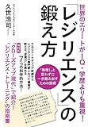

投稿日: {{ page.date | date: '%Y-%m-%d' }}

## はじめに

この記事はkindle出版を目指している「日記のすすめ（仮）」の一部です。

日記の書き方についての章の一部になります。

## 自分の現状に不満があるなら感謝日記を書いてみよう

いまの職場や家庭、趣味などさまざまな環境に満足していますか？

自信をもって満足していると言える方はなかなかいないのではないでしょうか。しかしたとえ満足できない環境でも前向きにとらえる方法があります

感謝日記です。

感謝日記は一日の中で感謝したいことを3~4つほど箇条書きで書く日記です。たとえば

- 仕事のトラブルを同僚に手助けしてもらった
- 妻がおいしい料理を作ってくれた
- 今日読んだ本がおもしろかった
- 家族がみんな健康である

など具体的な出来事（トラブル手助けや料理）だけでなく、家族がみんな健康であるといった状態に対する感謝など様々なことに対して感謝の気持ちを持つ日記です。

この日記には環境に対して前向きになるだけでなく、ほかにも効果があります。

### 前向きになれる

まず感謝日記を書くことで前向きになれます。それは感謝するということは過去のことが今に意味があると考えることだからです。

たとえば過去の病気のおかげで健康に気を使って長生きできたと考えるようなものです。

過去に意味があると考えるのであれば、今ここでの経験もきっと意味があると前向きに考えることができます。

感謝日記を書くことで、前向きに物事を考えられます。

私がきょう妻に叱られたことにもきっと意味があるはずです（笑）

### 満足度が分かる

感謝日記を書いていくと、ときどき偏りが出てきます。家族については感謝の気持ちを書いているのに、職場の人たちに関しては書いていない。あるいはその逆もあります。

それはもちろん自分が感謝できることに気づいていないのかもしれませんが、もしかしたらその環境自体に問題がある可能性もあります。

もし謙虚に、自分に正直に考えてみて、それでも感謝できないならその環境へ満足できていないのかもしれません。

感謝日記は環境を変えるきっかけも作ってくれます。

### 状況に感謝できる

だいたいのことに人間慣れてしまいます。最初は感謝していたことでも慣れてしまえば当たり前のように感じてしまいます。

病気になって始めて健康への大切さに気づくとよく言います。

また隣の芝生は青くみえます。しかし、自分の芝生に目を向けなければいつの間にか枯れてしまうかもしれません。

でも感謝日記を書くことで今の状況に対する感謝を持つことができます。自分の芝生に目を向けて、水をやる機会を得ることができます

### お礼ができる

いろんなことに対してお礼ができます。

感謝日記は今日あった感謝したいことを書く日記です。そこには当然お礼がしたいことがあり、お返しをしたい人がいます。

そしてそれは特別な場合（たとえばトラブルを助けてもらったとか）だけではありません。前項で書いたように感謝日記ではいつも当たり前のように受け取っているものに対しても感謝することができます。

たとえばパートナーがつくってくれるご飯を当たり前と思っていませんか？あるいは同僚のちょっとした気遣いもそうです。

そうした当たり前と思っていることにも感謝日記は「ありがとう」とお礼を伝えるきっかけになります。

このように感謝日記を書くことでいろんな人に実は支えられているということが分かるはずです。

余談ですが、自立とは支えが一つだけでなくたくさんあることだと思います。

### 感謝日記の書き方

日記帳やノート、wordなどでもかまいません。自分が書きやすいものに感謝の気持ちを3つ書いてみてください。

書き方のコツとしては思いつかなくても3つ挙げてみる。そして別に毎日同じものがあってもかまわないということです。

まず思いつかなくても3つ挙げることとで当たり前と思っていることに対しても目を向けることができます。もし3つ以上思いつくならどんどん書いていきましょう。

また毎日違うことを書く必要はありません。感謝したいことであれば同じことを書いてもOKです。

### おすすめツール

#### ノート

ノートに感謝日記を書いていき、お礼をしたいことなどについては付箋などをして分かるようにしておきます。

読み返すことで周囲の環境に対する満足度もわかってきます。

#### カード

名刺大のカード1枚につき1つ感謝したいことを書いていきます。カードであれば分類がしやすいです。

どの環境に対しての感謝が多いか分かります。またこのことに関してはお礼をしたいから分けておこうといったこともできます。

ただ保管がしにくかったり、少し読み返しにくいのが難点といえます。

#### エクセル、googleスプレッドシート

エクセルであれば、検索やフィルターがかけやすいので自分の感謝の傾向などを分析するのに最適です。

パソコンやスマホで書きたいという方はエクセルやgoogleスプレッドシートをおすすめします。

## おわりに

感謝日記についての記事は何回か書いているのですが、そのたびに発見があって日記の奥深さというのを感じます。

感謝日記は慣れれば3分もかからずに書ける日記です。この機会に自分の環境についてもう一度考えてみませんか？

Log is for Happy!!

* * *

日記のすすめ(仮)のこれまでの記事はこちらのまとめページから読めます。

https://log-is-fun.com/book-how-to-start-diary/

参考文献

[世界のエリートがIQ・学歴よりも重視! 「レジリエンス」の鍛え方](//af.moshimo.com/af/c/click?a_id=765702&p_id=170&pc_id=185&pl_id=4062&s_v=b5Rz2P0601xu&url=http%3A%2F%2Fwww.amazon.co.jp%2Fexec%2Fobidos%2FASIN%2F440845494X%2Fref%3Dnosim)

posted with [ヨメレバ](https://yomereba.com)

久世 浩司 実業之日本社 2014-02-28

売り上げランキング : 50869

[Amazonで探す](//af.moshimo.com/af/c/click?a_id=765702&p_id=170&pc_id=185&pl_id=4062&s_v=b5Rz2P0601xu&url=http%3A%2F%2Fwww.amazon.co.jp%2Fexec%2Fobidos%2FASIN%2F440845494X%2Fref%3Dnosim)

[Kindleで探す](//af.moshimo.com/af/c/click?a_id=765702&p_id=170&pc_id=185&pl_id=4062&s_v=b5Rz2P0601xu&url=http%3A%2F%2Fwww.amazon.co.jp%2Fexec%2Fobidos%2FASIN%2FB00LWW5WR6%2F)

[楽天ブックスで探す](//af.moshimo.com/af/c/click?a_id=765703&p_id=56&pc_id=56&pl_id=637&s_v=b5Rz2P0601xu&url=http%3A%2F%2Fbooks.rakuten.co.jp%2Frb%2F12687584%2F)

[楽天koboで探す](//af.moshimo.com/af/c/click?a_id=765703&p_id=56&pc_id=56&pl_id=637&s_v=b5Rz2P0601xu&url=https%3A%2F%2Fbooks.rakuten.co.jp%2Frk%2Fc1c93170372d30b1b51aff045f9e2386%2F)

[7netで探す](//af.moshimo.com/af/c/click?a_id=765667&p_id=932&pc_id=1188&pl_id=12456&s_v=b5Rz2P0601xu&url=http%3A%2F%2F7net.omni7.jp%2Fsearch%2F%3FsearchKeywordFlg%3D1%26keyword%3D4-40-845494-8%2520%257C%25204-408-45494-8%2520%257C%25204-4084-5494-8%2520%257C%25204-40845-494-8%2520%257C%25204-408454-94-8%2520%257C%25204-4084549-4-8)
