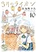
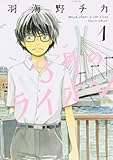

投稿日: {{ page.date | date: '%Y-%m-%d' }}

3月のライオンが好きです。去年映画化されて、最近新刊が出ました。

特に10巻が好きで、最初読んだときはぼろ泣きしたんですよ。

それも嬉し泣き。誰かの自己犠牲とかで泣くとかは今までけっこうあったんですけど、成長ぶりに対して泣くというのはなかなかない経験でした。

[3月のライオン 10 (ジェッツコミックス)](http://www.amazon.co.jp/exec/obidos/ASIN/B00PXF6BGO/do0909-22/)

羽海野チカ

<!--more-->

で、ごめんなさい。ここまでの話は置いておいて、この作品の中で好きな台詞の１つが島田八段の台詞です

> 宗谷は「天才」と呼ばれる人間のごたぶんにもれずサボらない
> 
> どんなに登りつめても決してゆるまず
> 
> 自分を過信することがない
> 
> だから差は縮まらない
> 
> どこまで行っても
> 
> しかし「縮まらないから」といって　それが　オレが進まない理由にはならん
> 
> 「抜けないことがあきらか」だからって
> 
> オレが「努力しなくていい」ってことにはならない
> 
> 3月のライオン　4巻 p118-120

作中で将棋の名人タイトルなど5タイトルを持つ宗谷名人（現実でいう羽生さんですね）とタイトル戦で戦う島田八段のセリフです。

これはメタ認知のレベル高いなぁと思いました。

いや読んでいるときはかっこいい！って思ってそんなところまで考えてなかったんですが、あらためて読み返してみるとすごいですね。

勝てないかもしれない、差は縮まらないかもしれない。そこには必ずあきらめとか絶望とかそういった感情が顔を出します。

たいていの人はその感情に飲み込まれてしまいます。しかし島田八段はちがいます。

そう、感情はそうだろう。でもどうしたと、だからなんだと。

その感情はじぶんが歩みを止める理由にはならないと。

感情と自分の考えの間にしっかりと隙間を作っているのが伝わってきます。

メタ認知はかっこいい大人になるためにも必要なのだなぁと思いました。そして感情を理解しつつも、固執しない姿勢はやはり幸せの１つの形なのかもしれません。

（関連記事：[幸せはメタ認知の行きつく先にある？](https://log-is-fun.com/katuai/)）

こんなかっこいい大人になりたいです(笑)

## 終わりに

3月のライオンを読んでいるとなにかを背負いながらも一歩一歩進める大人になりたい、と思います。

まずはそこに一歩一歩近づこうとする。そして一歩一歩足を進めているうちに気づいたらそんな大人になっているのかもしれないですね。

日記で歩みを確認しつつ、一歩一歩前に進んでいきたいと思います。

Log is for Happy!!

* * *

kindle版1巻、2巻が2017/10/18までの期間限定無料対象になっています。気になる方はお早めに！

[3月のライオン (1) (ジェッツコミックス)](//af.moshimo.com/af/c/click?a_id=765702&p_id=170&pc_id=185&pl_id=4062&s_v=b5Rz2P0601xu&url=http%3A%2F%2Fwww.amazon.co.jp%2Fexec%2Fobidos%2FASIN%2F4592145119%2Fref%3Dnosim)

posted with [ヨメレバ](https://yomereba.com)

羽海野 チカ 白泉社 2008-02-22

売り上げランキング : 4686

[Amazonで探す](//af.moshimo.com/af/c/click?a_id=765702&p_id=170&pc_id=185&pl_id=4062&s_v=b5Rz2P0601xu&url=http%3A%2F%2Fwww.amazon.co.jp%2Fexec%2Fobidos%2FASIN%2F4592145119%2Fref%3Dnosim)

[Kindleで探す](//af.moshimo.com/af/c/click?a_id=765702&p_id=170&pc_id=185&pl_id=4062&s_v=b5Rz2P0601xu&url=http%3A%2F%2Fwww.amazon.co.jp%2Fexec%2Fobidos%2FASIN%2FB074WNGMQ9%2F)

[楽天ブックスで探す](//af.moshimo.com/af/c/click?a_id=765703&p_id=56&pc_id=56&pl_id=637&s_v=b5Rz2P0601xu&url=http%3A%2F%2Fbooks.rakuten.co.jp%2Frb%2F5393393%2F)

[7netで探す](//af.moshimo.com/af/c/click?a_id=765667&p_id=932&pc_id=1188&pl_id=12456&s_v=b5Rz2P0601xu&url=http%3A%2F%2F7net.omni7.jp%2Fsearch%2F%3FsearchKeywordFlg%3D1%26keyword%3D4-59-214511-0%2520%257C%25204-592-14511-0%2520%257C%25204-5921-4511-0%2520%257C%25204-59214-511-0%2520%257C%25204-592145-11-0%2520%257C%25204-5921451-1-0)
