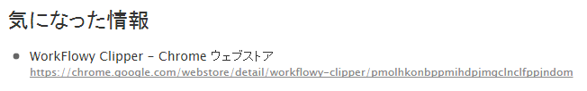
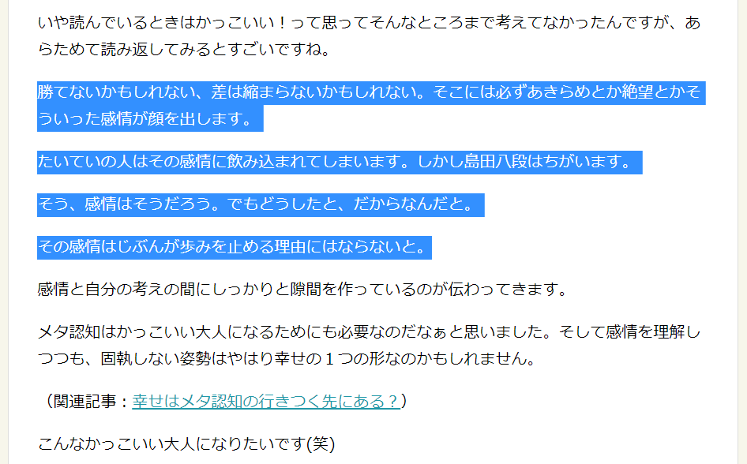
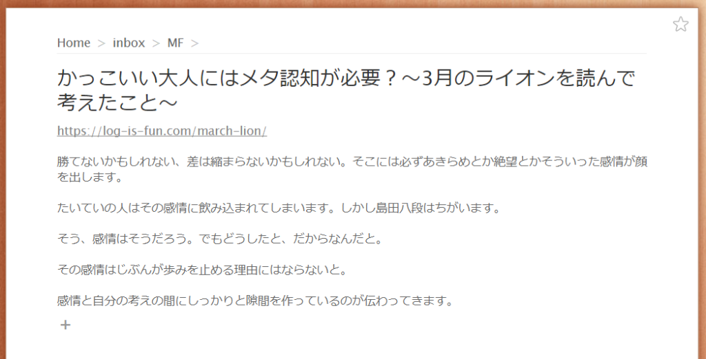

投稿日: {{ page.date | date: '%Y-%m-%d' }}

最近はDynalistとかWorkFlowy以外のアウトライナーが話題になっています。ただ私はWorkFlowyからはまだまだ乗り移れなそうです。

WorkFlowyには使えるブックマークレットとかアドオンがいっぱいあるので、そこらへんを使っているとなかなか移りにくいんですよね。

今回はわたしが使っているクロームアドオンの一つWorkFlowy Clipperの使い方をご紹介します。

<!--more-->

## WorkFlowy Clipper

昔ちがうブログでご紹介したGoogle Chromeで使うアドオンです

http://oyakuni.com/workflowy6

このWorkFlowy Clipperは、今見ているサイトなどのタイトルとURLをWorkFlowyの特定のトピック（自分で決められます）に送るアドオンです。

たとえば「気になった情報」というトピックに送ると、下の画像のようにタイトルとURLが送られます。

## 文章も一緒に送れる！

このWorkFlowy Clipperですが最近新しい使い方があることに気づきました

選択した文字列もURLと一緒にnote部分に送れるんですよね

たとえば、画像のように記事の気になった部分を選択します

そのあとWorkFlowy Clipperを使うと

こんな感じで選んだところも一緒にWorkFlowyのnote部分に送ることができます。

今まで「タイトルとURLだけWorkFlowyに送ってもなぁ」とおもっていました。

しかし読んでいる記事の気になるところも一緒に送れるとわかって、わたしの中で使用頻度が急上昇しています。

## どうやって使う？

今はニュース記事のポイントの部分や自分が気になった部分と一緒にWorkFlowyに送っています。

たまってくると「あ、このニュースとこのニュースが関連しているんだ」とか、「じぶんはこの分野のニュースが気になっているんだな」とか分かってきます。

これはニュースだけでなくブログ記事とかでも同様です。自分がどんな分野に関心を持っているかもわかります。

また、じぶんの見聞きする情報に偏りがないかも見えてきます。

たとえば前回のアメリカ大統領選でトランプ氏とヒラリー氏のどちらの記事をより多くWorkFlowyにクリップしているかで偏りが分かります。

多分トランプ氏の記事の方が多くクリップされているでしょう。

## 終わりに

Evernoteにも気になった記事をスクラップしていましたが、どうにも活かしきれない記事が多かったです。

しかしWorkFlowyにいれておくことで記事の情報をほかの情報とつなげて育てやすくなりました。

自分の興味の傾向が把握できれば、興味を広げるのか、深めるのかといった楽しみもでてきますね。

育て方については分野は違いますが、こちらの記事が参考になると思います。

関連記事：[WorkFlowyで自分にとって大切なものを見つける方法～リストを育てる編～](https://log-is-fun.com/workflowy3/)

WorkFlowy Clipperでためた情報を育てた先にどんな景色が見えるのか。

楽しみです。

Log is for Happy!!

* * *

WorkFlowyにはまるきっかけになった本

[アウトライン・プロセッシング入門: アウトライナーで文章を書き、考える技術\[Kindle版\]](//af.moshimo.com/af/c/click?a_id=765702&p_id=170&pc_id=185&pl_id=4062&s_v=b5Rz2P0601xu&url=http%3A%2F%2Fwww.amazon.co.jp%2Fexec%2Fobidos%2FASIN%2FB00XCIETIG%2Fref%3Dnosim)

posted with [ヨメレバ](http://yomereba.com)

Tak. 2015-05-07

[Kindleで調べる](//af.moshimo.com/af/c/click?a_id=765702&p_id=170&pc_id=185&pl_id=4062&s_v=b5Rz2P0601xu&url=http%3A%2F%2Fwww.amazon.co.jp%2Fexec%2Fobidos%2FASIN%2FB00XCIETIG%2F)
