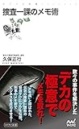

タイトルで惹かれて買った「捜査一課のメモ術」の紹介です。

この本ではメモ＝「すくいとった水」と例えています。時間の流れは水にようにながれていきます。

その時間の流れを切り取るのがメモです。水が器の形に合わせて変化するように、メモも以下のように様々な用途に姿を変えます。

- 行動の記録
- 相手に伝える
- 思考
- 発奮材料
- 反省
- 教訓
- 思い出す
- etc.

## 気になったメモ術

ではどうやってメモするのか。本の中で気になったメモ術を3つ紹介します。

### 略語、隠語を使う

メモを取るならさっと書く必要があります。また刑事のメモは操作機密がある場合もありますから部外者に見られてすぐ分かってしまうのは困ります。そこで使うのが略語、隠語です。

少しだけ例を挙げるとこんな感じです

| 略語、隠語 | 意味 |
| --- | --- |
| ガサをやる | 捜索する |
| アカ | 放火 |
| ありんこ | 歩いている人 |

ガサ入れなんかは刑事ドラマで出てきたりしますね。メモでよく使う言葉や見られて困るような事柄は略語や隠語を使ってみるといいかもしれません。

### 相手に見えないところでメモを書く

刑事さんの場合、聞き込み先でメモを取ることを嫌がられることがあります。そこで短い鉛筆を使ってコートのポケットに忍ばせた紙と短い鉛筆でメモするそうです。

> コートの右ポケットに折りたたんだ紙を忍ばせ、その紙に短い鉛筆でポイントを殴り書きするのです。
> 
> これがズボンですと上手く書けないのですが、コートではポケットに余裕があり、案外書けるんです。
> 
> 『捜査一課のメモ術 (マイナビ新書)』(久保 正行 著) より、　http://a.co/3BiWyIK

これは仕事にも応用できそうですね。

### メモが間に合わないときは最初と最後と中間を記憶する

ポケットの中でもメモできなかったり、メモが間に合わなかったりしたときは、最初と最後と中間を記憶します

> "それでも間に合わないときは、最初と最後、そして中間の３箇所を記憶します。これは心理学上においても有効な方法です。"
> 
> 『捜査一課のメモ術 (マイナビ新書)』(久保 正行 著) より、　http://a.co/1ebUe7u

これもすぐに試せそうです。

## メモは必ず差し押さえる

メモ術ではないですが「へー！」と思ったところを1点ご紹介。

犯罪捜査では現場に残されていたメモ自体が重要な証拠になることが多々あるそうです。なので家宅捜索などで差し押さえするもののリストには必ずメモを含めます。

確かにわたしもメモにプライベートなことをいっぱい書いてるし、そりゃ証拠にもなりますよね。

> "現場に残されたメモを発見したことで事件全体が把握され、ホシ（以下被疑者と呼称）を検挙した例は多くあります。
> 
> そのために事件によって、捜索差押（一般的な家宅捜索のこと）する際には、必ず差押（押収）する物件として最後の項目に、「その他本件に関係あるメモ、写真等の物件」を挿入して、発見した場合に押収できるように裁判官に請求するのです。"
> 
> 『捜査一課のメモ術 (マイナビ新書)』(久保 正行 著) より、 http://a.co/bCmApyA

## 終わりに

感想としてはメモ術よりも刑事の仕事にどれだけメモが大事なのかに重点が置かれている印象でした。

なので刑事の仕事の流儀みたいな内容もかなり多いですね。純粋なメモ術の本として受け取らないほうがいいかと思います。

わたしは話の最初と最後と中間を記憶するテクニックをこれから使ってみます。

気になった方はチェックしてみてくださいね！

Log is for Happy!!

[捜査一課のメモ術 (マイナビ新書)](//af.moshimo.com/af/c/click?a_id=765702&p_id=170&pc_id=185&pl_id=4062&s_v=b5Rz2P0601xu&url=http%3A%2F%2Fwww.amazon.co.jp%2Fexec%2Fobidos%2FASIN%2FB01MQT194U%2Fref%3Dnosim)

posted with [ヨメレバ](https://yomereba.com)

久保 正行 マイナビ出版 2016-11-25

売り上げランキング : 52453

[Kindleで購入](//af.moshimo.com/af/c/click?a_id=765702&p_id=170&pc_id=185&pl_id=4062&s_v=b5Rz2P0601xu&url=http%3A%2F%2Fwww.amazon.co.jp%2Fexec%2Fobidos%2FASIN%2FB01MQT194U%2F)

[Amazon\[書籍版\]で購入](//af.moshimo.com/af/c/click?a_id=765702&p_id=170&pc_id=185&pl_id=4062&s_v=b5Rz2P0601xu&url=http%3A%2F%2Fwww.amazon.co.jp%2Fexec%2Fobidos%2FASIN%2F4839954119%2F)
