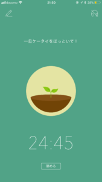
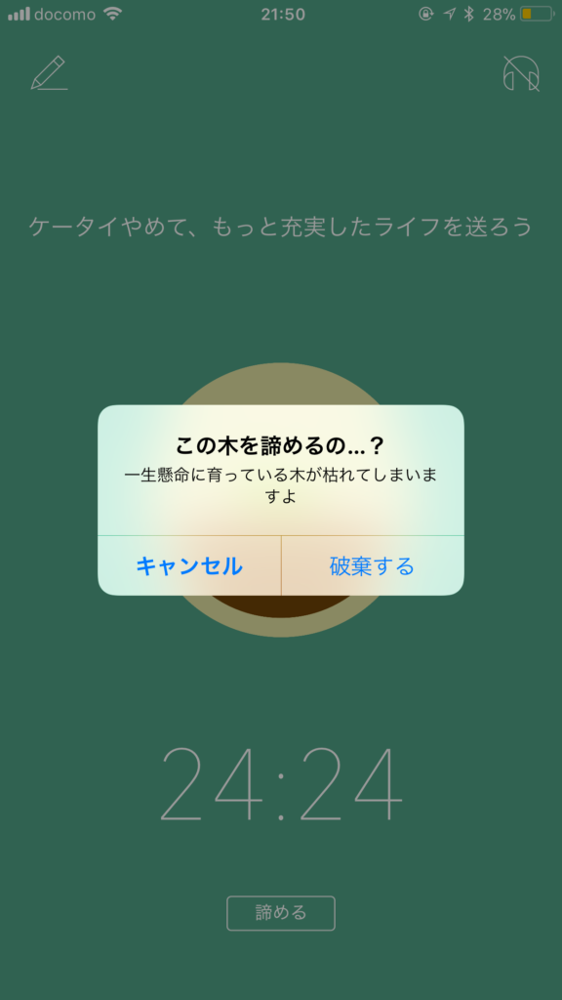
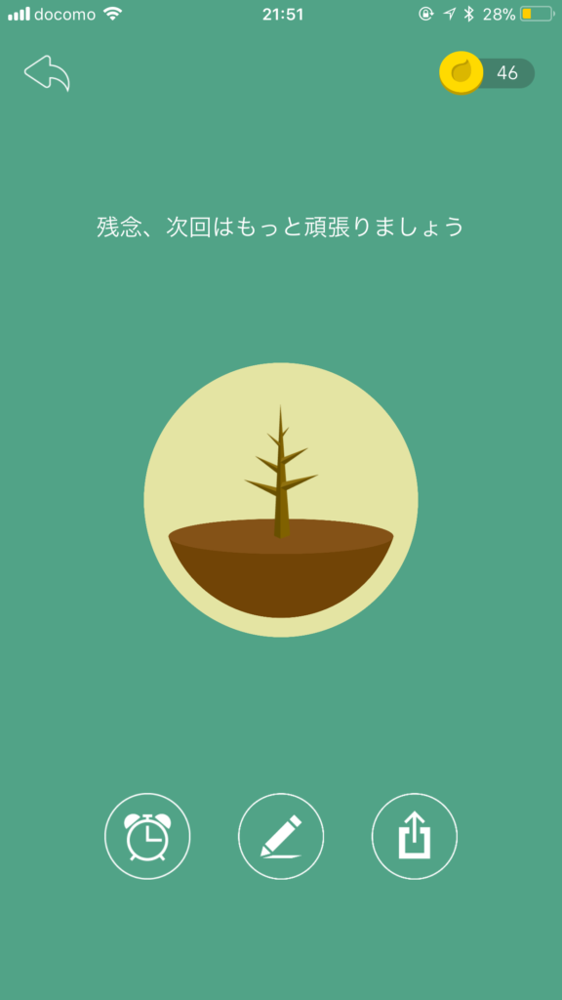
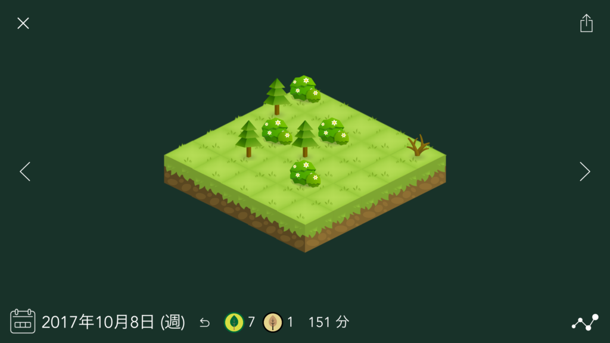
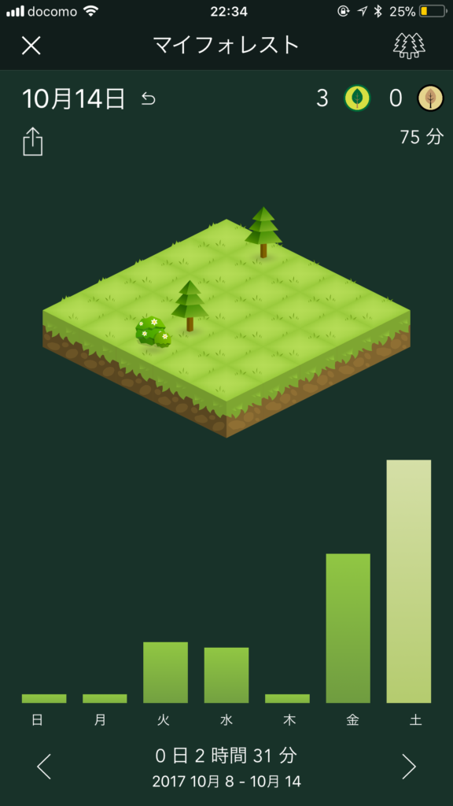
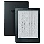

投稿日: {{ page.date | date: '%Y-%m-%d' }}

スマホは現代に生きる日本人にはほとんど必需品といってもいいぐらいです。しかしスマホは何でもできる反面、どんどん脱線して時間を食いつぶしていく面も持っています。

スマホを使っているのではなく、**スマホを使わされているような感覚**をお持ちの方も多いのではないでしょうか。

今回はスマホの使いすぎを防ぐアプリ「Forest」を使う３つのタイミングをご紹介します

<!--more-->

## Forestとは？

わたしがForestを知ったのはこちらの記事からです。

https://jmatsuzaki.com/archives/21690

Forestは簡単に言えばゲーム感覚でスマホの使いすぎを防ぐアプリです。専門的に言えばゲーミフィケーションを使ったアプリです。

ゲーム感覚といっても侮ってはいけません。むしろゲーム感覚だからこそ効果があります。

スマホやニンテンドーDS、PSP。古くはファミコンやスーファミなどでゲームをやめられなくなった人はその威力を体感しているはずです。

## Forestの使い方

ではForestの使い方です。まず[ダウンロード](https://itunes.apple.com/jp/app/forest-by-seekrtech/id866450515?mt=8)します。

あとはアプリを起動してスマホから離れる時間をセットしてスタートするだけ。

消そうとすると「諦めるの...？」ってでます。

それでもあきらめると木が枯れてしまいます。たとえやむを得ない事情があっても、けっこう残念な気持ちになります。

成功すると木が増えていくのでどんどん木を増やして森を育てたい気持ちになります。

\[caption id="attachment\_1069" align="alignnone" width="680"\] 始めたばかりの割には育っている気がします\[/caption\]

ログの振り返りももちろんOKです！

それでは次からForestを使うおすすめのタイミングをご紹介します。

## １．食事前

家族や友人との食事中にブルっとスマホがなって、ちょっと気になってスマホを見てしまうことはありませんか？

わたしは一人で食事をするときは、食事しながらスマホをだらだら見てしまうことがあります。ちなみにスマホとか本を読みながらご飯を食べると消化にあまりよくないみたいですね...

また食事中はアイディアがでやすいタイミングでもあります。

http://oyakuni.com/how-to-get-ideas3

しかしスマホの刺激や誘惑はなかなか手ごわいものです。そこで食事前にForestを起動しておくようにしました。

ご飯を味わえるようになり、家族や友人との時間がより充実しました。

## ２．歯磨き前

スマホをみながら磨いているといつの間にかすごい時間がたっていたりします。わたしも電子書籍を読みながら歯を磨いたりしてしまいます。

長い時間歯を磨いた割にはきちんと磨けているか分かっていないので、不安でもう一度気になるところを磨きなおしたりしてしまします。

これはあきらかに無駄ですよね。というかやるなら電子書籍読むのと歯を磨くのを分けるべきです（反省）。

というわけで歯磨き前にもForestがおすすめです。

## ３．読書前

電子書籍はスマホさえあればすぐ読めて便利な反面、ものすごい脱線しやすいです。

いつでもネットやSNSなどに脱線しますし、なんなら途中で通知も入ってきます。ふと別なことを思いついて、そのまま脱線することもしょっちゅうです。

しかし紙の本はスペースの問題もあるので電子書籍を読みたい。そこでkindleを使ってスマホの方はForestを起動することにしました。

kindleを買ったのはいいもののなかなか活用できていなかったので使い道ができたのもうれしいです。

[Kindle (Newモデル) Wi-Fi、ブラック、キャンペーン情報つきモデル、電子書籍リーダー](http://www.amazon.co.jp/exec/obidos/ASIN/B0186FESEE/do0909-22/)

Amazon

【2017/10/16現在プライム会員なら4000円引き！】

## 終わりに

他にも仕事中や子供と遊ぶ前などForestを活用できる場面はいっぱいあります。

スマホに使われるのでなく、スマホを使いたいと思っている方におすすめのアプリです！

Log is for Happy!!

[Forest by Seekrtech](https://itunes.apple.com/jp/app/forest-by-seekrtech/id866450515?mt=8&uo=4&at=1010lxsX)

240円

(2017.10.16時点)

[ShaoKan Pi](https://itunes.apple.com/jp/developer/shaokan-pi/id469475888?uo=4&at=1010lxsX)

posted with [ポチレバ](http://pochireba.com)
