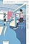
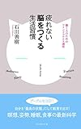

幸せになりたいですか？

もし幸せになりたいならこちらの本「どうすれば幸せになれるのか科学的に考えてみた」がおすすめです。

[どうすれば幸せになれるか科学的に考えてみた](http://www.amazon.co.jp/exec/obidos/ASIN/4040693191/do0909-22/)

吉田 尚記, 石川 善樹

「なぜ、この人と話をすると楽になるのか」の吉田尚記さんと「疲れない脳を作る生活習慣」の石川善樹さんの対談本です。

二冊ともおもしろいおもしろいとハイライトをいっぱい引いたのを思い出します。

この二人の対談となれば読まないわけにはいかないですね。

そしてめちゃくちゃおもしろかったです！

<!--more-->

## 科学的＝再現できる

吉田さんの「なぜ、この人と話をすると楽になるのか」の中ですごい心が楽になったのがコミュニケーションも「技術」なのかと考えられたことです

コミュニケーションなんてできて当たり前と（コミュ力ないのに）思い込んでた中でこの本に出会えて、コミュニケーションに対して気持ちが楽になったのを覚えています

例えば下のような文章です

> それは「空気を読め」という言い方自体に具体性がないからです。具体的じゃないままになんとなく挑んでしまったら、そりゃ転びもするしケガもします。
> 
> ではどうしたら空気を読めるようになるのか、それには具体的に実行へ移せるよう言葉を噛み砕く必要がある。
> 
> 自転車の乗り方にそれなりの技術があるように、コミュニケーションに関しても適切に練習すれば実行に移せる技術があるわけです。
> 
> 吉田 尚記. なぜ、この人と話をすると楽になるのか (Kindle の位置No.226-231).  . Kindle 版.

そして技術とは「具体的で再現できる」ことです。ある意味科学的ともいえます。**科学とは言ってしまえば再現できるかどうかが全てだからです。**

## 幸せを再現するポイントは？

では幸せを再現するポイントはどこなのか。本書では色々出ていますがわたしはこの二点が大事だと思います

1. 感情の認識
2. 感情のコントロール

### じぶんの感情を認識する

まずはじぶんの感情を認識することです。メタ認知とも言いますね。

じぶんが何を幸せと感じているかが分からなければ、幸せを再現することはできません。

また自分を動かす原動力はなんなのか。「わくわく」？「楽しさ」？それとも「怒り」？「負けたくない」？

そしてその原動力は自分に合った原動力でしょうか。

私もときどき「負けたくない」という感情が原動力になることがあります。でもその原動力はあまり好きではありません。疲れます。

わくわくとか楽しいとかそんな原動力が好きですね。

こんな感じで自分の感情を認識することはじぶんにあった生き方をするうえでかなり大事です。

じぶんの感情の解像度が高ければおのずとやりたいこと好きなことが見えてきます

#### 感情のチェックリスト

本書の中では感情の認識する方法のひとつとして石川さんがやっている感情のチェックリストが紹介されています

仕事などでtodoリストを作った方は多いと思います。しかしtobeチェックリストを作った方はそういないのではないかと。

このチェックリストのメリットとして感じたのは「感情をじぶんから切り離してみるきっかけになる」ことです。

持ち物リストで持ち物を揃えるように感情のチェックリストで感情を揃える。そんなイメージで感情を取り扱う感覚を得ることができると思うのです。

ちなみに石川さんがどんな感情をチェックしているのかは本書を参考にしてもらえればと思います。

追記：実際にやってみました。

[https://log-is-fun.com/checklist/](https://log-is-fun.com/checklist/)

### 感情をコントロールする

好きなことや認識した後はどう扱うかです。どうやって感情をあつかうか。楽しいこと、幸せだと思うこと、やりたいことをどうやったら再現できるか。

その方法のひとつが自分の「型」を見つけることです。

#### 自分の「型」をみつける

自分の「型」とは自分をうまく使いこなす方法のことです。たいてい自分をうまく使うコツをなんとなく持っている人が多いのではないでしょうか

たとえばスーパーで買う物を忘れないように手に書いておくというのも立派な自分の「型」です

他にも

- 出かけるのがおっくうでも出かけるとだいたい楽しい
- 片づけはほんの少しだけ始めるつもりでやる
- 頭がもやもやしたときはノートなどに書き出す

このようなコツを見つけていくことで自分をより動かしやすくなります。

わたしは休日の午前中にコーヒーとお菓子と本があればだいたいごきげんです（これがわたしの「型」のひとつです）

この「型」がわかっていれば幸せなこと、楽しかったことを再現しやすくなります。

こうした感情の認識や自分の使い方をじぶんが知ることができたのはやっぱり日記の効果が大きかったと思います。

関連記事：[\[日記のすすめ(仮)\]日記で幸せへの第一歩を踏み出す](https://log-is-fun.com/how-to-be-happy/)

## 他にもいろいろ

他にもいろいろ印象に残っているので箇条書きで

・やりたいことの見つけ方  
→過去の経験を分類、抽象化する

・ポジティブネガティブそれぞれの感情に役割がある  
　関連記事：[ネガティブにはネガティブの意味がある](https://log-is-fun.com/negative/)

・習慣が身につくまでには決まった感情の変化がある  
→感情の変化を追えば習慣化の手助けになりそう

## 終わりに

科学的とタイトルに入っているからといって硬い本ではありません。対談形式で楽しみながら読める本でした。

特に第四章の石川さんの恋愛エピソードはラブコメになっててもおかしくないですね。通勤電車の中でニヤニヤしてました。だれか映画化してください。

読めて満足な一冊でした！

Log is for Happy!!

* * *

[どうすれば幸せになれるか科学的に考えてみた\[Kindle版\]](//af.moshimo.com/af/c/click?a_id=765702&p_id=170&pc_id=185&pl_id=4062&s_v=b5Rz2P0601xu&url=http%3A%2F%2Fwww.amazon.co.jp%2Fexec%2Fobidos%2FASIN%2FB075QYPNNK%2Fref%3Dnosim)

posted with [ヨメレバ](https://yomereba.com)

吉田 尚記,石川 善樹 KADOKAWA / メディアファクトリー 2017-09-21

売り上げランキング : 1521

[Kindleで購入](//af.moshimo.com/af/c/click?a_id=765702&p_id=170&pc_id=185&pl_id=4062&s_v=b5Rz2P0601xu&url=http%3A%2F%2Fwww.amazon.co.jp%2Fexec%2Fobidos%2FASIN%2FB075QYPNNK%2F)

[Amazon\[書籍版\]で購入](//af.moshimo.com/af/c/click?a_id=765702&p_id=170&pc_id=185&pl_id=4062&s_v=b5Rz2P0601xu&url=http%3A%2F%2Fwww.amazon.co.jp%2Fexec%2Fobidos%2FASIN%2F4040693191%2F)

[なぜ、この人と話をすると楽になるのか\[Kindle版\]](//af.moshimo.com/af/c/click?a_id=765702&p_id=170&pc_id=185&pl_id=4062&s_v=b5Rz2P0601xu&url=http%3A%2F%2Fwww.amazon.co.jp%2Fexec%2Fobidos%2FASIN%2FB00SQYBB0A%2Fref%3Dnosim)

posted with [ヨメレバ](https://yomereba.com)

吉田 尚記 太田出版 2015-01-31

売り上げランキング : 14699

[Kindleで購入](//af.moshimo.com/af/c/click?a_id=765702&p_id=170&pc_id=185&pl_id=4062&s_v=b5Rz2P0601xu&url=http%3A%2F%2Fwww.amazon.co.jp%2Fexec%2Fobidos%2FASIN%2FB00SQYBB0A%2F)

[Amazon\[書籍版\]で購入](//af.moshimo.com/af/c/click?a_id=765702&p_id=170&pc_id=185&pl_id=4062&s_v=b5Rz2P0601xu&url=http%3A%2F%2Fwww.amazon.co.jp%2Fexec%2Fobidos%2FASIN%2F4778314336%2F)

[疲れない脳をつくる生活習慣―働く人のためのマインドフルネス講座](//af.moshimo.com/af/c/click?a_id=765702&p_id=170&pc_id=185&pl_id=4062&s_v=b5Rz2P0601xu&url=http%3A%2F%2Fwww.amazon.co.jp%2Fexec%2Fobidos%2FASIN%2F4833421607%2Fref%3Dnosim)

posted with [ヨメレバ](https://yomereba.com)

石川善樹 プレジデント社 2016-01-28

売り上げランキング : 22669

[Amazonで購入](//af.moshimo.com/af/c/click?a_id=765702&p_id=170&pc_id=185&pl_id=4062&s_v=b5Rz2P0601xu&url=http%3A%2F%2Fwww.amazon.co.jp%2Fexec%2Fobidos%2FASIN%2F4833421607%2Fref%3Dnosim)

[Kindleで購入](//af.moshimo.com/af/c/click?a_id=765702&p_id=170&pc_id=185&pl_id=4062&s_v=b5Rz2P0601xu&url=http%3A%2F%2Fwww.amazon.co.jp%2Fexec%2Fobidos%2FASIN%2FB01BDB1LIE%2F)
