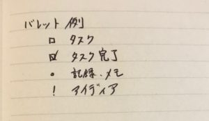
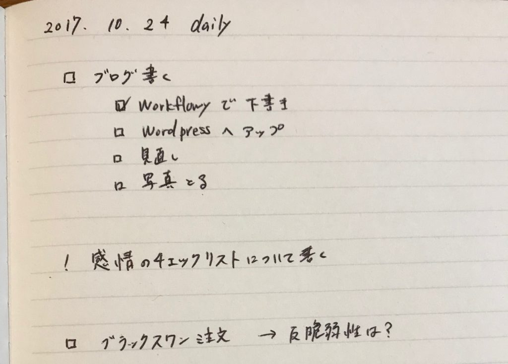

今回紹介する本は「箇条書き手帳でうまくいく　はじめてのバレットジャーナル」です

著者Marieさんのプレゼント企画に応募したら、まさかの当選。

早々にレビューしたかったのに体調不良でなんやかんや発売日(17/10/13)からこんなに遅くなってしまいました。と言い訳はここまでにして本についてです。

バレットジャーナルが前々から気にはなっていました。

しかしデザインとかデコレーションとかに凝っている写真を見て「ちょっと自分には合わないのかな？」なんてしり込みしていました（絵とかが下手）。

でも今回この本を読んで、バレットジャーナルが「気になる」から「使ってみたい！」に変わりました。

それではバレットジャーナルのおすすめポイントとこの本のおすすめポイント。この二点を見ていきましょう。

## バレットジャーナルとは

バレット＝「・」＝箇条書きの先頭につける点のことです。

「バレットを使ってタスクやスケジュール、メモなどを効率的に管理できる手帳」＝「バレットジャーナル」です。

バレットを使い分けることで、書いたものが単なるメモのなのか、タスクなのか、アイディアなのかとすぐに見分けられるようになります。

EvernoteやWorkFlowyのタグをイメージしてもらうと分かりやすいですね。バレットはじぶんで自由に設定できます。

そしてバレットジャーナルに必要なものはお気に入りのペンとノートだけです。

つまりバレットジャーナルとは**基本的にはとてもシンプルな手帳術**です。

## バレットジャーナルの構成

バレットジャーナルに必要なものは目次ページと各ページのナンバリングがあれば十分です。

あとは先人たちの知恵を参考にして自分の好きなモジュール、必要なモジュールを書きます。

たとえばデイリーページです。今日やることや思いついたことなどをバレットの種類で管理します。

<figure>

<figcaption>

↑さっと書いてみたバレットジャーナル

</figcaption>

</figure>

他にも以下のようなさまざまなモジュールがあります

- ウィークリーページ
- マンスリーページ
- 習慣化トラッカー
- 時間が空いたらやりたいことリスト
- ハッピーリスト
- コーピング　etc.

こうしたモジュールを組み合わせて自分好みの手帳が構成できるのはとてもわくわくします。

## バレットジャーナルおすすめポイント

### 自由度

いつでも始められます。手帳だと1月や4月など区切りのいいタイミングまで待ったりしますが、バレットジャーナルなら今すぐにでも始められます。

またモジュールを使って自分の好きなように手帳を構成できます。

日記を組み込んでみたり、読書録、旅のしおり、印象に残った景色のスケッチなんでも組み込むことができます。

すでにページが決まっている手帳では物足りない人にはぴったりの手帳なのではないでしょうか。

たとえば、ほぼ日手帳のような1日1ページでは足りない日もあります。バレットジャーナルなら柔軟に対処してくれます

### 一冊ですべて収まる

そして自由度が高いので1冊ですべて収まります。アイディアメモや会議中のメモ、気に入った詩の一節、読みたい本、確定申告の〆切もすべてこの1冊に書けばＯＫです。

アイディアはアイディアノートに。仕事の〆切は手帳になど考える必要はありません。まずバレットジャーナルに書いておけばいいというのはとても楽です。

楽だから続けやすいです。また一冊にまとまっているから見直しやすいです。続けやすく見直しやすいから楽しいです。

この楽しさは日記を読み返す楽しさにも通じると思います

続けやすくて楽しいというのはとても大事なことです。そして目次ページもありますから書いた内容も探しやすいですね。

### 書き直す

バレットジャーナルではデイリーページでできなかったタスクをもう一度次の日のデイリーページで書き直します。

書き直すというと手間がかかってデメリットのように感じます。しかし逆に書くことでそのタスクについてもう一度しっかりと向き合うことができるというメリットでもあります。

デイリーページだけでなく、たとえば自分の大切なものリストをバレットジャーナルに作ったとします。

一冊終わって次のバレットジャーナルにいくときに大切なものリストを全部書き直すっていうのはなかなか大変だと思うんですね。

そこでなんとかまとめられないかという思考が働く。アウトライナーで言うシェイクのようなものが書き直すことで起きるんじゃないかと思うんです。

このデジタル主流の中でバレットジャーナルという手書きのものを使う意義っていうのはここにあると思います。

デジタルではコピペで済ましてしまう**一つ一つのことに対してより真摯に向き合える気がします**。

▼関連記事  
[目標を毎日手帳に書くと、目標がどんどん育っていく](https://log-is-fun.com/mokuhyou/)  
[WorkFlowyで自分にとって大切なものを見つける方法～リストを育てる編～](https://log-is-fun.com/workflowy3/)

## この本のおすすめポイント

### 具体例がたくさん

著者のMarieさん以外にも4人の方の実際のバレットジャーナルが載っています。具体例がたくさんあると参考になりますね。見ていて楽しいですし。

それに具体例があるとそれがベースになって自分ならこうやるなとか考えやすいです。

自分も読んでいく中で自分の手帳の使い方だとこうするといいかも。こうしたいな。とかどんどんアイディアが出てきました。

このアイディアを簡単に吸収してくれるのもバレットジャーナルの柔軟性の高さだと思います。

### 一冊にまとまっている

バレットジャーナルって検索すればいろいろ情報は出てくるんですけどどうしても断片的になってしまうんですね。

だからこうして本としてまとまっているとかなり分かりやすいです。

実際いままで検索とかして調べたりもしましたけど、本を一冊読む方が効率良いなーと改めて思いました。

バレットジャーナルって言葉は気になってるけど良く知らないという方はこの本を手始めに読むと時間が無駄にならないと思います。

## 終わりに

バレットジャーナルを取り入れてみようといまノートを選定中です。手帳とかノートを選ぶ時間って楽しいですよね！

選んだノートについてもまた記事を書きたいと思います。

▼関連記事  
・[バレットジャーナルを始めるのでノートを5つ選んでみた](https://log-is-fun.com/bullet-journal2/)  
・[4つのバレットでシンプルに！タスク管理よりもアイデア寄りにバレットジャーナルを運用する](https://log-is-fun.com/bullet-journal3/)  
・[バレットジャーナルのノートをニーモシネにした3つの理由](https://log-is-fun.com/mnemosyene/)  
・[手帳、バレットジャーナルにおすすめ！コクヨのドローイングダイアリーを紹介](https://log-is-fun.com/drawing-diary/)

ピンクの表紙ですけど、男性にもおすすめの一冊です。kindleとかなら関係ないので男の人は電子書籍で読んでおくといいかもしれませんね。

バレットジャーナルをはじめるにはうってつけの本でした！

Log is for Happy!!

リンク
