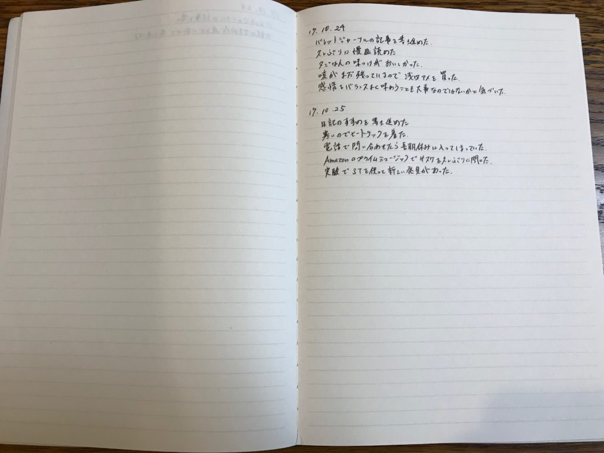
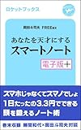

## はじめに

この記事はkindle出版を目指している「日記のすすめ（仮）」の一部です。

日記の書き方についての章の一部になります。

##  5行日記で日記にさらに習熟する

前記事：[日記を始めるならコスパのいい1行日記から](https://log-is-fun.com/start-one-sentence-diary/)

1行日記ではちょっと物足りない、もしくは物足りなくなってきた方は5行日記がおすすめです。

岡田斗司夫さんの[スマートノート](http://amzn.to/2z1z5Ng)で紹介されている日記の書き方で、日記にさらに慣れていくにはぴったりの日記の書き方です。

手書きの方が書きやすい日記です。ノートを見開きで使います。

右側に一日5行、動詞と名詞を一組にして日記を書きます。

左側は自由です。出来事に対する感想や、やっておきたいことなど書きます。映画やディズニーのチケットを貼ってもいいですね。

\[caption id="attachment\_1126" align="alignnone" width="680"\] ↑右のページに一日5行日記を書きます。左側のページは自由に使います。\[/caption\]

また数か月後や一年後に読み返した時に「こんなことで悩んでいたんかい！」と愛のあるツッコミをいれてあげるのもいいでしょう。

昔の自分の悩みが大したことないと思えれば、今の自分の悩みもじつは大したことないんじゃないかと別の視点を持つこともできます。

もちろん無理に左側は書かなくてもOKです。ただ上の画像を見てもわかるように、ページが空いていると何かしら書きたくなってきます。

この5行日記を続けていくとてたいていの人はもっといろんなことを書きたくなってきます。そのときは5行と制限せず、もっともっと書いちゃいましょう。

これから紹介するような感謝日記やＷＯＯＰ日記などを組み合わせると日記をより活用できるはずです。

またここまでくれば一日の出来事を綴っていくような通常の日記も書けるようになっているはずです。

▼関連記事  
[自分の現状に不満があるなら感謝日記を書いてみよう！  
](https://log-is-fun.com/book-thanksdiary/)[WOOP日記で夢や目標を達成する](https://log-is-fun.com/woop-diary/)

## 行動を採点する

さらに活用するなら0~5点で採点することもできます。

0が最低点で5点が最高点。その出来事がどれだけ楽しかったかを1行ずつ採点します。

この採点をすることでじぶんにとってなにが楽しいのかわかってきます。

**毎日つまらないと感じている人はじぶんがつまらないと感じるための「努力」を知らず知らずに積み重ねてしまっています。**

太ってしまう人と一緒ですね。毎日毎日カロリーの高い食事や間食をすることで太るための「努力」をしていることになります。

この「努力」をつまらないことをする努力から楽しいことをするための努力に変えられること。

それが採点する効果です。

自分にとってどんなことが楽しいかわかれば、そのための努力をすることができます。

## おすすめツール

### ノート

見開きで使うのでノートが最適です。使っていないノートがあればすぐにでも始められます。

持ち歩けるようにしておくと日記の三日坊主が防ぎやすいのでB5ぐらいにしておくとよいと思います。

## 応用できる日記の書き方

### 感謝日記

左側に感謝したことについての感想や、お返しをどうするかを書くことができます。感謝を忘れずにお返しできることで好印象もゲット。

### 絵日記

絵が好きな人は左側に絵も一緒に書くとより思い出が深まります。他にもマインドマップを書いたり、写真を貼ったりもいいですね。

## おわりに

5行日記が書ければ日記は書けるようになる。そう思います。ペンとノートがあればすぐにでも始められるのでぜひ試してみてください。

日記のすすめ(仮)の他の記事はこちらからどうぞ

https://log-is-fun.com/book-how-to-start-diary/

Log is for Happy!!

* * *

Amazonのプライム会員なら無料で読めます。

[あなたを天才にするスマートノート・電子版プラス\[Kindle版\]](//af.moshimo.com/af/c/click?a_id=765702&p_id=170&pc_id=185&pl_id=4062&s_v=b5Rz2P0601xu&url=http%3A%2F%2Fwww.amazon.co.jp%2Fexec%2Fobidos%2FASIN%2FB00E4U62PO)

posted with [ヨメレバ](https://yomereba.com)

岡田斗司夫 FREEex 株式会社ロケット 2014-01-06

売り上げランキング : 10

[Kindleで購入](//af.moshimo.com/af/c/click?a_id=765702&p_id=170&pc_id=185&pl_id=4062&s_v=b5Rz2P0601xu&url=http%3A%2F%2Fwww.amazon.co.jp%2Fexec%2Fobidos%2FASIN%2FB00E4U62PO%2F)

[Amazon\[書籍版\]で購入](//af.moshimo.com/af/c/click?a_id=765702&p_id=170&pc_id=185&pl_id=4062&s_v=b5Rz2P0601xu&url=http%3A%2F%2Fwww.amazon.co.jp%2Fexec%2Fobidos%2FASIN%2F4163735704%2F)
