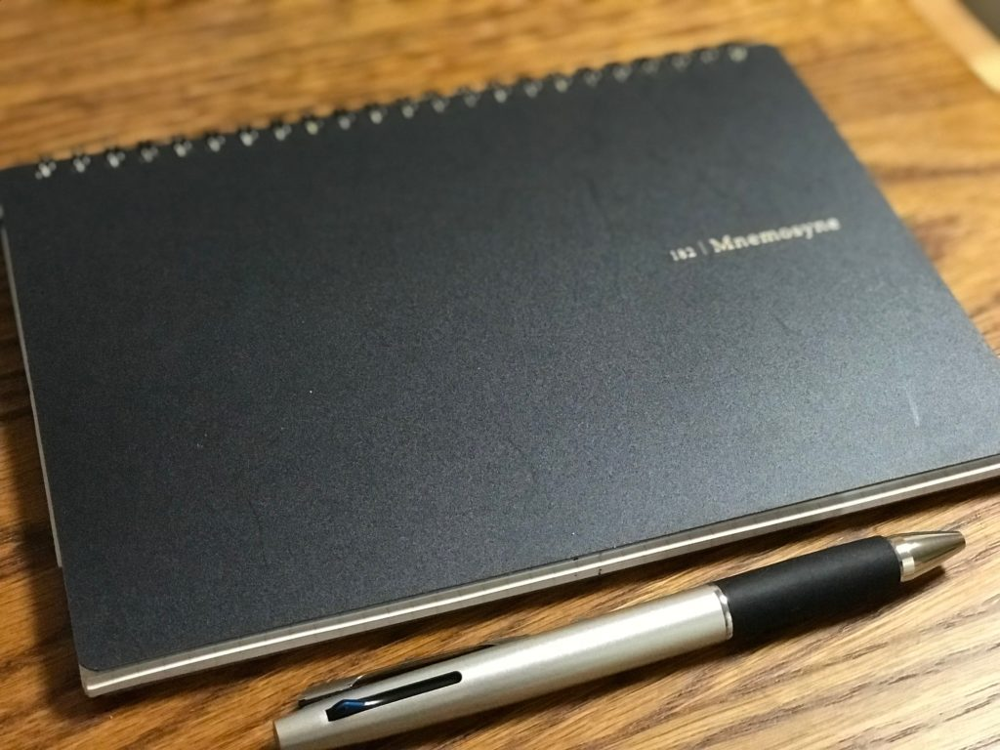
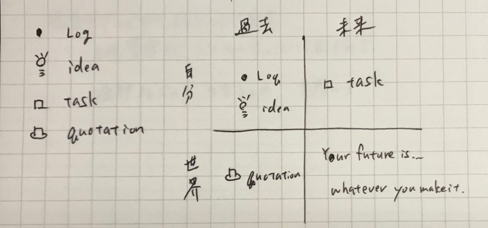
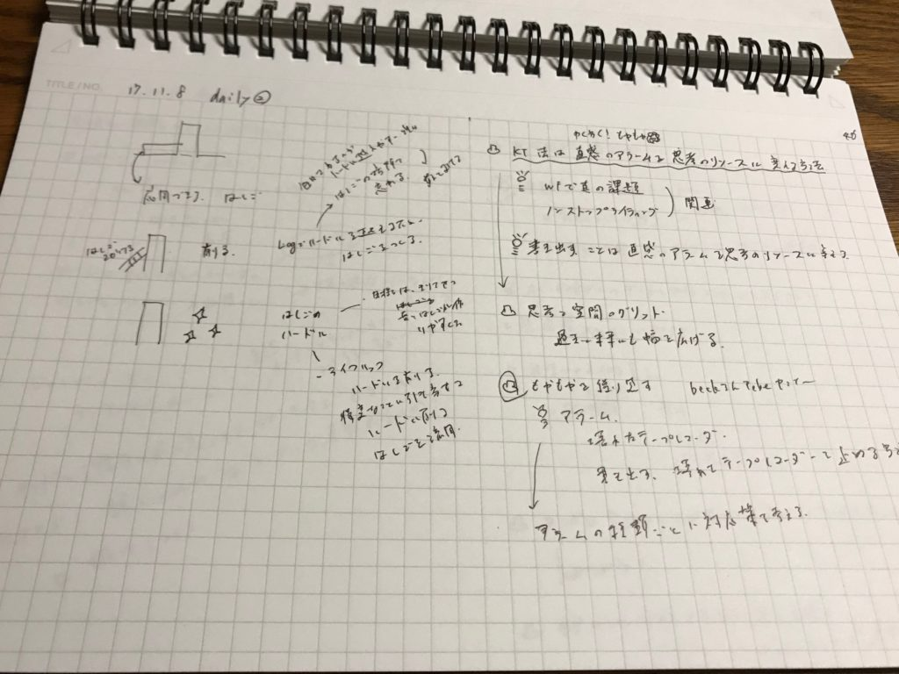
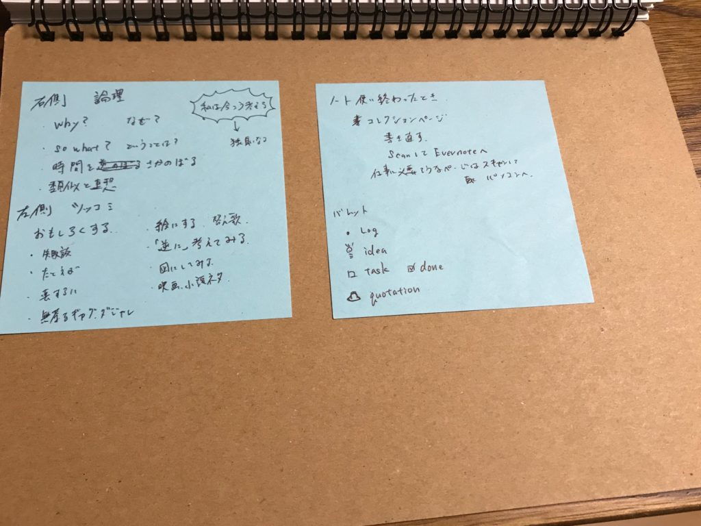
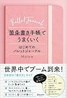
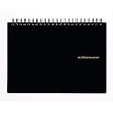

前回バレットジャーナルを始めるために5冊候補を選びました。

[https://log-is-fun.com/bullet-journal2/](https://log-is-fun.com/bullet-journal2/)

そのなかからわたしが選んだのはこちらです。

そう、ニーモシネです。選んだ理由を書いていたら長くなりそうだったので今回はバレットジャーナルを使い始めて3週間。どんなページ構成で運用しているか紹介します。

以下の4つで構成しています

1. インデックス
2. マンスリーページ
3. デイリーページ
4. コレクションページ

<!--more-->

## インデックスページ

デイリーページのなかに何回も見直したいページが埋もれてしまうとめんどうなのでデイリーページとその他でインデックスを分けました。

デイリーページ含めて見返したいページにはポストイットも貼ってます。

## マンスリーページ

今月やりたいプロジェクトを書いています。スケジュールというよりも今月何に力を入れたいのかをはっきりさせるためのページです。

スケジュール管理は手帳のカレンダーで管理してます。

## デイリーページ

考えたことややったことなどの記録。アイディア。気になった文章やニュースを書き留めたりします

使うバレットは下の画像の左にある4種類です。

4つのバレットでシンプルにしました。

デイジーページの構成は一ページを半分に分けています。右側から書いて、左側はあとから追記したりするために空けてあります。

下の画像は実際に書いたもので、右側に箇条書きで書いて、左側に図で考えを整理したりしました。

ここらへんの運用は以下の記事や本を参考にしました。

http://gofujita.info/notes\_bjtodofw.html

https://rashita.net/blog/?p=23125

[あなたを天才にするスマートノート・電子版プラス](http://www.amazon.co.jp/exec/obidos/ASIN/B00E4U62PO/do0909-22/)

岡田斗司夫 FREEex

この使い方はじぶんに合っているなーと感じています。

バレットで書いてあることを分類しておきつつ、左側でアイディアを育てたり、タスクを洗い出したり。

バレットを使うとなんとなく「整理して書かなきゃ」みたいな意識が働くんですよね。メリットでもあります。しかしデメリットにもなります。

だから自由に書くスペースを確保しておくのは大事だなと思います。

## バレットについて

この4種類のバレットで全て分類できます。

4つのバレットを自分と世界、過去と未来のマトリクスに分けてみると上の画像の右のように分類できます。

- 記録→自分の過去の行動、思考
- アイディア→自分のアイディアの記録。記録の一種
- タスク→自分の未来の行動
- 本やニュースなどからの引用→世界の過去の行動、思考、アイディア

自分の過去と自分の未来、世界の過去はこの4つのバレットで分類できます。

世界の未来はコントロール外です。自分の記録やアイディアからでてきた未来の行動＝タスクを通じてなにかしら影響を与えるしかありません。

世界の未来を予測したものはアイディアの範疇になります。PoICという情報カードの活用法を応用しました。

http://web.archive.org/web/20191225044044/http://pileofindexcards.org/wiki/index.php/PoIC\_%E3%81%A8%E3%81%AF%EF%BC%9F

## コレクションページ

ここらへんはさらっと紹介します。

### 自分TIPS

自分を使いこなすコツを書いていくページ

### ネタページ

スマートノートを読んで、おもしろさ（funny,interestingの両方）の力をのばしたいなとと考えています。といってもなかなかネタが増えません。

これから増えるといいのですが。

### 感情のチェックリスト

これは以前紹介した本の中で紹介されていた感情のチェックリストです。感情の偏りが分かります。いまは本にあった感情でチェックしてますが、そのうちリストをカスタマイズしたいところです。

[https://log-is-fun.com/happy-science/](https://log-is-fun.com/happy-science/)

## 使い方メモ

使い方はいつでも見られるようにポストイットで裏表紙に貼ってます。

## 終わりに

というわけでバレットジャーナルの使い方をご紹介しました。バレットジャーナルを使っている方や始めようかなと思っている方の参考なればうれしいです

Log is for Happy!!

▼関連記事 ・[バレットジャーナルとはなにか知りたいなら「箇条書き手帳でうまくいく　はじめてのバレットジャーナル」がおすすめ](https://log-is-fun.com/bullet-journal1/) ・[バレットジャーナルを始めるのでノートを5つ選んでみた](https://log-is-fun.com/bullet-journal2/) ・[バレットジャーナルのノートをニーモシネにした3つの理由](https://log-is-fun.com/mnemosyene/) ・[手帳、バレットジャーナルにおすすめ！コクヨのドローイングダイアリーを紹介](https://log-is-fun.com/drawing-diary/)

[「箇条書き手帳」でうまくいく はじめてのバレットジャーナル](//af.moshimo.com/af/c/click?a_id=765702&p_id=170&pc_id=185&pl_id=4062&s_v=b5Rz2P0601xu&url=http%3A%2F%2Fwww.amazon.co.jp%2Fexec%2Fobidos%2FASIN%2F4799321811%2Fref%3Dnosim)

posted with [ヨメレバ](https://yomereba.com)

Marie ディスカヴァー・トゥエンティワン 2017-10-13

売り上げランキング : 85

[Amazonで購入](//af.moshimo.com/af/c/click?a_id=765702&p_id=170&pc_id=185&pl_id=4062&s_v=b5Rz2P0601xu&url=http%3A%2F%2Fwww.amazon.co.jp%2Fexec%2Fobidos%2FASIN%2F4799321811%2Fref%3Dnosim)

[Kindleで購入](//af.moshimo.com/af/c/click?a_id=765702&p_id=170&pc_id=185&pl_id=4062&s_v=b5Rz2P0601xu&url=http%3A%2F%2Fwww.amazon.co.jp%2Fexec%2Fobidos%2FASIN%2FB076D9QPCW%2F)

[楽天ブックスで購入](//af.moshimo.com/af/c/click?a_id=765703&p_id=56&pc_id=56&pl_id=637&s_v=b5Rz2P0601xu&url=http%3A%2F%2Fbooks.rakuten.co.jp%2Frb%2F15191692%2F)

[楽天koboで購入](//af.moshimo.com/af/c/click?a_id=765703&p_id=56&pc_id=56&pl_id=637&s_v=b5Rz2P0601xu&url=https%3A%2F%2Fbooks.rakuten.co.jp%2Frk%2Fa76e72f034cb3b5f911147c4760f1197%2F)

[7netで購入](//af.moshimo.com/af/c/click?a_id=765667&p_id=932&pc_id=1188&pl_id=12456&s_v=b5Rz2P0601xu&url=http%3A%2F%2F7net.omni7.jp%2Fsearch%2F%3FsearchKeywordFlg%3D1%26keyword%3D4-79-932181-2%2520%257C%25204-799-32181-2%2520%257C%25204-7993-2181-2%2520%257C%25204-79932-181-2%2520%257C%25204-799321-81-2%2520%257C%25204-7993218-1-2)

[マルマン ノート ニーモシネ A5 方眼罫 N182A](//af.moshimo.com/af/c/click?a_id=765702&p_id=170&pc_id=185&pl_id=4062&s_v=b5Rz2P0601xu&url=http%3A%2F%2Fwww.amazon.co.jp%2Fexec%2Fobidos%2FASIN%2FB00TES82HW%2Fref%3Dnosim)

posted with [カエレバ](http://kaereba.com)

マルマン(maruman) 2015-02-16

売り上げランキング : 479
