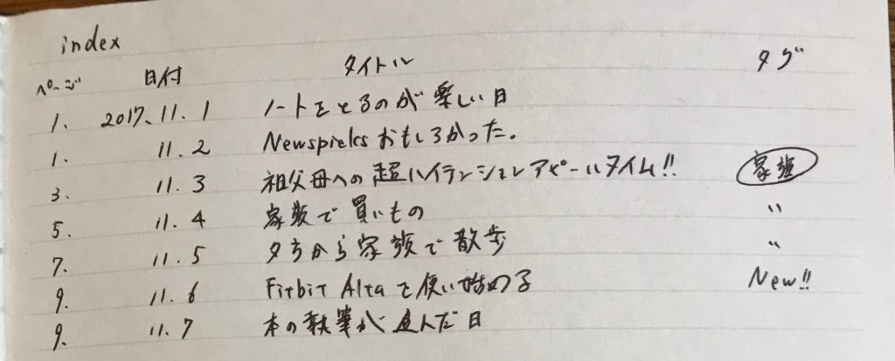
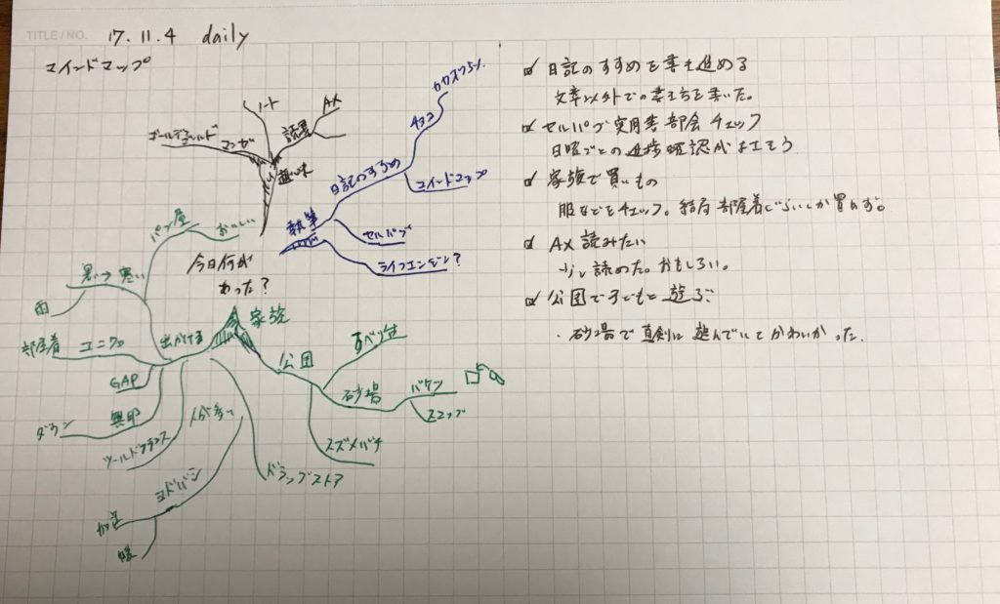

日記を簡単に始めるなら手書きが一番だと思っています。

そこで今回は手書き日記を始めるお手軽3ステップをご紹介します。

1. ノートを買います
2. 最初の数ページを目次にします
3. 見開きの右側に日記を書き、左側をフリースペースにします

終わりです。ノートがあれば2ステップで終わります。

簡単ですね。

次から各ステップについて説明していきます。

<!--more-->

## １．ノートを買う

ノートを買います。自分の好きなノートでOKです。文章で書くなら横罫線のあるものがいいと思います。

絵などをかきたいなら無地のものや方眼のものでもありですね。

## ２．indexページを作る

最初の数ページを目次にします。大体でかまわないです。ノートのページ数につき、目次を一つ作ると考えておけばいいと思います。

もし足りなかったら最後のページを使いましょう。目次があることで日記を読み返しやすくなります。

目次に必要なものはページ番号、日付、タイトルです。

日記を書いた後に目次を作ります。

あとは目次にタイトルと一緒にタグを書いておくと便利です。

たとえば家族のことや仕事のことで重大なイベントがあった日や夢のために行動した日など読み返したいページが分かるようにしておきましょう。

たとえば家族のことについて読み返したい日があったら、目次のタイトルや日付の後ろに家族と書いて〇で囲っておけば分かりやすいですね。

参考に管理人が実際に書いた例をどうぞ。

### 日記にタイトルをつける理由

日記にタイトルをつけることで

- 日記を深く読み返せる
- 自分の大切なものが分かる

といった効果があります。

日記のタイトル＝その日自分が重要だと思えたことです。

ですから目次に日記のタイトルを書いておけば、目次を読み返すだけで自分が自分にとって重要なことができているかどうかが分かります。

また目次にタイトルがあることで、タイトルだけでも一か月や一年などの長期間にわたってざっと読み返せるようになります。

そうすることで日記を読み返す楽しさや効果を体感することができます

詳しくは以前書いたこちらの記事でも書いております。

https://log-is-fun.com/diary-title/

## 見開きで使う

右側に日記を書きます。形式はなんでも大丈夫です。

おすすめとしては1日にあったことを５行書く5行日記です。１行にひとつ今日あったことを書きます。

詳しく知りたい方はスマートノートを読んでみてください。（プライム会員なら読み放題）

[あなたを天才にするスマートノート・電子版プラス](http://www.amazon.co.jp/exec/obidos/ASIN/B00E4U62PO/do0909-22/)

岡田斗司夫 FREEex

一ページに続けて何日分か書けるので自然と前の日の日記を見返すことができます。

左側は追記用に残しておきます。もちろん追記しなくてもいいです。

しかし左側も活用するとより充実した日記になります。

左側の使い方としては以下のような方法があります。

### 考えをふくらませる

右側に書いてあったことに対して考えを膨らませます。

たとえば「今日の飲み会は楽しかった」と書いてあったとします。

そこから考えを膨らませてみましょう。なんで楽しかったのか？友達と話せたからでしょうか。

それとも自分の話したいことを話せたからでしょうか？はたまたおもしろい話を聞けたからでしょうか。

料理がおいしかったということもあるでしょう。そうして考えを深めることでじぶんの傾向や性格がより深く理解できます。

ニュースについて日記に書いて考えを深めれば、世の中の出来事に対する見方も変わってくるはずです。

### ツッコミを入れる

日記を書いていると嫌な日も当然あります。落ち込むこともあります。

その日には「なんでこんなことになったんだ」「もう嫌だ！」と思うこともあるでしょう。

しかし数日、はたまた数週間たってから日記を読み返してみると、まったく大したことではないのにものすごく落ち込んでいるある意味こっけいな自分に気がつきます。

そうしたときは優しく「こんなの大したことなかった」とツッコミを書いておきましょう。

ツッコミをするということは自分の気分は絶対ではないと気づくことです。

次に落ち込んだ時には「もう嫌だ」と思わず、すこし時間がたったら大したことなくなるとあなたは分かっているはずです。

### チケットや写真を貼る

映画や遊園地のチケット、写真を張ることで、より鮮明に日記の内容やそれ以上のことも思い出せます。

写真を撮ったのがどんな状況だったのか、写真を撮った後どんなことがあったのかを一緒に書いておくとより思い出が深まります。

### 絵やマインドマップを書く

その日あったことを絵にしたり、マインドマップで日記を書いてみてもいいと思います。

以下の写真はtodoリストを右側に書いて、そのリストをもとにマインドマップを書いた時のものです。（ノートを見開きではなく、二分割にして使っています）

▼関連記事 [\[日記のすすめ(仮)\]文章で綴る以外でも日記は書ける](https://log-is-fun.com/mindmap-diary/)

## 終わりに

手書きは自由度が高いのがいいですね。自分の好きなノートならなんでもいいですが、もし迷ったらコクヨのナンバードノートがおすすめです。

少しお高いですが、各ページにページ番号が最初からついていますし、インデックスページがもあります。

時間対効果を考えると悪くないと思います。

もちろんコンビニに売ってるノートだってOKですよ！

それではマイペースに楽しい日記ライフを！

日記同好会も始めましたので、こちらもぜひチェックしてみてくださいね。

https://note.com/mailman/n/nbe584ebcaeca

Log is for Happy!!

* * *

[コクヨ ノート ナンバードノート A5変形 KE-SP2-2N](//af.moshimo.com/af/c/click?a_id=765702&p_id=170&pc_id=185&pl_id=4062&s_v=b5Rz2P0601xu&url=http%3A%2F%2Fwww.amazon.co.jp%2Fexec%2Fobidos%2FASIN%2FB01GUQRBGI%2Fref%3Dnosim)

posted with [カエレバ](http://kaereba.com)

コクヨ(KOKUYO) 2017-06-14

[Amazonで調べる](//af.moshimo.com/af/c/click?a_id=765702&p_id=170&pc_id=185&pl_id=4062&s_v=b5Rz2P0601xu&url=http%3A%2F%2Fwww.amazon.co.jp%2Fgp%2Fsearch%3Fkeywords%3D%25E3%2583%258A%25E3%2583%25B3%25E3%2583%2590%25E3%2583%25BC%25E3%2583%2589%25E3%2583%258E%25E3%2583%25BC%25E3%2583%2588%26__mk_ja_JP%3D%25E3%2582%25AB%25E3%2582%25BF%25E3%2582%25AB%25E3%2583%258A)

[楽天市場で調べる](//af.moshimo.com/af/c/click?a_id=765702&p_id=54&pc_id=54&pl_id=616&s_v=b5Rz2P0601xu&url=http%3A%2F%2Fsearch.rakuten.co.jp%2Fsearch%2Fmall%2F%25E3%2583%258A%25E3%2583%25B3%25E3%2583%2590%25E3%2583%25BC%25E3%2583%2589%25E3%2583%258E%25E3%2583%25BC%25E3%2583%2588%2F-%2Ff.1-p.1-s.1-sf.0-st.A-v.2%3Fx%3D0)

[7netで調べる](//af.moshimo.com/af/c/click?a_id=765702&p_id=932&pc_id=1188&pl_id=12456&s_v=b5Rz2P0601xu&url=http%3A%2F%2F7net.omni7.jp%2Fsearch%2F%3Fkeyword%3D%25E3%2583%258A%25E3%2583%25B3%25E3%2583%2590%25E3%2583%25BC%25E3%2583%2589%25E3%2583%258E%25E3%2583%25BC%25E3%2583%2588%26searchKeywordFlg%3D1)
