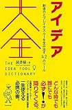

最近アイデア大全を読み返しています。アイディア発想法が42も載っている良書です。発想法の背景や実例も分かるので、読んでいてわくわくします。

[アイデア大全――創造力とブレイクスルーを生み出す42のツール](http://www.amazon.co.jp/exec/obidos/ASIN/4894517450/do0909-22/)

読書猿 

さてアイディア大全を読んでいるとセルフコントロールの方法として使えたり、ブラッシュアップできる方法となりそうなものがいくつもありました。

その理由とどう応用するかについて考えてみました。

<!--more-->

## アイディア発想法は思考の取り扱い法

たとえばノンストップ・ライティングです。このノンストップ・ライティング法はアイデア大全でも紹介されている発想法です。

しかしジャーナリングとして心を鎮めるためのマインドフルネスの技法として紹介されることもあります。

> ジャーナリングは思考と情動を対象とするマインドフルネスとみなすことができる。
> 
> 思考と情動が湧き起こるそばから一瞬一瞬の、評価や判断とは無縁の注意をそれに向け、紙に書くことで、その流れを助けるのだ。
> 
> 「[サーチ インサイド ユアセルフ](http://amzn.to/2AeEstI)」 No.1815

それはなぜなのでしょうか？

それは多分アイディアを発想する方法とは自分の思考や考えを頭の外に出してうまく取り扱うための方法だからです。

つまりじぶんの頭の中に思いついたこと、思考、感情、気分を頭の外に出した後に昇華させてアイディアにするのか、消化してなかったことにするのかの違いだけなんだと思うんです。（ちょっとうまいこと言った感）

だからアイディア発想法が自分の感情などをコントロールする方法として使えるのは、気づいてしまえば当たり前なのかもしれません。

つまりアイデア大全はセルフコントロール方法を改善する「セルフコントロールバイキルトの書」とも言えるのではないかと。

ではどのように改善するのか？

ということで今回はWOOPに応用してみました

## WOOPとは

WOOPは

- Wish　願い
- Outcome　結果
- Obstacle　障害
- Plan　計画

の頭文字をとった言葉です。この項目に沿って自分の願いやその結果、そこに至るまでの障害、それを乗り越えるための計画を書いていきます。

そうすることで目標、やりたいことに向かって行動できるようにする、あるいは問題の解決や課題を克服することができます。

詳しくは以前書いたこちらの記事をどうぞ

[https://log-is-fun.com/woop1/](https://log-is-fun.com/woop1/)

## WOOPへの応用

アイデア大全の中から今回応用したのは以下の2つです。

発想法20　ルビッチならどうする  
発想法21　ディズニーの３つの部屋

### ルビッチならどうする？

映画監督であるビリー・ワイルダー氏が師であるエルンスト・ルビッチ監督ならどうするだろうか？と考えてインスピレーションを得ていたことに由来。

自分以外の視点から物事を見ることでアイディアを膨らませる発想法

### ディズニーの３つの部屋

「ルビッチならどうする？」をさらに応用したような方法。

夢想家と実務家、批評家の３つの視点からアイディアを成功へと導くプランを立てる方法。

まず夢想家の視点からなんでも実現可能だと考えて発想を膨らませ、実務家の視点から実現へと導けないか考えます。

そして批評家の視点で、この実現させるための計画にまずいところはないだろうかと考えることで計画の中の落とし穴を回避できます。

この二つの発想法のポイントは自分以外の視点から考えることです。

そしてWOOPでもなんでもそうですが、自分で計画を立てようとしたり、目標を立てたりとかしようとしても、じぶんの今までの固定観念というか常識の範囲内にどうしてもとどまってしまい、袋小路になってしまうことがあるのです。

でもこの方法を使えばすこしでも自分の発想の枠が取り払えると考えました。

たとえばWOOPをやっていても、自分一人の思考だとwishやoutcomeが変わらないことが多いんですよね。

だから思考の幅を広げるために他人のような視点が持てるこの二つの発想法をWOOPへ応用しました。

## WOOPに応用するとこうなります

#### Wish、Outcome→～ならどうする？（夢想家）

ルビッチならどうする？とディズニーの３つの部屋の夢想家の役割を応用。発想を自由に広げます。

#### plan→実務家視点

計画をこの段階で一度立てます。実務家の役割として上で考えた願いをどう実現するか考えます。

広げた発想を現実にできないか考えるステップです。もう一度計画をたてるときのたたき台にもなります。

#### obstacle→批評家視点

障害を批評家視点でチェックします。この視点で独りよがりになっていないか、見逃しているリスクはないかなどを探ります。

#### plan→実務家

もう一回批評家の指摘を受けて計画を練り直します。こうすることでより確率の高い計画を立てられるようになります。

このようにWOOPを改良してからすこし思考の枠が広がった気がします。

「これは自分じゃないから、夢想家の視点だから」とある意味で言い訳ができてどんどん夢というか野望が出せるようになったのだと思います。

そしてしっかりと現実にするためのステップも考えられます。なかなかいい改善ができた気がします。

## 終わりに

アイデア大全の中の発想法を応用してみました。他にもいろいろ応用できそうなものがあって楽しみです。

またライフハック大全も読んでいるのですが、こちらはもっと具体的な日々に活かせる工夫が多いので直接的な応用がしやすいですね。

アイデア大全の次のシリーズ、問題解決大全を読むのも楽しみです。

それでは楽しい日々をお過ごしください。

Log is for Happy!!

▼関連記事  
・[先送りしたくない人は「ノンストップ・ライティング」がおすすめ！  
](https://log-is-fun.com/sakiokuri/)・[「やりたい」を「やる」にするためのテクニック「WOOP」を紹介するよ！](https://log-is-fun.com/mnemosyene/)

* * *

[アイデア大全――創造力とブレイクスルーを生み出す42のツール](//af.moshimo.com/af/c/click?a_id=765702&p_id=170&pc_id=185&pl_id=4062&s_v=b5Rz2P0601xu&url=http%3A%2F%2Fwww.amazon.co.jp%2Fexec%2Fobidos%2FASIN%2F4894517450)

posted with [ヨメレバ](https://yomereba.com)

読書猿 フォレスト出版 2017-01-22

売り上げランキング : 304

[Amazonで購入](//af.moshimo.com/af/c/click?a_id=765702&p_id=170&pc_id=185&pl_id=4062&s_v=b5Rz2P0601xu&url=http%3A%2F%2Fwww.amazon.co.jp%2Fexec%2Fobidos%2FASIN%2F4894517450)

[Kindleで購入](//af.moshimo.com/af/c/click?a_id=765702&p_id=170&pc_id=185&pl_id=4062&s_v=b5Rz2P0601xu&url=http%3A%2F%2Fwww.amazon.co.jp%2Fexec%2Fobidos%2FASIN%2FB06XFPYZ8P%2F)

[ライフハック大全―――人生と仕事を変える小さな習慣250](//af.moshimo.com/af/c/click?a_id=765702&p_id=170&pc_id=185&pl_id=4062&s_v=b5Rz2P0601xu&url=http%3A%2F%2Fwww.amazon.co.jp%2Fexec%2Fobidos%2FASIN%2F4046021543)

posted with [ヨメレバ](https://yomereba.com)

堀 正岳 KADOKAWA 2017-11-16

売り上げランキング : 244

[Amazonで調べる](//af.moshimo.com/af/c/click?a_id=765702&p_id=170&pc_id=185&pl_id=4062&s_v=b5Rz2P0601xu&url=http%3A%2F%2Fwww.amazon.co.jp%2Fexec%2Fobidos%2FASIN%2F4046021543)

[Kindleで調べる](//af.moshimo.com/af/c/click?a_id=765702&p_id=170&pc_id=185&pl_id=4062&s_v=b5Rz2P0601xu&url=http%3A%2F%2Fwww.amazon.co.jp%2Fexec%2Fobidos%2FASIN%2FB0779KV65Z%2F)
