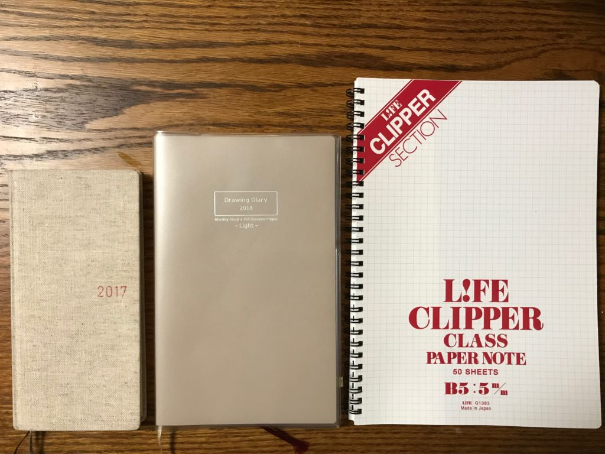
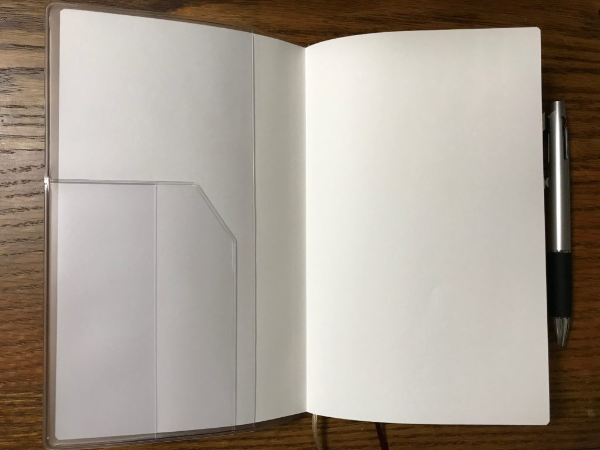
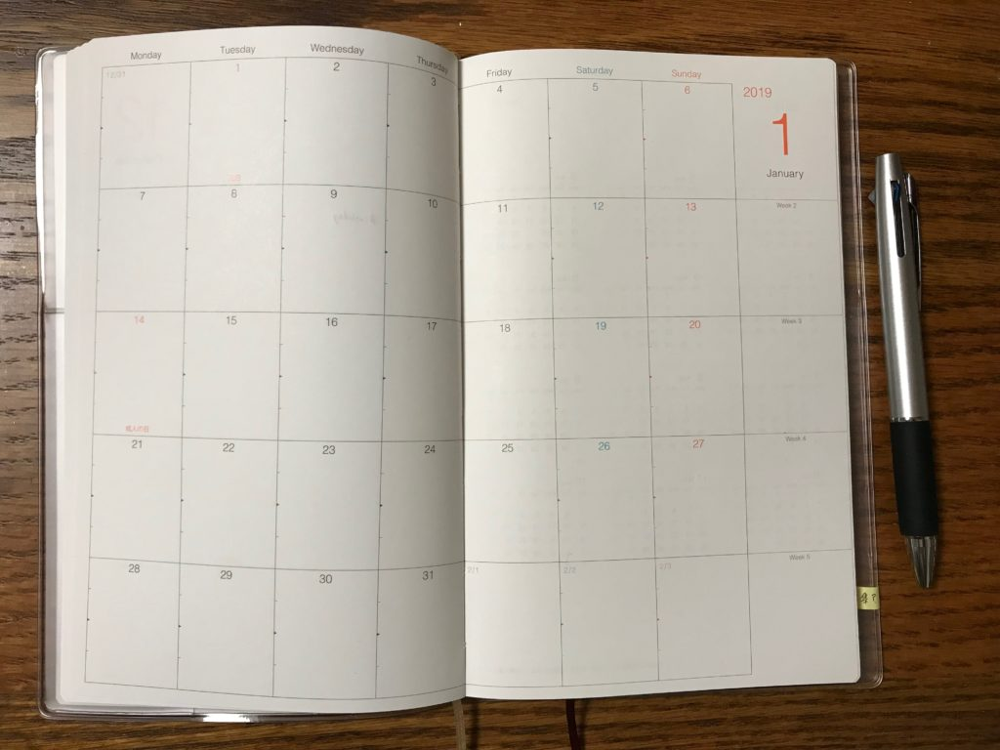
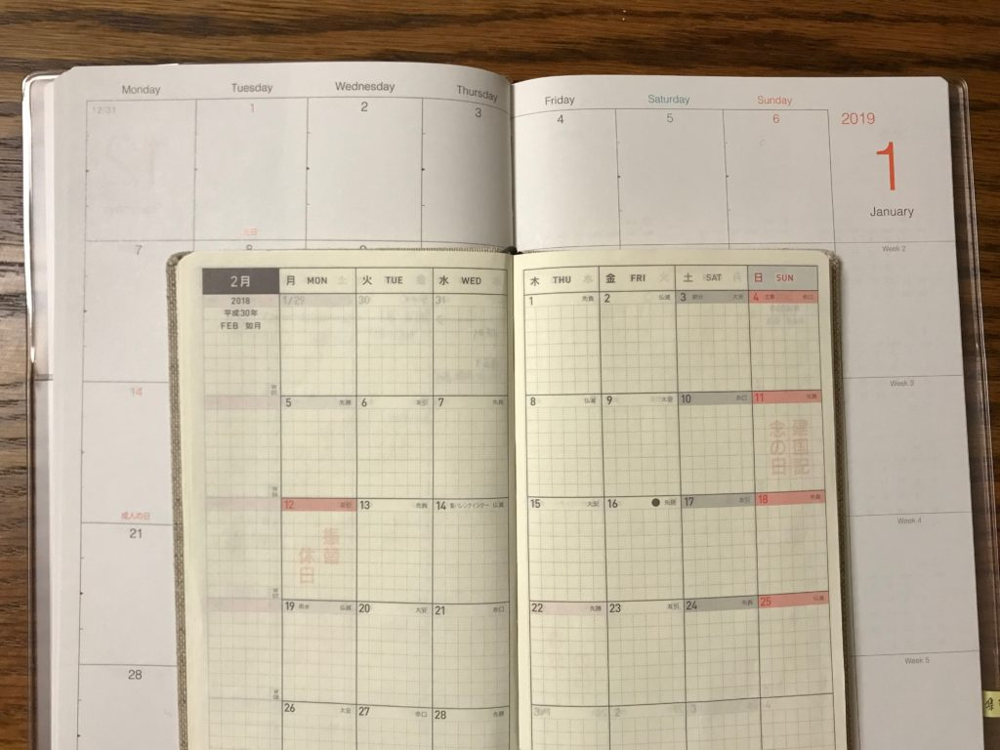
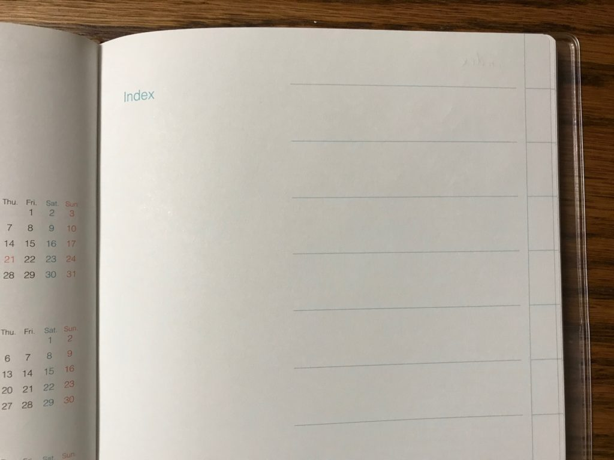
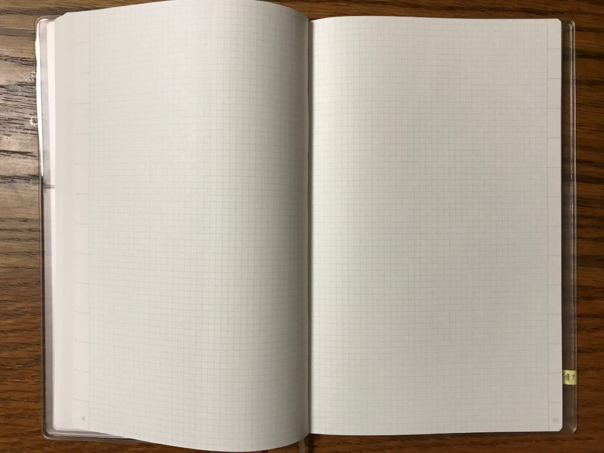
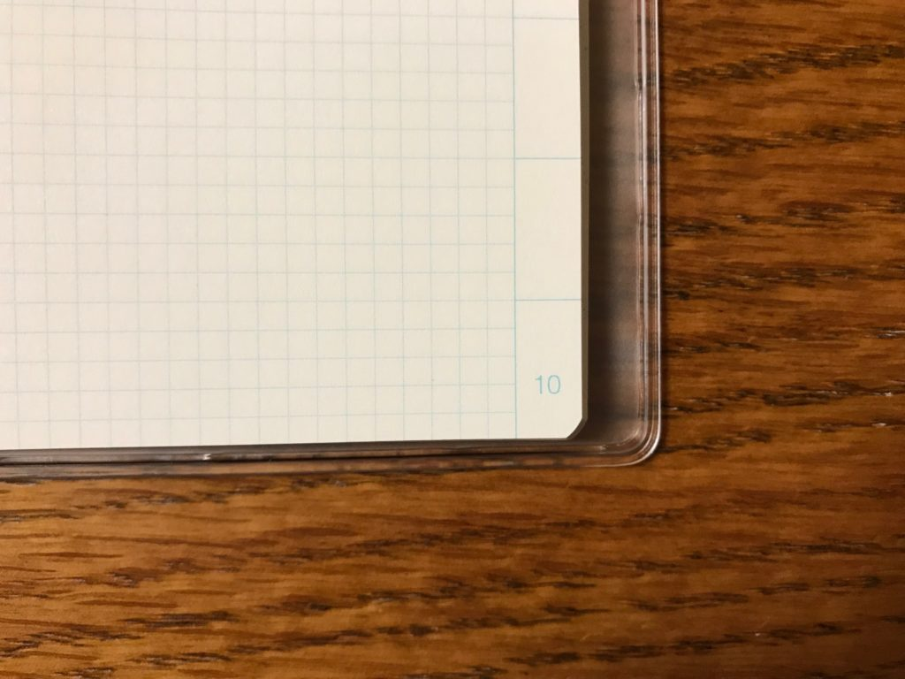
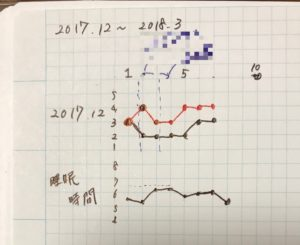
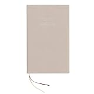
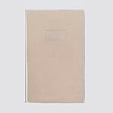

ドローイングダイアリーを買いました。

ニーモシネをバレットジャーナルに使っています。しかし、使い方やページ数の関係もあって一ヶ月もしないうちに使い切ってしまいます。

そうするとバレットジャーナルの特徴の一つであるコレクションページがあまり活かせません。

習慣化トラッカーやハッピーリスト、マンスリーページといった長期間書き込むページや何回も見直したいページを見直すために何冊もノートを持ち歩くことになります。

そこでニーモシネをデイリーページ用として、ドローイングダイアリーをマンスリーやコレクションページ用に分けることにしました。

今回はドローイングダイアリーとはどんなノートなのかご紹介します。

<!--more-->

## Drawing Diary

ドローイングダイアリーは以下の3つのページで構成されています。

1. カレンダーページ
2. インデックスページ
3. インデックス、ページナンバー付き3mm方眼ページ

スピンも2つついているので、カレンダーページと方眼ページ両方にしおりとして使えます。

ドローイングダイアリーにはLightとHeavyの二種類あります。ちがいは方眼ページのページ数だけで、Lightが158ページ、Heavyが382ページです。

大きさはA5ノートより少し小さめです（A5変形サイズと言うみたいですね）。

\[caption id="attachment\_1266" align="alignnone" width="680"\] 左からほぼ日weekly、Drawing Diary、B5ノート\[/caption\]

カバーがないと表紙が折れそうだったので専用カバーをつけました。折り返し部分に内ポケットが一つずつ付いています。

## カレンダーページ

まずはカレンダーページです。2017年12月から2019年1月までの月間カレンダーがページ見開きで載っています。

ドローイングダイアリーの大きさはA5を少し小さくしたものですから、見開きにすればA4ぐらいになります。大体の人なら余裕を持って予定を書き込めるのではないでしょうか。

\[caption id="attachment\_1271" align="alignnone" width="680"\] ↑ほぼ日weeklyのカレンダーと比較\[/caption\]

バレットジャーナルで予定を管理するために手書きでカレンダーを書きたくない人もいらっしゃると思います。

そういった方はカレンダーがついていて、かつ自由に書けるページもたくさんあるドローイングダイアリーみたいなノートも選択肢に入ってくるのではないでしょうか。

## インデックスページ

インデックスが書けます。

たとえばマンスリーページのインデックスを赤と決めて、右端のインデックスを赤く塗っておけばページが見つけやすくなります。読み返すときに便利です。

## インデックス、ページナンバー付き3mm方眼ページ

見開きではこんな感じです。

ページの隅に番号がついているので、自分で書く手間が省けます。

ページ番号の活用法としてはバレットジャーナルのもくじとしてはもちろん、たとえばやりたいことを書いたページの番号をカレンダーの実行日に書いておけば紐づけできます。

## 現在の使い方

### 評価と調子の長期間の記録

以前の記事で紹介した1日の評価と調子を記録することに加えて、睡眠時間も記録するようにしました。やっぱり睡眠は重要ですよね。

上のグラフの黒が調子、赤が評価。下のグラフが睡眠時間です。最近睡眠時間が6時間を切っているのでまずいなと思っています。

▼関連記事

[https://log-is-fun.com/biolism1/](https://log-is-fun.com/biolism1/)

### データや気になった言葉集

仕事やニュース等で気になったデータ、本で気になった文章や言葉を書きためていく予定です。移し替えやすいようにポストイットに書いています。

他にも思いついた使い方があれば、ちょこちょこ追加して楽しもうと思ってます。

感情のチェックリストを追加してみました（2018/01/15追記）

[https://log-is-fun.com/checklist/](https://log-is-fun.com/checklist/)

## 終わりに

ドローイングダイアリーの紹介でした。次の1年のパートナーとしてドローイングダイアリーを試してみてはいかがでしょうか。

Log is for Happy!!

▼関連記事  
・[バレットジャーナルとはなにか知りたいなら「箇条書き手帳でうまくいく　はじめてのバレットジャーナル」がおすすめ](https://log-is-fun.com/bullet-journal1/)  
・[バレットジャーナルを始めるのでノートを5つ選んでみた](https://log-is-fun.com/bullet-journal2/)  
・[4つのバレットでシンプルに！タスク管理よりもアイデア寄りにバレットジャーナルを運用する](https://log-is-fun.com/bullet-journal3/)  
・[バレットジャーナルのノートをニーモシネにした3つの理由](https://log-is-fun.com/mnemosyene/)  
・[自分とうまく付き合うために○○のチェックリストを使う](https://log-is-fun.com/checklist/)

* * *

[コクヨ ドローイングダイアリー 2018 A5変形 ライト 灰](//af.moshimo.com/af/c/click?a_id=765702&p_id=170&pc_id=185&pl_id=4062&s_v=b5Rz2P0601xu&url=http%3A%2F%2Fwww.amazon.co.jp%2Fexec%2Fobidos%2FASIN%2FB071K5QC45%2Fref%3Dnosim)

posted with [カエレバ](http://kaereba.com)

コクヨ(KOKUYO) 2017-09-01

売り上げランキング : 18966

カレンダーがいらない方はカレンダーがないナンバードノートという商品もあります。

[コクヨ ノート ナンバードノート A5変形 KE-SP2-2N](//af.moshimo.com/af/c/click?a_id=765702&p_id=170&pc_id=185&pl_id=4062&s_v=b5Rz2P0601xu&url=http%3A%2F%2Fwww.amazon.co.jp%2Fexec%2Fobidos%2FASIN%2FB01GUQRBGI%2Fref%3Dnosim)

posted with [カエレバ](http://kaereba.com)

コクヨ(KOKUYO) 2017-06-14

売り上げランキング : 31226

ちなみにこんな本を書いております。

[日記のすすめ: 日記で人生はもっと楽しくなる!!\[Kindle版\]](//af.moshimo.com/af/c/click?a_id=765702&p_id=170&pc_id=185&pl_id=4062&s_v=b5Rz2P0601xu&url=http%3A%2F%2Fwww.amazon.co.jp%2Fexec%2Fobidos%2FASIN%2FB078MNHHPZ)

posted with [ヨメレバ](https://yomereba.com)

ゆうびんや 2017-12-25
