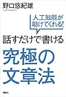

## はじめに

この記事は現在執筆中の「幸せのすすめ（仮題）」の「人とかかわる」の章です。

前回の記事はこちら。

https://log-is-fun.com/happiness6/

以下から本文です。

## 音声入力で言葉の精度上げる

あいさつをする、小道具を使うなど話すきっかけについて書いてきました。

そして会話を始めたら、次は何を話すか頭のなかで考え、口に出す必要があります。

しかし自分が考えていることってしっかりとした言葉のようなものだけじゃなくて、写真や絵のようなイメージだったり、音や色、匂いのような感覚だったり、あるいは過去の思い出の断片だったりとさまざまです。

そして会話に必要なのは頭の中で考えていることをうまく言葉に「変換」することです。

この「変換」がうまくできると会話がより楽しくなるはずです。しかし私のように「変換」がうまくない場合

- 「あぁもっとこう伝えたい事があるのに少ししか伝えられない」
- 「頭の中で考えていたニュアンスとちがう形で言ってしまった」
- 「1/3も純情な感情が伝わらない」

といったことになるわけです。

もちろん考えていることすべてを伝えることはどんなに言葉が達者な人でも無理でしょう。

しかし自分が納得できるぐらいの「変換」のうまさは会話をする上での自信になるはずです。

そこでこの「変換」するための能力をトレーニングする方法として私がおすすめしたいのは音声入力です。

音声入力はここ最近すこしずつ定着してきています。

音声入力でブログを書く方もわたしがネット上で観測する中では増えていますし、「「超」勉強法」の野口悠紀雄氏のように音声入力で本を書いた方もいます。

わたしも最近はブログ記事を書いてみたり、ライフログやかんたんなメモは音声入力をするようになりました。

音声入力のメリットの一つは文字を入力するスピードの速さです。そして私がかんがえるもう一つのメリットは自分の思考を言葉に「変換」した結果が目に見えることです。

頭の中のイメージを口に出し、その結果がすぐに目に見える。そしてその結果をチェックして、変だったら直す。

普段の会話だったら、そのまま流れていってしまう自分のイメージとずれてしまった言葉たちを音声入力であれば自分のペースで見直すことができます。

そうした見直しで言葉の精度を上げていくことができます。

他にも「感情に対処する」の章でも書きますが、頭の中のものを紙へ書き出すことなども言葉の精度を上げることができるはずです。

iphoneなどの入力画面でマイクのアイコンをタップすれば音声入力が始まります。使ったことのない方はぜひ試してみてください。

## 終わりに

頭の中のイメージをいかにアウトプットするか。その精度が少し上がると会話がより楽しくなると思います。

わたしもまだまだ音声入力のトレーニング中ですが効果を感じます。

またこちらの記事のように将来的に音声入力が主流の入力方法のひとつになるという予測もあります。

https://newspicks.com/news/2682111

そういった観点でも音声入力をトライする価値はあるのかなと思っています。

それでは次の記事で！

Log is for Happy!!

* * *

[話すだけで書ける究極の文章法　人工知能が助けてくれる\[Kindle版\]](//af.moshimo.com/af/c/click?a_id=765702&p_id=170&pc_id=185&pl_id=4062&s_v=b5Rz2P0601xu&url=http%3A%2F%2Fwww.amazon.co.jp%2Fexec%2Fobidos%2FASIN%2FB01FTH2N94)

posted with [ヨメレバ](https://yomereba.com)

野口悠紀雄 講談社 2016-05-20

売り上げランキング : 26128

[Kindleで購入](//af.moshimo.com/af/c/click?a_id=765702&p_id=170&pc_id=185&pl_id=4062&s_v=b5Rz2P0601xu&url=http%3A%2F%2Fwww.amazon.co.jp%2Fexec%2Fobidos%2FASIN%2FB01FTH2N94%2F)

[Amazon\[書籍版\]で購入](//af.moshimo.com/af/c/click?a_id=765702&p_id=170&pc_id=185&pl_id=4062&s_v=b5Rz2P0601xu&url=http%3A%2F%2Fwww.amazon.co.jp%2Fexec%2Fobidos%2FASIN%2F4062200570%2F)
