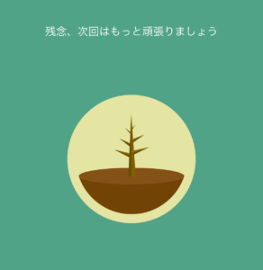

## はじめに

この記事は現在執筆中の「あなたの幸せの踏み台になる本（仮題）」の「今ここに集中する」の章です。

前回の記事はこちら。

https://log-is-fun.com/happiness11/

以下から本文です。

## 今ここに集中する

> "今を生きる。過去にとらわれない。未来に翻弄されない──" 
> 
> 『伝えることから始めよう』(高田 明 著) より、http://a.co/0ModLLV

「あなたが幸せだな」と思った時を思い出してみてください。多くの場合が「自分がなにかをしている」時だと思います。

それはたとえ「楽しい過去」を振り返っているときであっても今目の前のことに集中していることよりも幸福度は下がるそうです。

（参照：「「幸せ」について知っておきたい５つのこと 」(中経出版)　ＮＨＫ「幸福学」白熱教室制作班; エリザベス・ダン; ロバート・ビスワス＝ディーナー. 　） 

もちろんいつも目の前のことに集中し続けるということは不可能ですし、楽しい過去や未来に思いをはせるのも幸せなことだと思います。

ただこの章ではできるだけ一つ一つ目の前のことに集中できるようにするためのヒントをご紹介したいと思います。

ジャパネットの高田前社長は「いまこの一瞬を生きる」ことを積み重ねて、会社を大きく成長させたそうです。

わたしたちは会社を大きくさせる必要はないかもしれません。しかし「いまこの一瞬を生きる」ことは決して無駄にはならないはずです。

## スマホへの脱線を減らす

目の前のことに集中すること、その妨げになる要因のひとつはスマホでしょう。

通知が入ってくれば集中力が途切れてしまいますし、実はスマホをテーブルの上に置いておくだけで集中力が下がる研究結果もあります。

このスマホとの付き合い方を自分なりにうまく構築することは目の前のことに集中するためには重要です。

スマホを少し遠くに置いてみたり、電源を切っておくことでスマホへの脱線をへらすこともできます。

3m離れたところにスマホを置くだけで手に取る頻度は大きく下がります。しかし、手元に置いておいてすぐにスマホを使えるようにしておきたいのも事実です。

そんな時に使えるのがスマホ使用を抑えるアプリです。私が使っているアプリ「Forest」について少しご紹介します。

（関連記事：[スマホの使いすぎを防ぐアプリ「Forest」を使う3つのタイミング](https://log-is-fun.com/forest/))

このアプリはスマホを使わない時間を決めてタイマーをセットします。タイマーが動いている間スマホを使わなければ、木がどんどん育っていきます。

しかしスマホを使ってしまうと、(正確に言えばアプリを閉じて他のことをしてしまうと）下の画像のように木が枯れてしまいます。

こんなことでスマホを使わなくなるの？と思うかもしれませんが、案外あなどれません。

一度始めてしまえば続けたくなります。また人は損したくない生き物ですので、育った木を枯らしたくないのです。

このアプリは「スマホを使うのを我慢しなくちゃというのではなく、スマホを使わないようにしたい」と思わせてくれます。

こうしたアプリが家族で過ごしている時間や勉強しているとき、仕事に集中したいときなどスマホへの脱線を防ぎたいときの手助けになるはずです。
