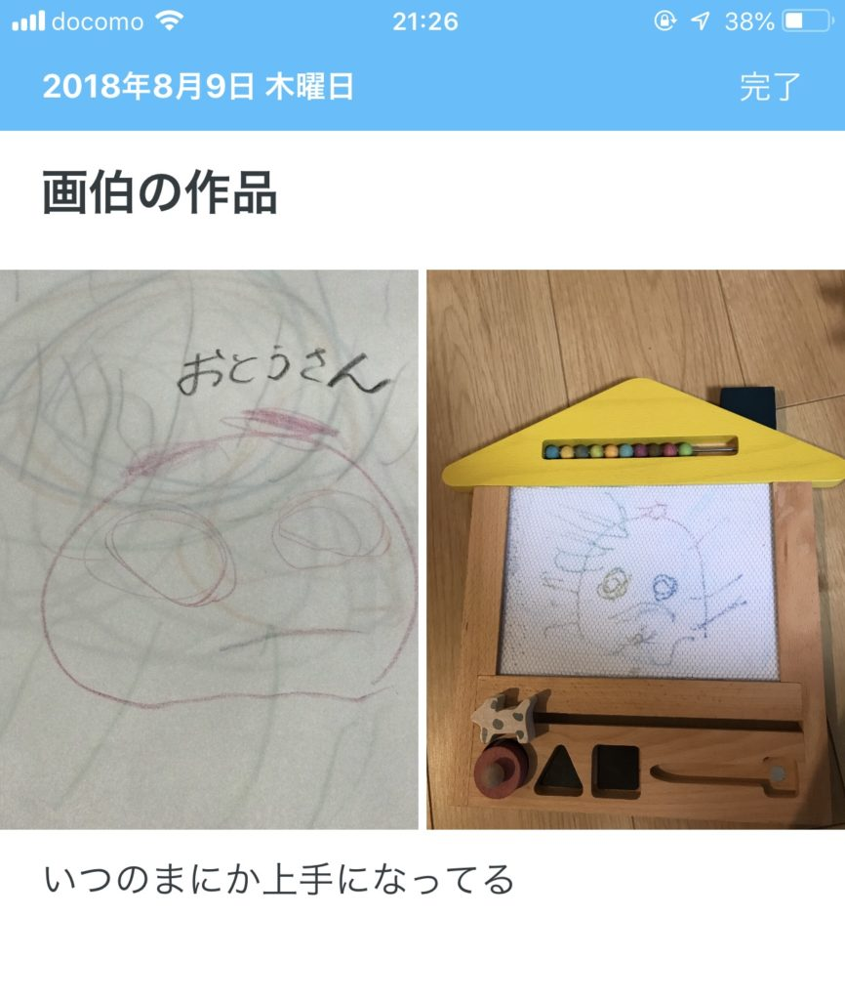

だいぶ前ですが『僕たちが何者でもなかった頃の話をしよう (文春新書)』を読んでいて、こんな記述がありました。

"子どもたちは、撮ることによって初めて見えてくるものがたくさんあって、びっくりする。僕は、「カメラは世界を発見する道具です」と言うのですが、そうやって「撮る」ということがどういうことかを体験してもらっています。"  
『僕たちが何者でもなかった頃の話をしよう (文春新書)』http://a.co/7WBbMYp

## カメラは風景を「眺める」のではなく「観る」ようにしてくれる

これは確かにそうだなと思います。カメラというツールを使うことで何気ないものを「発見」することができます。

たとえいつも通勤で使っている道でも、カメラで何かを取ろうと思って歩くだけで「あれ、こんなところに謎の置物が」「ここからの風景が案外きれい」といろいろ気付くことがあります。

カメラを使うことでそうした今まで気づかなかったものにアンテナを向けられるのです。

カメラが日々の風景に対しての感度や解像度を上げているとも言えます。

## 日記も日々に対する解像度を上げる

そしてそれはカメラだけでなく日記も同じです。

カメラが日々の風景に対して感度を上げるように、日記も日々の生活や感情に対して感度を上げることができます（もちろん風景にも）。

その対象も様々です。

自分の趣味なのか、生活全体か、育児についてか、人間関係か、それとも感情の揺れ動きなのか。

そんな通勤の風景のようにいつもなら素通りしていたものに対して感度が高くなります。

人間だいたい忘れてしまうので、いろんなことを素通りしています。

しかし日記は忘れてしまうものの受け皿になってくれます。いろんな記録についても言えますが、受け皿があるからこそ素通りしないで受け取ろうと思えるのです。

## あなたを質問するもの

カメラや日記はアンテナとなるだけでなく、あなたに質問を投げかけています。

あなたは私で何を撮るのですか？  
あなたは私にどんなものを書くのですか？  

その答えは人によって様々だと思います。その日気になったニュースを書く方もいるでしょう。気に入った風景を撮ったり、家族の写真だったりする方もいるでしょう。

そんな質問に答えるうちにあなたは自分にとって何が大切なのか、何が気になるのかが見えてきます。

それは日々の無数の選択肢を選ぶための、そして気づかなかったときのは少しちがう選択肢を選ぶためのきっかけにもなります。

## DayOneで写真日記をつける

このカメラと日記を組み合わせるの方法のひとつが写真日記です。

Instagramでも良いのかもしれませんが、自分のプライベートなところを表現するのであれば、SNSではない方が良いでしょう。

そこでおすすめしたいのがDayOneで写真に一言コメントを添えた日記を書くことです。

スマホで写真を撮ってその中から1枚選び、少しコメントを書くそれだけです。スマホであれば、だいたい写真はいっぱい取れますので、容量を気にする必要もありません。

DayOneは写真1枚をつけるだけであれば無料で使っていくことができます。  

写真を撮った場所を地図で一覧できたり、写真を撮った日付や時間に合わせてくれるのでとても便利です。

私は子供の成長記録などに使っています。

<figure>

<figcaption>

ある日の1ページ

</figcaption>

</figure>

おすすめです。  

## おわりに  

現在、「あなたの幸せの踏み台になる本」の校正をがんばってます。このペースでいけば、年末には出せるのではないかなと思っております。

がんばります。

noteにて日記同好会も始めましたので、こちらもぜひチェックしてみてくださいね。

[https://note.com/mailman/n/nbe584ebcaeca](https://note.com/mailman/n/nbe584ebcaeca)

Log is for Happy!!
