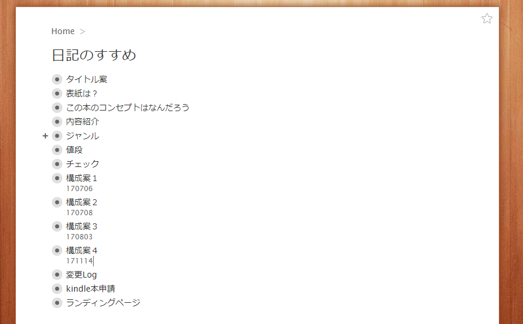
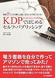

投稿日: {{ page.date | date: '%Y-%m-%d' }}

先日初めて本を出版しました。

[https://log-is-fun.com/nikkinosusume/](https://log-is-fun.com/nikkinosusume/)

初めての本の執筆ということもありなかなか苦戦しました。しかし本を書いて出版するのは楽しい経験でもありました。

そこでこれからセルフパブリッシングをやる方に少しでも参考になるように、どうやって執筆作業をやったかを残しておきたいと思います。

少しでも「お、自分でもできそうだな」と思ってもらえたら幸いです。

<!--more-->

## 使ったツール

使ったのは主に以下の3つです。次からどんなふうに執筆を進めていったかご紹介します。

1. WorkFlowy
2. ブログ
3. googleドキュメント

## WorkFlowyで企画、執筆

WorkFlowyはクラウド型のアウトライナーツールです。

簡単に言えば段差をつけながら文章を書いていくツールです。下のような画像を見るとなんとなくイメージがつかめるのではないでしょうか。

まずこのWorkFlowyに自分が書きたい本のタイトルの名前でトピック（段差の見出しのようなもの）を作りました。軽い気持ちで仮のタイトルをつけてみるとよいと思います。

実はわたしがWorkFlowyに「日記のすすめ」のトピックを作ったのが2016/8/31です。

そこから本の構成などを本格的に考え出したのが2017/6/27でした。

約10か月もの長い間ほぼタイトルだけのトピックだったんです。しかしその間もちらちらタイトルが目に入っていました。

そしてすこしずつどんな本にするかメモしたり、一部の人に話したりするようになりました。

そして2017/6/27の通勤中に「あ、本を書けそう」と自然と思えました。

タイトルを眺めたりメモしたり、人に話したりしている間に、本を書こうという決心のようなものが積み重なっていったのだと思います。

ですから、初めての本をなかなか書き始められない人は、自己嫌悪せず、まだハードルを越えられるエネルギーがたまっていないだけと考えて欲しいです。

新しいことを始めるための充電期間は人それぞれですから。

本のタイトルをいつも目につくところに置いておいて、メモなどをできるようにしておけばそれでよいと思います。

ただできそうだと思ったら、さっとはじめてしまいましょう。友人に話したり、SNSなどで宣言したりするのもいいですね。

書き始めてからはトピックの中にタイトル案や本の章立てや構成、本文を下の画像のように書いていきました。

## ブログでペース作り

執筆のペースを作るために週一回ブログで内容を公開しました。

どんな方法でもいいのでコツコツ本を書き続けていく自分なりのリズムをつかむのが一番大事だと思います。

私の場合はブログで公開すれば本の内容も知ってもらえるし、一石二鳥かなと考えました。

ただKindle Unlimitedに登録したい場合は公開した記事を非公開にする必要があるので、そこらへんは少し手間ですかね。サンプルとして本の10％は公開できます。

ちなみにブログなどで本文を公開してると出版申請をする際にAmazonから「無料公開されているけど著作権持ってますか？持ってるならもう一度申請してください（意訳）」とメールが来ます。

メールにある通りもう一度申請したらすんなり出版できました。

## WorkFlowyふたたび

本の原稿ができてきたら本の構成をいじります。

もちろん最初にある程度本の構成は考えてあります。しかし書いて行くうちに「この方が流れがスムーズかな？」「あ、ここらへん書き足しとくといいな」といった部分が出てきます。

そうした部分をWorkFlowyでいじって、本の流れがうまくいくようにしました。

編集作業ともいうのかもしれません。構成案は最終的にver.4までできました。

どうしてこの構成にしたかをメモとしておくと自分の思考の積み重ねが見えて不安がやわらぎます。

## Googleドキュメントで推敲校正推敲校正推敲・・・

できた原稿をGoogleドキュメントにいれてあとはひたすら推敲と校正です。

隙間時間でもコツコツできるようにクラウドツールであるGoogleドキュメント入れておきました。(WorkFlowyだとどこで行頭下げるかといった感覚があまり分からないのです)

慣れているツールがあればそちらの方がいいと思います。Googleドキュメントだけでなく印刷して赤字を入れたりするなどもしました。

この推敲と校正の作業でかかった時間が1番長かったと思います。

「だいたいできたかなー」と思ったらでんでんコンバーターでEpubファイルに直して、iBooksで目を通してチェックしました。

（だいたい直すところが見つかるので再び校正します）

「これでOK！」となったらEpubファイルをmobiファイルにします。そのmobiファイルもOKと判断したらAmazonに申請します、

Epubファイルやmobiファイルへの変換などはネットや本などで調べればいろいろ情報が出てくるのでこの記事では省かせていただきます。

ひとつ言えるのは「でんでんコンバーター最高！」ということです。

## 終わりに

原稿を書いて、推敲、校正できればセルフパブリッシングはできます。

質を上げようと思って上を目指すときりがなくなるのである程度〆切を決めてエイヤと一回出版してしまうのが案外大切なのかなと思います。

あとはセルフパブリッシングの先輩方からアドバイスをもらったりすることですね。

わたしはこちらの[セルフパブリッシング実用書部会](https://rashita.net/blog/?p=19029)でアドバイスをいただきました。

もちろんわたしに分かることならアドバイスさせていただきます。

セルフパブリッシングするうえでで参考になった本がたくさんあったので、次回はそこら辺をご紹介したいと思います。

この記事を読んでくださったあなたの本を読むのを楽しみにしております。

Log is for Happy!!

* * *

私が勝手に師匠にしている倉下氏のセルフパブリッシングについての本です。

[KDPではじめる セルフパブリッシング](//af.moshimo.com/af/c/click?a_id=765702&p_id=170&pc_id=185&pl_id=4062&s_v=b5Rz2P0601xu&url=http%3A%2F%2Fwww.amazon.co.jp%2Fexec%2Fobidos%2FASIN%2F4863541384)

posted with [ヨメレバ](https://yomereba.com)

倉下 忠憲 シーアンドアール研究所 2013-12-21

売り上げランキング : 344627

[Amazonで購入](//af.moshimo.com/af/c/click?a_id=765702&p_id=170&pc_id=185&pl_id=4062&s_v=b5Rz2P0601xu&url=http%3A%2F%2Fwww.amazon.co.jp%2Fexec%2Fobidos%2FASIN%2F4863541384)

[Kindleで購入](//af.moshimo.com/af/c/click?a_id=765702&p_id=170&pc_id=185&pl_id=4062&s_v=b5Rz2P0601xu&url=http%3A%2F%2Fwww.amazon.co.jp%2Fexec%2Fobidos%2FASIN%2FB01EL08HVI%2F)
