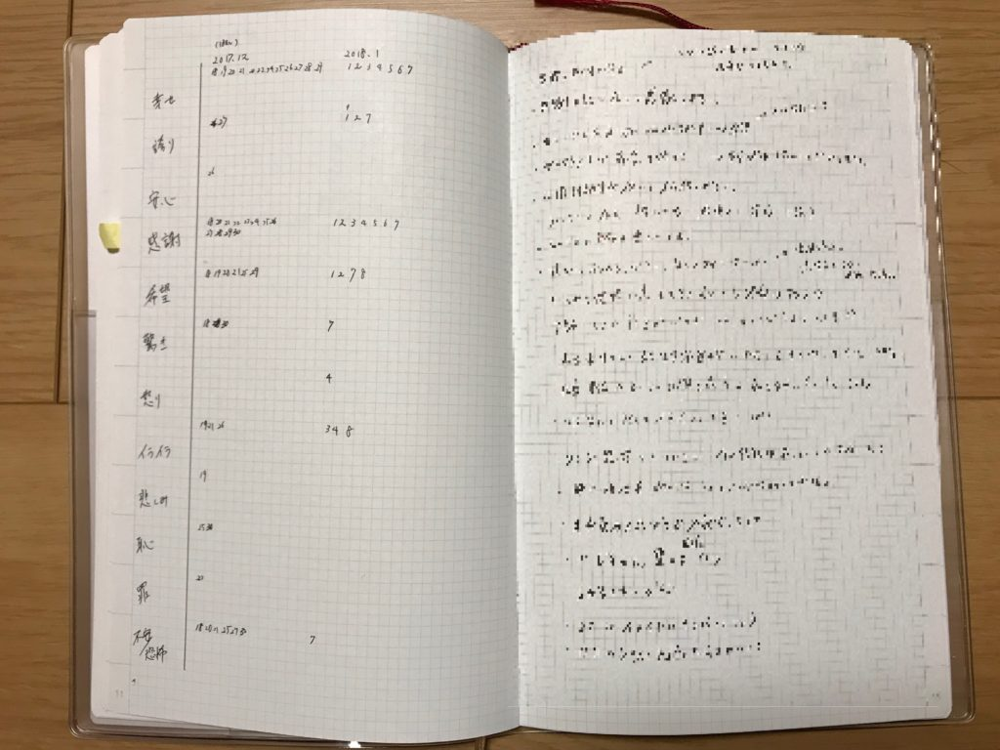

バレットジャーナルに使っているDrawing Diaryに感情へのチェックリストを追加してみました。

バレットジャーナルや手帳ユーザーだけでなく、いろんな人に効果がありそうなのでご紹介したいと思います。

## 感情のチェックリストって？

感情のチェックリストとは[「どうすれば幸せになれるか科学的に考えてみた」のレビュー記事](https://log-is-fun.com/happy-science/)でご紹介したものです。

ハーバード大の意志決定センターが感情を分類したものでポジティブとネガティブの二つに分類されています。

それぞれ6つの感情があり、計12の感情がリストになっています。以下のようになっています

ポジティブな感情

1. 幸せ
2. 誇り
3. 安心
4. 感謝
5. 希望
6. 驚き

ネガティブな感情

1. 怒り
2. イライラ
3. 悲しみ
4. 恥
5. 罪
6. 不安/恐怖

もうすこし違った感情もありそうな気がしますけど、この12個の感情のどこかに分類されるのでしょう。

たとえばわたしは勝手に達成感は誇りに、寂しさは不安にジャンル分けしています。

## 感情のチェックリストの書き方

書き方についてです。特に決まった書き方はないと思います。

私は下の画像のように左のページに感情のリストと、その感情を感じた日付を記入しています。

ここらへんはたぶんもっとうまいやり方がある気がします。

右のページにその感情を感じた理由を箇条書きで書いてます（プライベートすぎて画像ではモザイクかかってます）。

最初はすべての感情をごちゃ混ぜにして書いてましたけど、今は感情ごとにページを分けて書いています。

この感情のチェックリストはノートや手帳でやらなくても、エクセルなどを使えばもっとうまくできるかもしれません。

## 感情のチェックリストの効果

そしてわたしが感じる「感情のチェックリスト」の効果は以下の３つです。

### 感情をバランスよく使える

感情にはそれぞれ役割があると言われています。例えばネガティブな感情の時にはより物事をより厳密にシビアに考えやすくなります。

[https://log-is-fun.com/negative/](https://log-is-fun.com/negative/)

私の場合、他の感情に比べて怒りや悲しみが使われていません。これは喜ばしいことです。

しかしこういった感情にも何かしらの役割があるはずなので、もう少し泣ける映画でも見たほうがいいかもしれません。

### 感情の解像度が上がる

「今の感情はチェックリストのどの感情に当てはまるのか？」と考えることで感情をより高解像度で見ることができます。

また「この感情はいったいなんなのか？」と考えることでより高い視点から見ることも可能です。

### 自分マニュアルを作る

それぞれの感情をどんなときに感じるかを蓄積していけば傾向が見えてきます。

たとえばどんな時に「幸せ」を感じるかを書きためていけば

- 家族と過ごすことが大事
- 趣味の時間が幸せ
- おいしいお菓子と本があれば幸せ

といった傾向が分かってくるはずです。

12の感情の傾向が分かれば、行動方針が立てられます。自分をうまく使うコツもかなり分かってくるはずです。

そうした情報は自分の取扱説明書、「自分マニュアル」として役立つはずです。

## 終わりに

感情は人を生かしも殺しもするものだと思います。

そんな感情と上手く付き合っていくひとつのツールとして「感情のチェックリスト」がうまくいきそうな気がしています。

Log is for Happy!!

* * *

自分マニュアルについての話はこちらでも少し書いております。

[日記のすすめ: 日記で人生はもっと楽しくなる!!\[Kindle版\]](//af.moshimo.com/af/c/click?a_id=765702&p_id=170&pc_id=185&pl_id=4062&s_v=b5Rz2P0601xu&url=http%3A%2F%2Fwww.amazon.co.jp%2Fexec%2Fobidos%2FASIN%2FB078MNHHPZ)

posted with [ヨメレバ](https://yomereba.com)

ゆうびんや 2017-12-25
