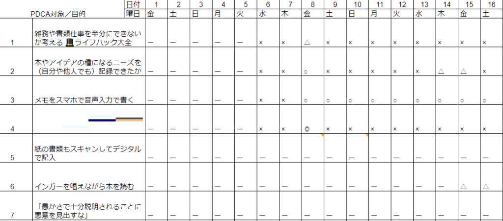

投稿日: {{ page.date | date: '%Y-%m-%d' }}

ひとそれぞれ習慣にしたいことがいろいろあると思います。

英語のリスニングや筋トレ、ポジティブシンキングや読書などさまざまです。

その習慣化に良く活用されているのが**習慣化トラッカー**です。

習慣にしようとしていることができたらカレンダーに印をつけたり、表にして○をつけたりと色々なやり方があります。

そのやり方をすこし変えてみたのでご紹介したいと思います。

<!--more-->

## 積み上げ方式にする

そのきっかけになったのがMarieさんの記事です。

> 1か月分の日付が並んで、「**できていない**けどできるようになりたい項目」がずらりと並んでいるのがもうプレッシャー。
> 
> きれいに塗るのが楽しいという意見もあるけど、私は塗れたところより、塗れずに空白になっているところに目がいってしまいます。
> 
> [手帳に書いたけど「できなかったこと」をどうするか問題](https://mandarinnote.com/archives/20936)

確かに空白とか×の部分が気になるんですよね

私もgoogleスプレッドシートでやっていました。◎○△×と4段階で習慣にしたいことができたかを記録していました。

でも×が続くのは確かに少し気がめいるんですよね。そこでちょっと書き方を変えてみました。

まずバレットジャーナルというかノートの方が（私にとっては）レビューを書きやすいので、習慣化トラッカーをつけるのをスプレッドシートからバレットジャーナルに変えました。

そして書き方も積み上げ方式にしました。

方法は簡単です

１．下の画像の左のページのように習慣にしたいことができた日の日付を書きます。  
２．気づいたことやこうしたらいいんじゃないかといったアイディアを空いたスペースで振り返ります。

以上です。できる限り簡単にしておくのが習慣化トラッカーを習慣づけるコツかと思います

## 少しでもできたらOK

ポイントはすこしでもやったらOKにすることです。

プロになるためのトレーニングとか、受からないといけない試験があるのであれば別かもしれません。

しかしちょっと習慣化したいなぐらいのことであれば、まずは少しでもできたらOKでいいと思います。

少しでもやったら○、できなかったらなし。やればやるだけ積みあがります。

じぶんはこういう方式が結構好きです。大リーグのイチロー選手が打率よりヒット数を指標にすることからインスパイアされています。

それに人間機械じゃないですから、連続でやり続けるのはやっぱりむずかしいです。

また連続してやることにこだわりすぎると、なにかの拍子で途切れた時に投げやりになりやすくなります。（これをWhat-the-hell-effect、どうにでもなれ効果といいます）

ですから習慣化トラッカーとか連続記録とかちょっとじぶんにはあっていないんだよなーと感じる方は少しやり方を変えて積み上げ方式でやってみてはいかがでしょうか？

## 終わりに

もちろん連続記録を重視した方が習慣化しやすいっていう方もいると思いますし、人それぞれに合ったやり方があると思います。

そうした人それぞれのちがいをうまく受け止めてくれるのがバレットジャーナルの良いところだと思います。

それにバレットジャーナルだけでなくエクセルやアプリを使うなどいろいろな方法があります。ですから一つの方法を試してダメだったら、失敗と思わずに次に行きましょう。

「失敗＝成功の途中」とどこかで聞いた気がします。

Log is for Happy!!
