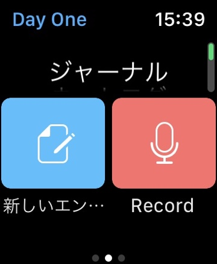
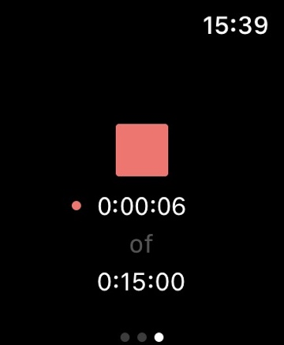

最近のpaypay20%ポイントバック祭りで、Apple Watchを買いました。その中でちょっといいなという使い方がありました。それがDayOneで声を記録することです。

スマホでももともとできたのですが、スマホを取り出してアプリを起動して音声を録音すると言う手順が正直めんどくさくて、しかも音声入力するなら動画をとればいいと考えていました。

でもApple Watchから行うことでほんの数ステップで録音までできます。

ではどんな時に録音するのかと言うと、手が離せない時です。

例え子供の手を取りながら一緒に歩いているときに、なかなか動画を撮影できません。しかし子供は歩いていてもいろんなおもしろいことを言っていたりします。

子供と散歩しているときに一緒に歌った歌をわたしとしては残しておきたいのです。

そういったときにApple WatchからDayOneですぐに録音できます。  

DayOneを起動するとこの画面になるので、マイクのボタンをタップすると録音が始まります。ここまでで数秒です。

あとは好きな時に止めるボタンを押すだけです。

これで子供との楽しいやり取りが少しでも録音できれば十分です。

あとは一日の終わりに見返して少しメモや写真を追加できればさらによいでしょう。

写真などが一枚でもあれば、さらにその時の情景を思い出しやすくなります。まわりの風景をさっと一枚とるだけでもいいかもしれません。

まだ使ってはいませんが、例えば少し旅行などで街を歩いているときに周りの音を録音してみれば、その時の音を聞くだけで、風景やにおい、そのときの感情まで蘇る可能性があると思っています。

運動会の徒競走のあの音楽を聴けば、運動会の感情がさっとよみがえるときもありますからね。

もちろん音声だけでなく、音声入力で文字として残しておくことも可能です。

他にもいろいろ使い道はありそうなので、Apple Watchをお持ちの方はぜひ使ってみてください。

▼日記同好会始めました。

[https://note.com/mailman/n/nbe584ebcaeca](https://note.com/mailman/n/nbe584ebcaeca)
