投稿日: {{ page.date | date: '%Y-%m-%d' }}

## はじめに

「あなたの幸せの踏み台になる本」をお読みいただき、ありがとうございました。

この記事ではこの本の次に読みたいおすすめ本を、タイプ別にご紹介します。

## 幸せについて知りたい

本書で幸せについてより関心を持った方は、以下の二冊をおすすめします。

### 「幸せ」について知っておきたい5つのこと

[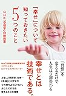](//af.moshimo.com/af/c/click?a_id=765702&p_id=170&pc_id=185&pl_id=4062&s_v=b5Rz2P0601xu&url=https%3A%2F%2Fwww.amazon.co.jp%2Fexec%2Fobidos%2FASIN%2F4046010533)

[「幸せ」について知っておきたい5つのこと NHK「幸福学」白熱教室](//af.moshimo.com/af/c/click?a_id=765702&p_id=170&pc_id=185&pl_id=4062&s_v=b5Rz2P0601xu&url=https%3A%2F%2Fwww.amazon.co.jp%2Fexec%2Fobidos%2FASIN%2F4046010533)

posted with [ヨメレバ](https://yomereba.com)

NHK「幸福学」白熱教室制作班,エリザベス・ダン,ロバート・ビスワス=ディーナー KADOKAWA/中経出版 2014-12-20

こちらはNHKの番組を本にまとめたもので、手軽に読める一冊です。多くの人に共通する幸福について知ることができます。

### 幸せな選択、不幸な選択

[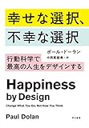](//af.moshimo.com/af/c/click?a_id=765702&p_id=170&pc_id=185&pl_id=4062&s_v=b5Rz2P0601xu&url=https%3A%2F%2Fwww.amazon.co.jp%2Fexec%2Fobidos%2FASIN%2F4152095598)

[幸せな選択、不幸な選択――行動科学で最高の人生をデザインする](//af.moshimo.com/af/c/click?a_id=765702&p_id=170&pc_id=185&pl_id=4062&s_v=b5Rz2P0601xu&url=https%3A%2F%2Fwww.amazon.co.jp%2Fexec%2Fobidos%2FASIN%2F4152095598)

posted with [ヨメレバ](https://yomereba.com)

ポール・ドーラン 早川書房 2015-08-21

サブタイトルに「人生をデザインする」とあるように、自分自身の幸せをどうデザインするかついて書かれた本です。

本書でも紹介した「快楽とやりがいの法則」も、こちらから引用しました。幸福について考えるうえで読んでおいて損はない本だと思います。

## 思考の型について知りたい

本書では思考の型を5つご紹介しました。思考の型を道具としてもっと知っておきたいという方には以下の本がおすすめです。

### アイデア大全、問題解決大全

[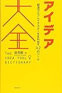](//af.moshimo.com/af/c/click?a_id=765702&p_id=170&pc_id=185&pl_id=4062&s_v=b5Rz2P0601xu&url=https%3A%2F%2Fwww.amazon.co.jp%2Fexec%2Fobidos%2FASIN%2F4894517450)

[アイデア大全――創造力とブレイクスルーを生み出す42のツール](//af.moshimo.com/af/c/click?a_id=765702&p_id=170&pc_id=185&pl_id=4062&s_v=b5Rz2P0601xu&url=https%3A%2F%2Fwww.amazon.co.jp%2Fexec%2Fobidos%2FASIN%2F4894517450)

posted with [ヨメレバ](https://yomereba.com)

読書猿 フォレスト出版 2017-01-22

[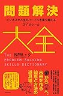](//af.moshimo.com/af/c/click?a_id=765702&p_id=170&pc_id=185&pl_id=4062&s_v=b5Rz2P0601xu&url=https%3A%2F%2Fwww.amazon.co.jp%2Fexec%2Fobidos%2FASIN%2F4894517809)

[問題解決大全――ビジネスや人生のハードルを乗り越える37のツール](//af.moshimo.com/af/c/click?a_id=765702&p_id=170&pc_id=185&pl_id=4062&s_v=b5Rz2P0601xu&url=https%3A%2F%2Fwww.amazon.co.jp%2Fexec%2Fobidos%2FASIN%2F4894517809)

posted with [ヨメレバ](https://yomereba.com)

読書猿 フォレスト出版 2017-11-19

読書猿さんのすご本です。アイデア大全で42個、問題解決大全で37個、合わせて79個の思考の型が、その背景まで含めて紹介されています。

「あなたの幸せの踏み台になる本」でも100年ルールやぐずぐず主義克服シートなどを紹介させてもらっています。おすすめです。

### 願望を実行計画に変えるWOOPの法則

[成功するには ポジティブ思考を捨てなさい 願望を実行計画に変えるWOOPの法則](//af.moshimo.com/af/c/click?a_id=765702&p_id=170&pc_id=185&pl_id=4062&s_v=b5Rz2P0601xu&url=https%3A%2F%2Fwww.amazon.co.jp%2Fexec%2Fobidos%2FASIN%2F4062194732)

posted with [ヨメレバ](https://yomereba.com)

ガブリエル・エッティンゲン 講談社 2015-06-10

本書の思考の型にてWOOPを紹介しました。

そのWOOPを詳細に解説しているのが本書です。WOOPについてより深く知りたい方はこちらの本を参考にしてみてください。

## 自分を知りたい

自分の大切なものを知る、自分の大切なものを実行できるようにする。そのためには、自分についてより深く知ることが助けになります。

ここでは自分について知るための本を3冊ご紹介します。

### ファスト＆スロー

[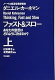](//af.moshimo.com/af/c/click?a_id=765702&p_id=170&pc_id=185&pl_id=4062&s_v=b5Rz2P0601xu&url=https%3A%2F%2Fwww.amazon.co.jp%2Fexec%2Fobidos%2FASIN%2F4150504105)

[ファスト&スロー(上) あなたの意思はどのように決まるか? (ハヤカワ・ノンフィクション文庫)](//af.moshimo.com/af/c/click?a_id=765702&p_id=170&pc_id=185&pl_id=4062&s_v=b5Rz2P0601xu&url=https%3A%2F%2Fwww.amazon.co.jp%2Fexec%2Fobidos%2FASIN%2F4150504105)

posted with [ヨメレバ](https://yomereba.com)

ダニエル・カーネマン 早川書房 2014-06-20

自分にとって大切なことを実行するにあたっては自分、もっと言えば人間の性質について知っておく必要があります。

心理学者ながらノーベル経済学賞を受賞したダニエル・カーネマンが書いた、人間の意思決定などに関する本です。

人間には早い思考（システム1）と遅い思考（システム2）があると知っておくだけでも、自分の意思決定プロセスを少し客観的にみられるようになると思います。

### マンガでやさしくわかる認知行動療法

[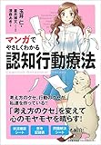](//af.moshimo.com/af/c/click?a_id=765702&p_id=170&pc_id=185&pl_id=4062&s_v=b5Rz2P0601xu&url=https%3A%2F%2Fwww.amazon.co.jp%2Fexec%2Fobidos%2FASIN%2F4820719467)

[マンガでやさしくわかる認知行動療法](//af.moshimo.com/af/c/click?a_id=765702&p_id=170&pc_id=185&pl_id=4062&s_v=b5Rz2P0601xu&url=https%3A%2F%2Fwww.amazon.co.jp%2Fexec%2Fobidos%2FASIN%2F4820719467)

posted with [ヨメレバ](https://yomereba.com)

玉井 仁 日本能率協会マネジメントセンター 2016-04-24

人は自分の見たいように物事を見ると聞いたことがある方も多いかと思います。

じゃあ自分が物事をどういう風にみているのか？

そのことについてのヒントが得られるのが認知行動療法です。

この認知行動療法についてマンガと文章でわかりやすく説明されています。「認知のABCモデル」といった知識は知っておいて損はありません。

### 日記の魔力、日記のすすめ

[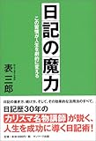](//af.moshimo.com/af/c/click?a_id=765702&p_id=170&pc_id=185&pl_id=4062&s_v=b5Rz2P0601xu&url=https%3A%2F%2Fwww.amazon.co.jp%2Fexec%2Fobidos%2FASIN%2F4763196022)

[日記の魔力―この習慣が人生を劇的に変える](//af.moshimo.com/af/c/click?a_id=765702&p_id=170&pc_id=185&pl_id=4062&s_v=b5Rz2P0601xu&url=https%3A%2F%2Fwww.amazon.co.jp%2Fexec%2Fobidos%2FASIN%2F4763196022)

posted with [ヨメレバ](https://yomereba.com)

表 三郎 サンマーク出版 2004-08-30

[日記のすすめ: 日記で人生はもっと楽しくなる!!\[Kindle版\]](//af.moshimo.com/af/c/click?a_id=765702&p_id=170&pc_id=185&pl_id=4062&s_v=b5Rz2P0601xu&url=https%3A%2F%2Fwww.amazon.co.jp%2Fexec%2Fobidos%2FASIN%2FB078MNHHPZ)

posted with [ヨメレバ](https://yomereba.com)

ゆうびんや 2017-12-25

本書の中でも日記には「自分について知ることができる」など様々な効果があるとご紹介しました。この日記にわたしがはまるきっかけとなったのが「日記の魔力」です。

日記を始めようかなと思っている方は一読をおすすめします。

もしよろしければ、拙著「日記のすすめ」も読んでいただければ幸いです。日記の魔力とはまた違った視点で日記について書いております。

## 大切なものを見つけたい

### 東大家庭教師の頭が良くなる思考法

[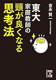](//af.moshimo.com/af/c/click?a_id=765702&p_id=170&pc_id=185&pl_id=4062&s_v=b5Rz2P0601xu&url=https%3A%2F%2Fwww.amazon.co.jp%2Fexec%2Fobidos%2FASIN%2FB01486BNWA)

[東大家庭教師の　頭が良くなる思考法 (中経の文庫)\[Kindle版\]](//af.moshimo.com/af/c/click?a_id=765702&p_id=170&pc_id=185&pl_id=4062&s_v=b5Rz2P0601xu&url=https%3A%2F%2Fwww.amazon.co.jp%2Fexec%2Fobidos%2FASIN%2FB01486BNWA)

posted with [ヨメレバ](https://yomereba.com)

吉永 賢一 KADOKAWA / 中経出版 2015-08-28

自分にとっての幸せを探すの中で紹介した「消したい悩みと手に入れたいものから考える」手法は、こちらの本から引用しました。

その他にも参考にできることが多い、おすすめ本です。

### アウトライン・プロセッシングLIFE

[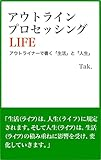](//af.moshimo.com/af/c/click?a_id=765702&p_id=170&pc_id=185&pl_id=4062&s_v=b5Rz2P0601xu&url=https%3A%2F%2Fwww.amazon.co.jp%2Fexec%2Fobidos%2FASIN%2FB07F3KN42K)

[アウトライン・プロセッシングLIFE: アウトライナーで書く「生活」と「人生」\[Kindle版\]](//af.moshimo.com/af/c/click?a_id=765702&p_id=170&pc_id=185&pl_id=4062&s_v=b5Rz2P0601xu&url=https%3A%2F%2Fwww.amazon.co.jp%2Fexec%2Fobidos%2FASIN%2FB07F3KN42K)

posted with [ヨメレバ](https://yomereba.com)

Tak. 2018-06-27

あなた自身の幸せを見つけるための実践編と言ってもいい本です。

特にアウトライナーを用いて、「Lifeのアウトライン」ができる過程は必読です。「Lifeのアウトライン」を作ることは、まさしく自分の大切なものを見つけることにも繋がります。

アウトライナーについてなじみがなければ、同著者の「アウトラインプロセッシング入門」がおすすめです。

わたしもアウトライナーを使って思考の整理から本の執筆までやっております。

## 自分を使いこなしたい

自分を知り、大切なことを見つけた後はどう実行するかです。

その実行のためには、自分自身を使いこなせたほうがいいでしょう。しかし、自分を使いこなすと言われても、なかなかピンときません。

そこで自分を使いこなすことを表していると感じた二冊をご紹介します。

### 「気がつきすぎて疲れる」が驚くほどなくなる 「繊細さん」の本

[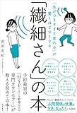](//af.moshimo.com/af/c/click?a_id=765702&p_id=170&pc_id=185&pl_id=4062&s_v=b5Rz2P0601xu&url=https%3A%2F%2Fwww.amazon.co.jp%2Fexec%2Fobidos%2FASIN%2F4864106266)

[「気がつきすぎて疲れる」が驚くほどなくなる 「繊細さん」の本](//af.moshimo.com/af/c/click?a_id=765702&p_id=170&pc_id=185&pl_id=4062&s_v=b5Rz2P0601xu&url=https%3A%2F%2Fwww.amazon.co.jp%2Fexec%2Fobidos%2FASIN%2F4864106266)

posted with [ヨメレバ](https://yomereba.com)

武田友紀 飛鳥新社 2018-07-25

HSP（Highly Sensitive Person）、簡単に言うと5人に一人はいるとされている「とても敏感な人」がHSPです。この「とても敏感な人＝繊細さん」として、繊細さんが生活や仕事上の小さな悩みに、どう対処していけばいいかについて書いています。

HSPのカウンセラーが書いた本ですので、HSPの方がどうすれば、HSPの長所を活かして過ごしていけるかについて書いてあります。

多かれ少なかれ、人には繊細なところがあります。思い当たる節がある方は読んでみると、「あーわかるわかる！」となると思います（わたしはなりました）。

### 発達障害の僕が「食える人」に変わった すごい仕事術

[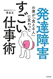](//af.moshimo.com/af/c/click?a_id=765702&p_id=170&pc_id=185&pl_id=4062&s_v=b5Rz2P0601xu&url=https%3A%2F%2Fwww.amazon.co.jp%2Fexec%2Fobidos%2FASIN%2F4046020768)

[発達障害の僕が「食える人」に変わった すごい仕事術](//af.moshimo.com/af/c/click?a_id=765702&p_id=170&pc_id=185&pl_id=4062&s_v=b5Rz2P0601xu&url=https%3A%2F%2Fwww.amazon.co.jp%2Fexec%2Fobidos%2FASIN%2F4046020768)

posted with [ヨメレバ](https://yomereba.com)

借金玉 KADOKAWA 2018-05-25

「自分を使いこなす」ことを体現した本です。

発達障害である著者の借金玉さんが、長年の経験をもとに発達障害の方の特性に合わせた仕事や生活上のテクニックを紹介しています。

本当に特性に合わせたもので、類書はなかなか思いつきません。そして、お世辞抜きで人の命を救える可能性のある本だと思っています。

## 日々のコツを知りたい

最後に日々をより楽に過ごすコツについて学べる本を二冊ご紹介します。

### 超ロジカル家事

[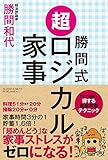](//af.moshimo.com/af/c/click?a_id=765702&p_id=170&pc_id=185&pl_id=4062&s_v=b5Rz2P0601xu&url=https%3A%2F%2Fwww.amazon.co.jp%2Fexec%2Fobidos%2FASIN%2F4866430087)

[勝間式 超ロジカル家事](//af.moshimo.com/af/c/click?a_id=765702&p_id=170&pc_id=185&pl_id=4062&s_v=b5Rz2P0601xu&url=https%3A%2F%2Fwww.amazon.co.jp%2Fexec%2Fobidos%2FASIN%2F4866430087)

posted with [ヨメレバ](https://yomereba.com)

勝間和代 アチーブメント出版 2017-03-25

まずは超ロジカル家事です。家事は毎日毎日繰り返すものです。この家事の時間を5分でも短縮できれば、長い目で見ればものすごい時間を生み出してくれます。

5分、少しずつ本が読めれば毎月一冊本が読めるかもしれません。そうした火事に関するコツを紹介しているのがこちらの「超ロジカル家事」です。

この本で我が家もだいぶ家事が短縮されました。

### ライフハック大全

[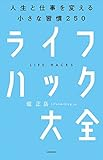](//af.moshimo.com/af/c/click?a_id=765702&p_id=170&pc_id=185&pl_id=4062&s_v=b5Rz2P0601xu&url=https%3A%2F%2Fwww.amazon.co.jp%2Fexec%2Fobidos%2FASIN%2F4046021543)

[ライフハック大全―――人生と仕事を変える小さな習慣250](//af.moshimo.com/af/c/click?a_id=765702&p_id=170&pc_id=185&pl_id=4062&s_v=b5Rz2P0601xu&url=https%3A%2F%2Fwww.amazon.co.jp%2Fexec%2Fobidos%2FASIN%2F4046021543)

posted with [ヨメレバ](https://yomereba.com)

堀 正岳 KADOKAWA 2017-11-16

今回「あなたの幸せの踏み台になる本」では、幸せのためのちょっとしたコツを31個ご紹介しました。

このライフハック大全では幸せについてではありませんが、「日々のちょっとしたコツ＝ライフハック」が250個載っています。

まさに大全という名にふさわしい本です。

250個あれば、自分にあった日々のコツが見つけられると思います。おすすめです。

## おわりに

「あなたの幸せの踏み台になる本」、そしてこのおまけ記事もお読みいただき、ありがとうございました。

今回ご紹介したような本だけでなく、様々な本を読んだり、新しいことを経験したりすることで、違った景色が見えてくることがあります。

そうした日々の積み重ねは、らせん階段を上るような小さな変化に過ぎないかもしれません。しかし積み重なれば、あなたにとって大きな変化となっているはずです。

それではあなたの日々が、少しでもあなたなりに納得できる日々となるよう願っております。
