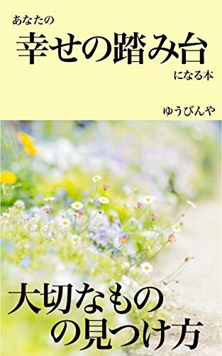
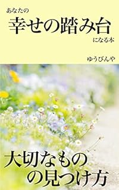

投稿日: {{ page.date | date: '%Y-%m-%d' }}

 

一年コツコツ書き上げた「あなたの幸せの踏み台になる本」が遂に発売となりました！

このブログの名前である「ログハピ！！」は、日記などの記録は最終的にはその人の幸せのためであるとの想い「Log is for Happy!!」を表したものです。

前回出した「日記のすすめ」は日記という「Log」についての本でした。

今回出した「あなたの幸せの踏み台になる本」は「Happy」についての本です（もちろん、Logについても出てきます）。

## この本について

この本では幸せを「あなたにとって大切なことが実行できること」と定義しています。

定義からわかるように、人それぞれ大切なものはちがいます。ですから、幸せも人それぞれちがいます。「自分だけの幸せの形」があるはずです。

この本は、あなただけの幸せを見つけるための「踏み台」として書きました。

一章では幸せについてのちょっとしたコツを31個紹介しています。

睡眠や食事、人とかかわる、感情に対処する、主観を調整するといった様々なコツについてまとめました。

そして二章では、どうやって自分に取っての大切なものを見つけるか、そして見つけた後に実行するためにはどんなコツがあるのか、そして実行した後に大切なものをアップデートするにはどうすればいいのか、と言った点について書きました。

「大切なことを見つけ、実行していく」ための章となっています。

この本を通して「あなたにとって大切なことを実行する」手助けができれば、うれしいです。

## こんな人におすすめ

・幸せについてのちょっとしたヒントが知りたい

・自分にとっての大切なものを知りたい

・大切なことを実行するためのヒントが欲しい

・毎日の生活と自分の大切なこととの間をずれをすり合わせたい

・日々を自分なりに納得して過ごしたい

## 立ち読み

以下の4つの記事で、本書の内容を紹介しています。

[はじめに](https://log-is-fun.com/fumidai-sample1/)

[コツ19「姿勢を変えてみる」  
コツ20「目の前のものに意識を向ける」](https://log-is-fun.com/post-1601/)

[スモールステップ](https://log-is-fun.com/post-1603/)

[\[アップデート\] 快楽とやりがいのバランスを考える](https://log-is-fun.com/post-1625/)  

## 目次

はじめに

一章 幸せのためのちょっとしたコツ  
・よく寝る  
　1.寝る前のルーティンを決める  
　2.光を調整する  
　3.体温に気を配る  
　4.睡眠の質を記録する

・食べる  
　5.虫歯、口内炎を予防する  
　6.ヨーグルトを食べる

・人と関わる  
　7.あいさつをする  
　8.小道具を使う  
　9.音声入力で「変換」の練習をする  
　10.非地位財にお金を使う  
　11.SNSを見ない  
　12.問題と人を切り離す  
　13.誰かを幸せにしてみる

・いまここ  
　14.新しいことをやる  
　15.時間を置く  
　16.スマホへの脱線を減らす  
　17.選択肢を絞る  
　18.「準備」ができているか考えてみる

・感情に対処する技術  
　19.姿勢を変えてみる  
　20.目の前のものに意識を向ける  
　21.感情を書き出す  
　22.100年ルール  
　23.感情のはかなさを知る  
　24.フィードバックに注目する  
　25.感情の役割を知る

・主観を調整する   
　26.わたしは～ではありません  
　27.感謝日記を書いてみる  
　28.1日に点数をつける  
　29.市場の値段と比較する  
　30.今の自分を俯瞰する  
　31.目標をじぶんなりに設定し直す  
コラム 主観の調整は注意の配分を変えること

二章 自分にとっての幸せをつかむ  
・自分にとっての幸せを探す  
　日々の生活の中から少しずつ発掘する  
　　毎日の評価をつける  
　　感情をチェックする  
　　日記を書き、読み返す  
　　目標を毎日書いて育てる  
　頭の中から洗い出す  
　　消したい悩みと手に入れたいものから考える  
　　これまでの自分を一気に振り返る（年表をつくる）  
　　質問から考えてみる  
　新しいことから見つける  
　　他の人を参考にする  
　自分にとっての幸せを見える化する  
　コラム 一気に探すのと少しずつ探すのとどっちがいいの？

・今日を少し変える  
　やりたいことを実行する  
　実行できなかった時はどうするか？  
　コラム 続けるか、やめるか

・明日を少し変える  
　振り返りをする理由  
　今日を確認する  
　明日を変える一手を打つ  
　大切なことをアップデートする  
　道具としての思考の型  
　振り返りのコツ  
　コラム 大切なものは、あなただけの花壇のようなもの

おわりに

## Amazonにて発売中

[Kindle Unlimited](http://amzn.to/2CDbchB)対象となっております。気になる方はぜひチェックしてみてください！

[あなたの幸せの踏み台になる本: 大切なものの見つけ方\[Kindle版\]](//af.moshimo.com/af/c/click?a_id=765702&p_id=170&pc_id=185&pl_id=4062&s_v=b5Rz2P0601xu&url=https%3A%2F%2Fwww.amazon.co.jp%2Fexec%2Fobidos%2FASIN%2FB07MK5Y84X)

posted with [ヨメレバ](https://yomereba.com)

ゆうびんや 2018-12-29
